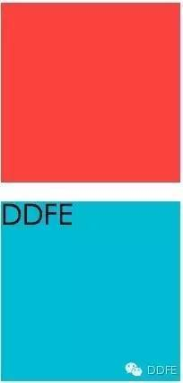
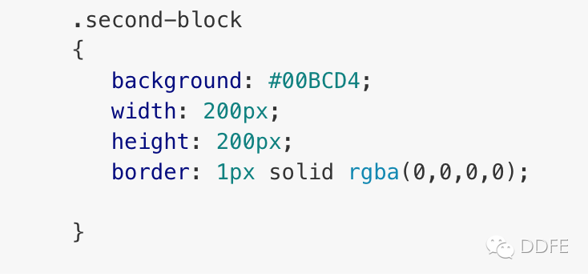
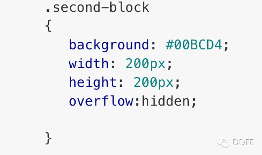
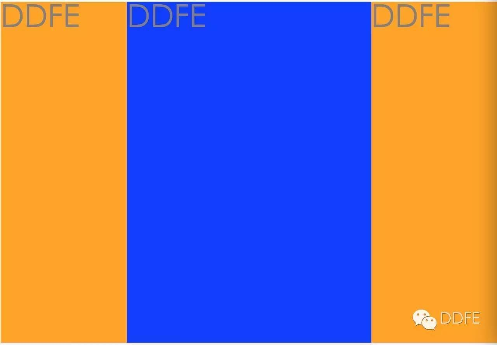
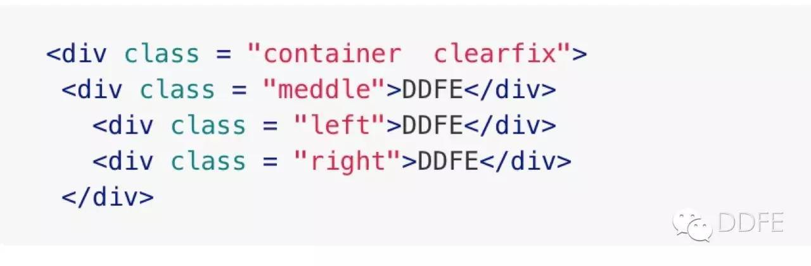
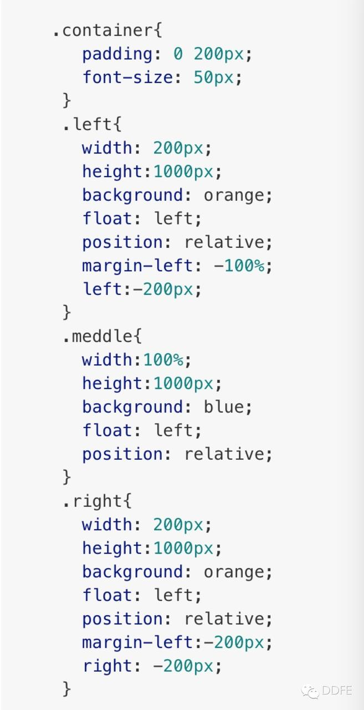
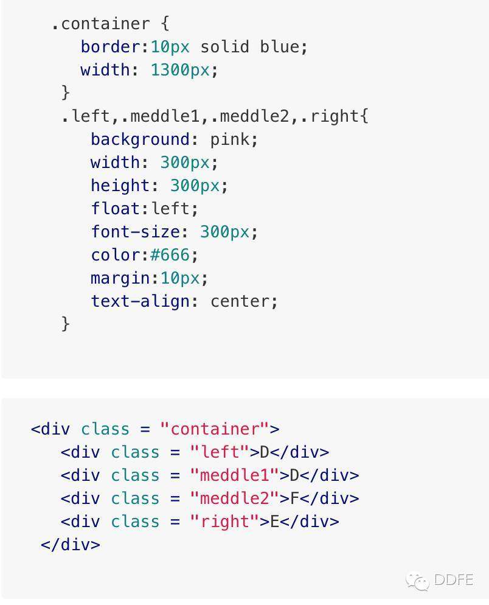
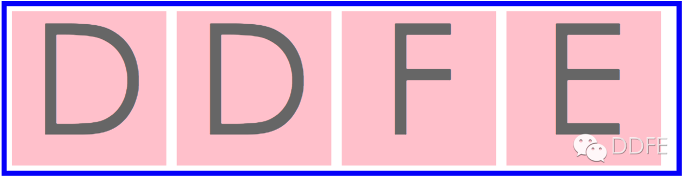
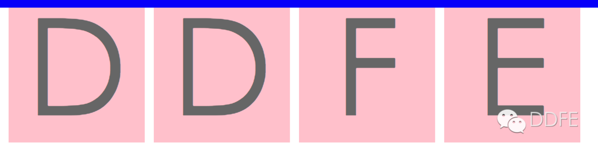
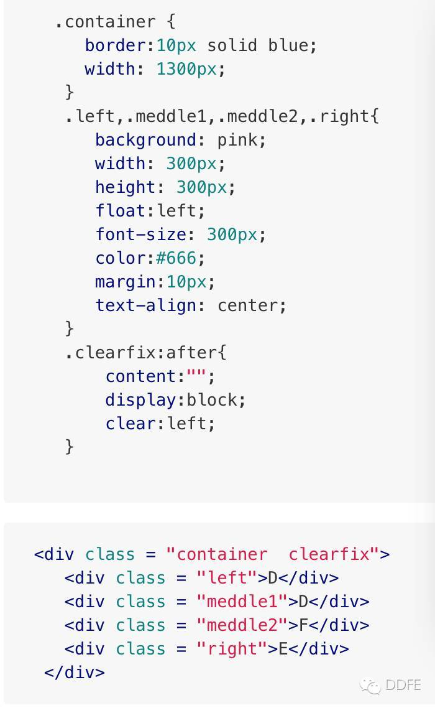

## BFC  --  块级格式化范围

[TOC]

### 1.什么是BFC

- BFC(Block formatting context)直译为"块级格式化上下文"。它是一个独立的渲染区域，只有Block-level box参与， 它规定了内部的Block-level Box如何布局，并且与这个区域外部毫不相干。

### 2.BFC 的特征

- 内部的Box会在垂直方向，一个接一个地放置。
- Box垂直方向的距离由margin决定。属于同一个BFC的两个相邻Box的margin会发生重叠
- 每个元素的margin box的左边， 与包含块border box的左边相接触(对于从左往右的格式化，否则相反)。即使存在浮动也是如此。
- BFC的区域不会与float box重叠。
- BFC就是页面上的一个隔离的独立容器，容器里面的子元素不会影响到外面的元素。反之也如此。
- 计算BFC的高度时，浮动元素也参与计算

### 3.如何触发 BFC

**满足下列条件中至少一项，即可触发 BFC：**

1. float 的值不为none。
2. position 的值不为static或者relative。
3. display的值为 table-cell, table-caption, inline-block, flex, 或者 inline-flex中的其中一个。
4. overflow的值不为visible。

### 4.BFC 的应用场景

#### 1.解决 `margin` 叠加问题

```css
<div class="first-block"></div>
<div class="second-block">
    <h2>DDFE</h2>
</div>

.first-block {
    background: #F44336;
    width: 200px;
    height: 200px;
}
.second-block {
    background: #00BCD4;
    width: 200px;
    height: 200px;
}
```

**效果如下**



- 为什么 first-block 和 second-block 之间会有这么宽的间距？

  原因是：外边距折叠，这个间距是 h2 的上外边距引起的。

**CSS 里面关于折叠的条件：**

两个块元素要产生**折叠**现象，必须满足一个必备条件：这两个元素的 margin 必须是 **相邻** 的；那么如果定义相邻呢，w3c 规范，两个 margin 是邻接的必须满足以下条件：

- 必须是处于常规文档流（非float和绝对定位）的块级盒子,并且处于同一个 BFC 当中。
- 没有inline盒子，没有空隙，没有 padding 和 border 将他们分隔开。
- 都属于垂直方向上相邻的外边距，可以是下面任意一种情况：

**那么我们就可以通过给元素叫边框或者边距来解决啦**

**解决办法 1：**



折叠问题解决了，但是由于有1px的边框，second-block 看起来会比 first-block 宽一点，没关系，添加 `box-sizing: border-box` 属性可以解决这个问题：`再加一句：box-sizing:border-box` ; 

**解决办法 2：**



通过把 overflow 把 second-block 元素形成一个 BFC，完美解决！

#### 2.用于布局

- 三列布局，中间宽度自适应，两边定宽，这样做的优势是重要的东西放在文档流前面可以优先渲染。



html部分：



css部分：



1. html代码中，middle部分首先要放在container的最前部分，然后是left，right 。
2. 将三者都设置 `float:left`, `position:relative`。
3. middle设置 `width:100%` 占满一行 。
4. 此时middle占满一行，所以要把left拉到middle所在行的最左边，使用 `margin-left:-100%` 。
5. 这时left拉回到middle所在行的最左边，但会覆盖middle内容的左端，要把middle内容拉出来，所以在外围container加上 `padding:0 200px` 。
6. middle内容拉出来了，但left也跟着出来了，所以要还原，就对left使用相对定位 `left:-200px`。
7. 同理，right要拉到middle所在行的最右边，使用 `margin-left:-200px`，`right:-200px` 。

#### 3.用于清除浮动，计算BFC高度



我们想象中应该是这样的：



但实际是却是这样的：



div 标签没有包住 ul 标签，原因很简单：container 下的子元素浮动了，因此div的高度就塌陷了。
要解决塌陷，就得清除浮动。

清除浮动就两种方式：

1)利用 `clear` 属性清除浮动。



2)使父容器形成 **BFC**。

给父元素 `.container` 加一句 `overflow:hidden` 触发 bfc。