## BootStrap/起步/全局CSS样式(栅格系统/排版/表格/表单/按钮/图片/响应式工具/代码块)

[TOC]

###### 

## 起步

### 1.什么是BootStrap?

- BootStrap是一个**基于HTML, CSS, JavaScript技术**的快速开发响应式布局，移动设备优先的前端框架.
- BootStrap简洁、直观、强悍的前端开发框架，让web开发更迅速、简单。
- BootStrap是由Twitter的Mark Otto和Jacob Thomton开发的. BootStrap是2011年八月在GitHub上发布的开源产品.

### 2.为什么使用BootStrap

- 移动设备优先的响应式网格, 从BootStrap3.0开始, 框架将包含了移动终端设备的优先的样式.
- 浏览器支持IE, Firefox, opera, chrome, safari.
- 基于WEB字体的图标, 适用于移动及高密度屏幕(高清屏).
- 使用更简单, 让开发者更容易上手, 只要你具备HTML和CSS的基础知识.
- 响应式设计, 这也是BootStrap最大的特色, 它能够自适应于台式机, 平板电脑和手机.
- 标记和样式更加简洁高效.
- 包含了功能强大的内置组件, 易于定制.
- 它是开源的, 可以根据需求任何更改源码.

### 3.BootStrap包的内容

- 基本结构: BootStarp提供了一个带着网络系统, 链接样式, 背景的基本结构.
- css: 自带, 全局的css设置, 定义基本的HTML元素样式, 可扩展的class, 以及一个先进的网格系统.
- 组件: 包含了十几个可重用的组件, 用于创建图像, 下拉菜单, 导航, 警告, 弹出框等等.
- JavaScript插件: 包含了十几个自定义的jQuery插件.
- 定制: 我们可以根据实际的需求定制BootStrap的组件等.


### 4.下载BootStrap源码

[官网下载](http://v3.bootcss.com/)

- 获得所有 CSS 和 JavaScript 原始文件，另外还包含一个说明文档的本地版本，可以直接在 GitHub 中下载最新的版本。

### 5.包含的内容

> ​	Bootstrap 提供了两种形式的压缩包，在下载下来的压缩包内可以看到以下目录和文件，这些文件按照类别放到了不同的目录内，并且提供了压缩与未压缩两种版本。

>#### Bootstrap 插件全部依赖 jQuery
>
>请注意，**Bootstrap 的所有 JavaScript 插件都依赖 jQuery，**因此 jQuery 必须在 Bootstrap 之前引入，就像在基本模版中所展示的一样。在[ `bower.json` 文件中](https://github.com/twbs/bootstrap/blob/v3.3.7/bower.json) 列出了 Bootstra p 所支持的 jQuery 版本。

#### 文档结构

```html
bootstrap/
├── less/
├── js/
├── fonts/
├── dist/
│   ├── css/
│   ├── js/
│   └── fonts/
└── docs/
    └── examples/
```

### 6.基本模板

- 拷贝并粘贴下面给出的 HTML 代码，这就是一个最简单的 Bootstrap 页面了。

```html
<!DOCTYPE html>
<html lang="zh-CN">
  <head>
    <meta charset="utf-8">
    <meta http-equiv="X-UA-Compatible" content="IE=edge">
    <meta name="viewport" content="width=device-width, initial-scale=1">
    <!-- 上述3个meta标签*必须*放在最前面，任何其他内容都*必须*跟随其后！ -->
    <title>Bootstrap 101 Template</title>

    <!-- Bootstrap -->
    <link href="bootstrap/dist/css/bootstrap.min.css" rel="stylesheet">

    <!-- HTML5 shim and Respond.js for IE8 support of HTML5 elements and media queries -->
    <!-- WARNING: Respond.js doesn't work if you view the page via file:// -->

    <!--
    IE中独有的条件hack
    -->
    <!--[if lt IE 9]>
      <script src="https://cdn.bootcss.com/html5shiv/3.7.3/html5shiv.min.js"></script>
      <script src="https://cdn.bootcss.com/respond.js/1.4.2/respond.min.js"></script>
    <![endif]-->
  </head>
  <body>

    <div class="container">
      <h1>你好，世界！</h1>
    </div>

    <div class="container-fluid">
      <h1>HELLO WORLD!</h1>
    </div>
    
    <!-- jQuery (necessary for Bootstrap's JavaScript plugins) -->
    <script src="./js/jquery.min.js"></script>
    <!-- Include all compiled plugins (below), or include individual files as needed -->
    <script src="bootstrap/dist/js/bootstrap.min.js"></script>
  </body>
</html>
```

### 7.IE 兼容模式

> ​	Bootstrap 不支持 IE 古老的兼容模式。为了让 IE 浏览器运行最新的渲染模式下，建议将此  `<meta>`  标签加入到你的页面中：

```html
<meta http-equiv="X-UA-Compatible" content="IE=edge">
<!--也就是不支持IE 11以下版本-->
```

### 8.国产浏览器高速模式

> ​	国内浏览器厂商一般都支持兼容模式（即 IE 内核）和高速模式（即 webkit 内核），不幸的是，所有国产浏览器都是默认使用兼容模式，这就造成由于低版本 IE （IE8 及以下）内核让基于 Bootstrap 构建的网站展现效果很糟糕的情况。

- 将下面的 `<meta>` 标签加入到页面中，可以让部分国产浏览器默认采用高速模式渲染页面：

```html
<meta name="renderer" content="webkit">
```

###### 

## 全局CSS样式

### 1.移动设备优先

- 为了确保适当的绘制和触屏缩放，需要在 `<head>` 之中**添加 viewport 元数据标签**。

```html
<meta name="viewport" content="width=device-width, initial-scale=1">
```

### 2.Normalize.css

- 为了增强跨浏览器表现的一致性，我们使用了 [Normalize.css](http://necolas.github.io/normalize.css/)，这是由 [Nicolas Gallagher](https://twitter.com/necolas) 和 [Jonathan Neal](https://twitter.com/jon_neal) 维护的一个CSS 重置样式库。
- 使用标签对样式进行重置
- 使用方式：下载Normalize.css文件，使用link引入外部样式文件

```css
<link rel="stylesheet" href="./css/normalize.css">
```

### 3.布局容器

- Bootstrap 需要为页面内容和栅格系统包裹一个 `.container` 容器。我们提供了两个作此用处的类。注意，由于 `padding` 等属性的原因，这两种 容器类不能互相嵌套。
- `.container` 类用于固定宽度并支持响应式布局的容器。

```html
<div class="container">
  ...
</div>
```

- `.container-fluid` 类用于 100% 宽度，占据全部视口（viewport）的容器。

```html
<div class="container-fluid">
  ...
</div>
```

### 4.栅格系统

> ​	Bootstrap 提供了一套响应式、移动设备优先的流式栅格系统，随着屏幕或视口（viewport）尺寸的增加，系统会自动分为最多12列。它包含了易于使用的[预定义类](http://v3.bootcss.com/css/#grid-example-basic)，还有强大的[mixin 用于生成更具语义的布局](http://v3.bootcss.com/css/#grid-less)。

#### 简介

栅格系统用于通过一系列的行（row）与列（column）的组合来创建页面布局，你的内容就可以放入这些创建好的布局中。下面就介绍一下 Bootstrap 栅格系统的工作原理：

- “行（row）”必须包含在 `.container` （固定宽度）或 `.container-fluid` （100% 宽度）中，以便为其赋予合适的排列（aligment）和内补（padding）。
- 通过“行（row）”在水平方向创建一组“列（column）”。
- 你的内容应当放置于“列（column）”内，并且，只有“列（column）”可以作为行（row）”的直接子元素。
- 类似 `.row` 和 `.col-xs-4` 这种预定义的类，可以用来快速创建栅格布局。Bootstrap 源码中定义的 mixin 也可以用来创建语义化的布局。
- 通过为“列（column）”设置 `padding` 属性，从而创建列与列之间的间隔（gutter）。通过为 `.row` 元素设置负值 `margin` 从而抵消掉为 `.container` 元素设置的 `padding`，也就间接为“行（row）”所包含的“列（column）”抵消掉了`padding`。
- 负值的 margin就是下面的示例为什么是向外突出的原因。在栅格列中的内容排成一行。
- 栅格系统中的列是通过指定1到12的值来表示其跨越的范围。例如，三个等宽的列可以使用三个  `.col-xs-4` 来创建。
- 如果一“行（row）”中包含了的“列（column）”大于 12，多余的“列（column）”所在的元素将被作为一个整体另起一行排列。
- 栅格类适用于与屏幕宽度大于或等于分界点大小的设备 ， 并且针对小屏幕设备覆盖栅格类。 因此，在元素上应用任何 `.col-md-*` 栅格类适用于与屏幕宽度大于或等于分界点大小的设备 ， 并且针对小屏幕设备覆盖栅格类。 因此，在元素上应用任何 `.col-lg-*` 不存在， 也影响大屏幕设备。

#### 栅格参数

|                   |  超小屏幕手机 (<768px)   |      小屏幕平板 (≥768px)       |    中等屏幕桌面显示器 (≥992px)     |    大屏幕大桌面显示器 (≥1200px)    |
| :---------------: | :----------------: | :-----------------------: | :-----------------------: | :-----------------------: |
|      栅格系统行为       |       总是水平排列       | 开始是堆叠在一起的，当大于这些阈值时将变为水平排列 | 开始是堆叠在一起的，当大于这些阈值时将变为水平排列 | 开始是堆叠在一起的，当大于这些阈值时将变为水平排列 |
| `.container` 最大宽度 |     None （自动）      |           750px           |           970px           |          1170px           |
|        类前缀        |     `.col-xs-`     |        `.col-sm-`         |        `.col-md-`         |        `.col-lg-`         |
|        列数         |         12         |            12             |            12             |            12             |
|       最大列宽        |         自动         |           ~62px           |           ~81px           |           ~97px           |
|        槽宽         | 30px （每列左右均有 15px） |    30px （每列左右均有 15px）     |    30px （每列左右均有 15px）     |    30px （每列左右均有 15px）     |
|        可嵌套        |         是          |             是             |             是             |             是             |
|        偏移         |         是          |             是             |             是             |             是             |
|        列排序        |         是          |             是             |             是             |             是             |

#### 实例：从堆叠到水平排列

> ​	使用单一的一组 `.col-md-*` 栅格类，就可以创建一个基本的栅格系统，在手机和平板设备上一开始是堆叠在一起的（超小屏幕到小屏幕这一范围），在桌面（中等）屏幕设备上变为水平排列。所有“列（column）必须放在 ” `.row` 内。

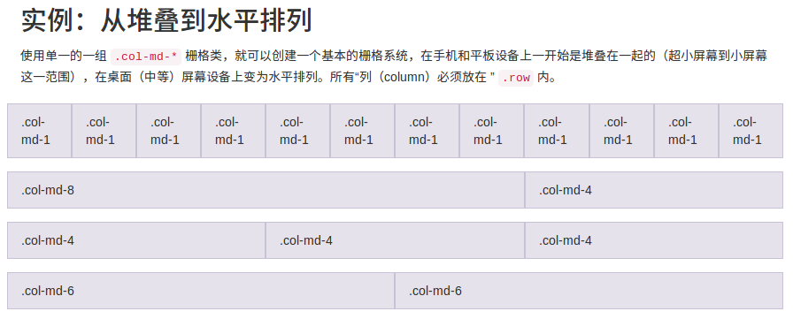

```html
<!-- 12列排布 响应式-->
    <div class="container container1">
      <div class="row">
        <div class="col-md-1 col-sm-2 col-xs-4">1</div>
        <div class="col-md-1 col-sm-2 col-xs-4">2</div>
        <div class="col-md-1 col-sm-2 col-xs-4">3</div>
        <div class="col-md-1 col-sm-2 col-xs-4">4</div>
        <div class="col-md-1 col-sm-2 col-xs-4">5</div>
        <div class="col-md-1 col-sm-2 col-xs-4">6</div>
        <div class="col-md-1 col-sm-2 col-xs-4">7</div>
        <div class="col-md-1 col-sm-2 col-xs-4">8</div>
        <div class="col-md-1 col-sm-2 col-xs-4">9</div>
        <div class="col-md-1 col-sm-2 col-xs-4">10</div>
        <div class="col-md-1 col-sm-2 col-xs-4">11</div>
        <div class="col-md-1 col-sm-2 col-xs-4">12</div>
      </div>
    </div>

    <!-- 8 4 排列  -->
    <div class="container container1">
      <div class="row">
        <div class="col-md-8">col-md-8</div>
        <div class="col-md-4">col-md-4</div>
      </div>
    </div>
    <!-- 4 4 4排列 -->
    <div class="container container1">
      <div class="row">
        <div class="col-md-4">col-md-4</div>
        <div class="col-md-4">col-md-4</div>
        <div class="col-md-4">col-md-4</div>
      </div>
    </div>
    <!-- 6 6排列 -->
    <div class="container container1">
      <div class="row">
        <div class="col-md-6">col-md-6</div>
        <div class="col-md-6">col-md-6</div>
      </div>
    </div>
```

#### 实例：流式布局容器

> ​	将最外面的布局元素 `.container` 修改为 `.container-fluid`，就可以将固定宽度的栅格布局转换为 100% 宽度的布局。

```html
<div class="container-fluid">
  <div class="row">
    ...
  </div>
</div>
```

#### 列偏移

> ​	使用 `.col-md-offset-*` 类可以将列向右侧偏移。这些类实际是通过使用 `*` 选择器为当前元素增加了左侧的边距（margin）。例如，`.col-md-offset-4` 类将 `.col-md-4` 元素向右侧偏移了4个列（column）的宽度。

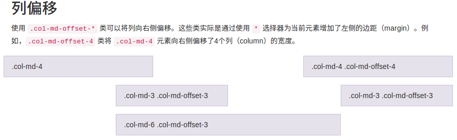

```html
<div class="container container1">
      <div class="row">
        <div class="col-md-4">col-md-4</div>
        <div class="col-md-4 col-md-offset-4">col-md-4</div>
      </div>

      <div class="row">
        <div class="col-md-3 col-md-offset-3">.col-md-3 .col-md-offset-3</div>
        <div class="col-md-3 col-md-offset-3">.col-md-3 .col-md-offset-3</div>
      </div>
      <div class="row">
        <div class="col-md-6 col-md-offset-3">.col-md-6 .col-md-offset-3</div>
      </div>
    </div>
```

#### 嵌套列

> ​	为了使用内置的栅格系统将内容再次嵌套，可以通过添加一个新的 `.row` 元素和一系列 `.col-sm-*` 元素到已经存在的 `.col-md-*` 元素内。被嵌套的行（row）所包含的列（column）的个数不能超过12（其实，没有要求你必须占满12列）。

```html
<!-- 嵌套  -->
      <div class="row">
        <div class="col-md-4">col-md-4</div>
        <div class="col-md-8">
          <div class="row">
            <div class="col-sm-4">col-sm-4</div>
            <div class="col-sm-4">col-sm-4</div>
            <div class="col-sm-4">col-sm-4</div>
          </div>
        </div>
      </div>
```

#### 列排序

>  通过使用 `.col-md-push-*` 和 `.col-md-pull-*` 类就可以很容易的改变列（column）的顺序。

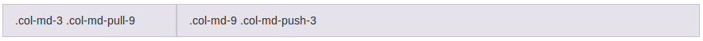

```html
<div class="row">
  <div class="col-md-9 col-md-push-3">.col-md-9 .col-md-push-3</div>
  <div class="col-md-3 col-md-pull-9">.col-md-3 .col-md-pull-9</div>
</div>
```

### 5.排版

#### 标题

> ​	HTML 中的所有标题标签，`<h1>` 到 `<h6>` 均可使用。另外，还提供了 `.h1` 到 `.h6` 类，为的是给内联（inline）属性的文本赋予标题的样式。

```html
<div class="container container1">
      <h1>我是H1标签</h1>
      <h2>我是H2标签</h2>
      <h3>我是H3标签</h3>
      <h4>我是H4标签</h4>
      <h5>我是H5标签</h5>
      <h6>我是H6标签</h6>
    </div>
```

> 在标题内还可以包含 `<small>` 标签或赋予 `.small` 类的元素，可以用来标记副标题。

```html
<h1>h1. Bootstrap heading <small>Secondary text</small></h1>
<h2>h2. Bootstrap heading <small>Secondary text</small></h2>
<h3>h3. Bootstrap heading <small>Secondary text</small></h3>
<h4>h4. Bootstrap heading <small>Secondary text</small></h4>
<h5>h5. Bootstrap heading <small>Secondary text</small></h5>
<h6>h6. Bootstrap heading <small>Secondary text</small></h6>
```

#### 页面主体

> ​	Bootstrap 将全局 `font-size` 设置为 **14px**，`line-height` 设置为 **1.428**。这些属性直接赋予 `<body>` 元素和所有段落元素。另外，`<p>` （段落）元素还被设置了等于 1/2 行高（即 10px）的底部外边距（margin）。

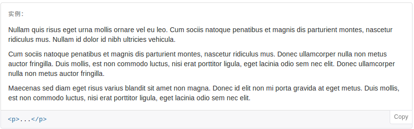

```html
<p>...</p>
```

#### 中心内容

> 通过添加 `.lead` 类可以让段落突出显示。

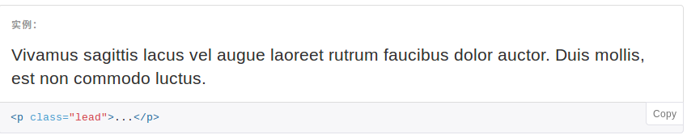

```html
<p class="lead">...</p>
```

#### 对齐

> 通过文本对齐类，可以简单方便的将文字重新对齐。

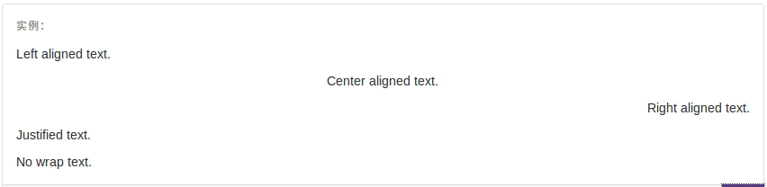

```html
<p class="text-left">Left aligned text.</p>
<p class="text-center">Center aligned text.</p>
<p class="text-right">Right aligned text.</p>
<p class="text-justify">Justified text.</p>		<!--内容两端对齐-->
<p class="text-nowrap">No wrap text.</p>		<!--文本不换行-->
```

#### 改变大小写

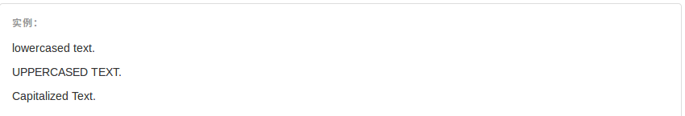

```html
<p class="text-lowercase">Lowercased text.</p>		<!--全部转换为小写-->
<p class="text-uppercase">Uppercased text.</p>		<!--全部转换为大写-->
<p class="text-capitalize">Capitalized text.</p>	<!--单词首字母大写-->
```

#### 缩略语

- 当鼠标悬停在缩写和缩写词上时就会显示完整内容，Bootstrap 实现了对 HTML 的 `<abbr>` 元素的增强样式。缩略语元素带有 `title` 属性，外观表现为带有较浅的虚线框，鼠标移至上面时会变成带有“问号”的指针。如想看完整的内容可把鼠标悬停在缩略语上（对使用辅助技术的用户也可见）, 但需要包含 title 属性。

##### 基本缩略语

```html
<abbr title="attribute">attr</abbr>
```

##### 首字母缩略语

```html
<abbr title="HyperText Markup Language" class="initialism">HTML</abbr>
```

#### 列表

##### 无样式列表

- 移除了默认的 `list-style` 样式和左侧外边距的一组元素（只针对直接子元素）。**这是针对直接子元素的**，也就是说，你需要对所有嵌套的列表都添加这个类才能具有同样的样式。

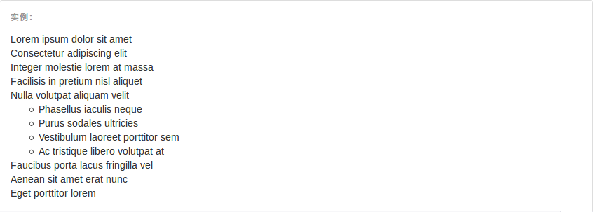

```html
<ul class="list-unstyled">
    <li>li 元素</li>
    <li>li 元素</li>
    <li>li 元素</li>
    <li>li 元素</li>
    <li>li 元素</li>
    <li>li 元素</li>
</ul>
```

##### 内联列表

- 通过设置 `display: inline-block;` 并添加少量的内补（padding），将所有元素放置于同一行。

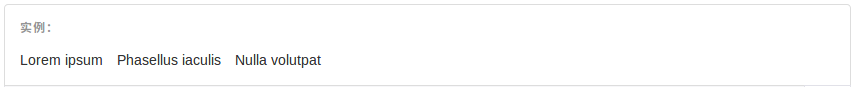

```html
<ul class="list-inline">
  <li>...</li>
</ul>
```

### 6.表格

#### 基本实例

- 为任意 `<table>` 标签添加 `.table` 类可以为其赋予基本的样式 — 少量的内补（padding）和水平方向的分隔线。

```html
<table class="table">
  ...
</table>
```

#### 条纹状表格

- 通过 `.table-striped` 类可以给 `<tbody>` 之内的每一行增加斑马条纹样式。

> #### 跨浏览器兼容问题
>
> 条纹状表格是依赖 `:nth-child` CSS 选择器实现的，而这一功能不被 Internet Explorer 8 支持。

```html
<table class="table table-striped">
  ...
</table>
```

#### 带边框的表格

- 添加 `.table-bordered` 类为表格和其中的每个单元格增加边框。

```html
<table class="table table-bordered">
  ...
</table>
```

#### 鼠标悬停

- 通过添加 `.table-hover` 类可以让 `<tbody>` 中的每一行对鼠标悬停状态作出响应。

```html
<table class="table table-hover">
  ...
</table>
```

#### 紧缩表格

- 通过添加 `.table-condensed` 类可以让表格更加紧凑，单元格中的内补（padding）均会减半。

```html
<table class="table table-condensed">
  ...
</table>
```

#### 状态类(颜色)

- 通过这些状态类可以为行或单元格设置颜色。

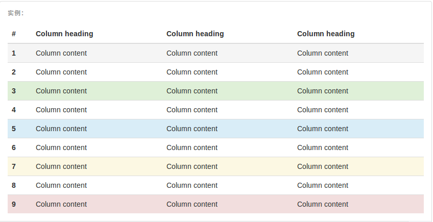

```html
<!-- On rows -->
<tr class="active">...</tr>
<tr class="success">...</tr>
<tr class="warning">...</tr>
<tr class="danger">...</tr>
<tr class="info">...</tr>

<!-- On cells (`td` or `th`) -->
<tr>
  <td class="active">...</td>
  <td class="success">...</td>
  <td class="warning">...</td>
  <td class="danger">...</td>
  <td class="info">...</td>
</tr>
```

| Class      | 描述                 |
| ---------- | ------------------ |
| `.active`  | 鼠标悬停在行或单元格上时所设置的颜色 |
| `.success` | 标识成功或积极的动作         |
| `.info`    | 标识普通的提示信息或动作       |
| `.warning` | 标识警告或需要用户注意        |
| `.danger`  | 标识危险或潜在的带来负面影响的动作  |

### 7.表单

#### 基本实例

- 单独的表单控件会被自动赋予一些全局样式。所有设置了 `.form-control` 类的 `<input>`、`<textarea>` 和 `<select>` 元素都将被默认设置宽度属性为 `width: 100%;`。 将 `label` 元素和前面提到的控件包裹在 `.form-group` 中可以获得最好的排列。

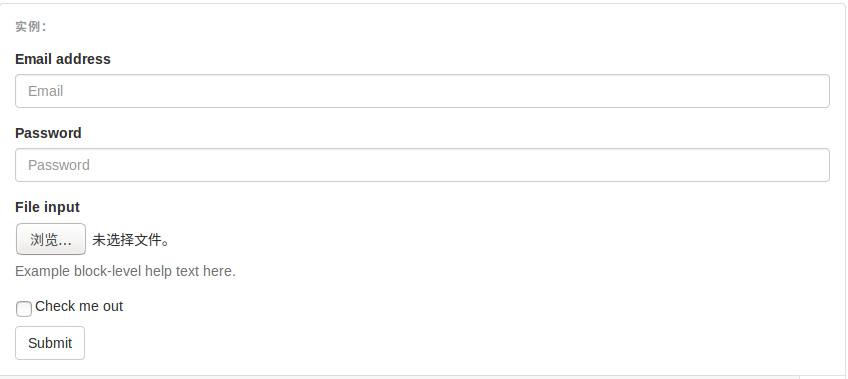

```html
<form>
    <div class="form-group">
      <!-- label的for属性和input的id一致，可以使input获得焦点  -->
      <label for="address">Email address</label>
      <input type="text" class="form-control" id="address" placeholder="Email">
    </div>
  
    <div class="form-group">
      <label for="Password1">Password</label>
      <input type="password" class="form-control" id="Password1" placeholder="Password">
    </div>
  
   <div class="form-group">
    <label for="exampleInputFile">File input</label>
    <input type="file" id="exampleInputFile">
    <p class="help-block">Example block-level help text here.</p>
  </div
     
  <div class="checkbox">
    <label>
      <input type="checkbox"> Check me out
    </label>
  </div>
    <input type="submit" class="btn btn-default">
  </form>
```

#### 内联表单

- 为 `<form>` 元素添加 `.form-inline` 类可使其内容左对齐并且表现为 `inline-block` 级别的控件。**只适用于视口（viewport）至少在 768px 宽度时（视口宽度再小的话就会使表单折叠）。**

> ###### 可能需要手动设置宽度
>
> 在 Bootstrap 中，输入框和单选/多选框控件默认被设置为 `width: 100%;` 宽度。在内联表单，我们将这些元素的宽度设置为 `width: auto;`，因此，多个控件可以排列在同一行。根据你的布局需求，可能需要一些额外的定制化组件。

> #### 一定要添加 `label` 标签
>
> 如果你没有为每个输入控件设置 `label` 标签，屏幕阅读器将无法正确识别。对于这些内联表单，你可以通过为 `label` 设置 `.sr-only` 类将其隐藏。还有一些辅助技术提供label标签的替代方案，比如 `aria-label`、`aria-labelledby` 或 `title` 属性。如果这些都不存在，屏幕阅读器可能会采取使用 `placeholder` 属性，如果存在的话，使用占位符来替代其他的标记，但要注意，这种方法是不妥当的。

- 实例一(有lable类型)

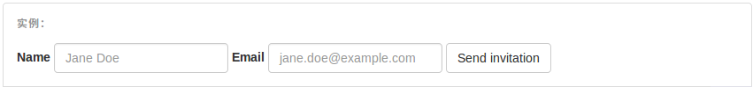

```html
<!-- 转换到一行 -->
<form class="form-inline">
  <div class="form-group">
    <label for="exampleInputName2">Name</label>
    <input type="text" class="form-control" id="exampleInputName2" placeholder="Jane Doe">
  </div>
  <div class="form-group">
    <label for="exampleInputEmail2">Email</label>
    <input type="email" class="form-control" id="exampleInputEmail2" placeholder="jane.doe@example.com">
  </div>
  <button type="submit" class="btn btn-default">Send invitation</button>
</form>
```

- 实例二(无lable类型)

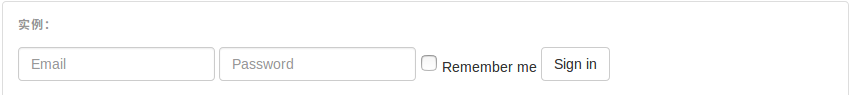

```html
<form class="form-inline">
  <div class="form-group">
    <label class="sr-only" for="exampleInputEmail3">Email address</label>
    <input type="email" class="form-control" id="exampleInputEmail3" placeholder="Email">
  </div>
  <div class="form-group">
    <label class="sr-only" for="exampleInputPassword3">Password</label>
    <input type="password" class="form-control" id="exampleInputPassword3" placeholder="Password">
  </div>
  <div class="checkbox">
    <label>
      <input type="checkbox"> Remember me
    </label>
  </div>
  <button type="submit" class="btn btn-default">Sign in</button>
</form>
```

- 实例三(提示框类型)

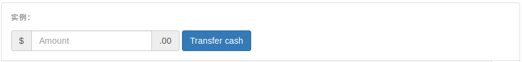

```html
<form class="form-inline">
  <div class="form-group">
    <label class="sr-only" for="exampleInputAmount">Amount (in dollars)</label>
    <div class="input-group">
      <div class="input-group-addon">$</div>
      <input type="text" class="form-control" id="exampleInputAmount" placeholder="Amount">
      <div class="input-group-addon">.00</div>
    </div>
  </div>
  <button type="submit" class="btn btn-primary">Transfer cash</button>
</form>
```

#### 水平排列的表单

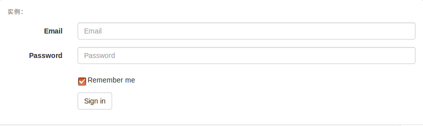

```html
<form class="form-horizontal">
  <div class="form-group">
    <label for="inputEmail3" class="col-sm-2 control-label">Email</label>
    <div class="col-sm-10">
      <input type="email" class="form-control" id="inputEmail3" placeholder="Email">
    </div>
  </div>
  <div class="form-group">
    <label for="inputPassword3" class="col-sm-2 control-label">Password</label>
    <div class="col-sm-10">
      <input type="password" class="form-control" id="inputPassword3" placeholder="Password">
    </div>
  </div>
  <div class="form-group">
    <div class="col-sm-offset-2 col-sm-10">
      <div class="checkbox">
        <label>
          <input type="checkbox"> Remember me
        </label>
      </div>
    </div>
  </div>
  <div class="form-group">
    <div class="col-sm-offset-2 col-sm-10">
      <button type="submit" class="btn btn-default">Sign in</button>
    </div>
  </div>
</form>
```

#### 被支持的控件

##### 输入框

```html
<input type="text" class="form-control" placeholder="Text input">
```

##### 文本域

- 支持多行文本的表单控件。可根据需要改变 `rows` 属性。

```html
<textarea class="form-control" rows="3"></textarea>
```

##### 多选和单选框

- 多选框（checkbox）用于选择列表中的一个或多个选项，而单选框（radio）用于从多个选项中只选择一个。

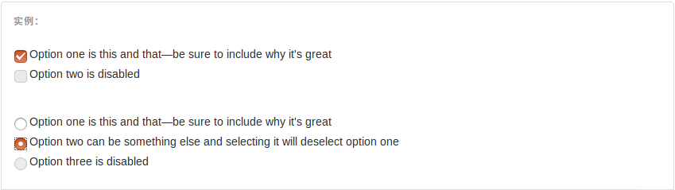

```html
<div class="checkbox">
  <label>
    <input type="checkbox" value="">
    Option one is this and that&mdash;be sure to include why it's great
  </label>
</div>
<div class="checkbox disabled">
  <label>
    <input type="checkbox" value="" disabled>
    Option two is disabled
  </label>
</div>

<div class="radio">
  <label>
    <input type="radio" name="optionsRadios" id="optionsRadios1" value="option1" checked>
    Option one is this and that&mdash;be sure to include why it's great
  </label>
</div>
<div class="radio">
  <label>
    <input type="radio" name="optionsRadios" id="optionsRadios2" value="option2">
    Option two can be something else and selecting it will deselect option one
  </label>
</div>
<div class="radio disabled">
  <label>
    <input type="radio" name="optionsRadios" id="optionsRadios3" value="option3" disabled>
    Option three is disabled
  </label>
</div>
```

##### 内联单选和多选框

- 通过将 `.checkbox-inline` 或 `.radio-inline` 类应用到一系列的多选框（checkbox）或单选框（radio）控件上，可以使这些控件排列在一行。


```html
<label class="checkbox-inline">
  <input type="checkbox" id="inlineCheckbox1" value="option1"> 1
</label>
<label class="checkbox-inline">
  <input type="checkbox" id="inlineCheckbox2" value="option2"> 2
</label>
<label class="checkbox-inline">
  <input type="checkbox" id="inlineCheckbox3" value="option3"> 3
</label>

<label class="radio-inline">
  <input type="radio" name="inlineRadioOptions" id="inlineRadio1" value="option1"> 1
</label>
<label class="radio-inline">
  <input type="radio" name="inlineRadioOptions" id="inlineRadio2" value="option2"> 2
</label>
<label class="radio-inline">
  <input type="radio" name="inlineRadioOptions" id="inlineRadio3" value="option3"> 3
</label>
```

##### 不带label文本的Checkbox 和 radio

- 如果需要 `<label>` 内没有文字，输入框（input）正是你所期望的。 **目前只适用于非内联的 checkbox 和 radio。** 请记住，仍然需要为使用辅助技术的用户提供某种形式的 label（例如，使用 `aria-label`）。

```html
<div class="checkbox">
  <label>
    <input type="checkbox" id="blankCheckbox" value="option1" aria-label="...">
  </label>
</div>
<div class="radio">
  <label>
    <input type="radio" name="blankRadio" id="blankRadio1" value="option1" aria-label="...">
  </label>
</div>
```

##### 下拉列表（select）

```html
<select  multiple class="form-control">
  <option>1</option>
  <option>2</option>
  <option>3</option>
  <option>4</option>
  <option>5</option>
</select>
```

- 对于标记了 `multiple` 属性的 `<select>` 控件来说，默认显示多选项。

```html
<select multiple class="form-control">
  <option>1</option>
  <option selected>2</option>
  <option>3</option>
  <option>4</option>
  <option>5</option>
</select>
```

##### 静态控件

- 如果需要在表单中将一行纯文本和 `label` 元素放置于同一行，为 `<p>` 元素添加 `.form-control-static` 类即可。

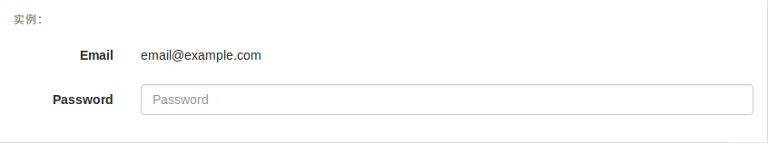

```html
<form class="form-horizontal">
  <div class="form-group">
    <label class="col-sm-2 control-label">Email</label>
    <div class="col-sm-10">
      <p class="form-control-static">email@example.com</p>
    </div>
  </div>
  <div class="form-group">
    <label for="inputPassword" class="col-sm-2 control-label">Password</label>
    <div class="col-sm-10">
      <input type="password" class="form-control" id="inputPassword" placeholder="Password">
    </div>
  </div>
</form>
```

##### 禁用状态

- 为输入框设置 `disabled` 属性可以禁止其与用户有任何交互（焦点、输入等）。被禁用的输入框颜色更浅，并且还添加了 `not-allowed` 鼠标状态。

```html
<input class="form-control" id="disabledInput" type="text" placeholder="Disabled input here..." disabled>
```

##### 只读状态

- 为输入框设置 `readonly` 属性可以禁止用户修改输入框中的内容。处于只读状态的输入框颜色更浅（就像被禁用的输入框一样），但是仍然保留标准的鼠标状态。

```html
<input class="form-control" type="text" placeholder="Readonly input here…" readonly>
```

##### 控件尺寸

- 高度尺寸

  ```html
  <input class="form-control input-lg" type="text" placeholder=".input-lg">
  <input class="form-control" type="text" placeholder="Default input">
  <input class="form-control input-sm" type="text" placeholder=".input-sm">

  <select class="form-control input-lg">...</select>
  <select class="form-control">...</select>
  <select class="form-control input-sm">...</select>
  ```

- 水平排列的表单组尺寸

  ```html
  <form class="form-horizontal">
    <div class="form-group form-group-lg">
      <label class="col-sm-2 control-label" for="formGroupInputLarge">Large label</label>
      <div class="col-sm-10">
        <input class="form-control" type="text" id="formGroupInputLarge" placeholder="Large input">
      </div>
    </div>
    <div class="form-group form-group-sm">
      <label class="col-sm-2 control-label" for="formGroupInputSmall">Small label</label>
      <div class="col-sm-10">
        <input class="form-control" type="text" id="formGroupInputSmall" placeholder="Small input">
      </div>
    </div>
  </form>
  ```

### 8.按钮

#### 可作为按钮使用的标签或元素

- 为 `<a>`、`<button>` 或 `<input>` 元素添加按钮类（button class）即可使用 Bootstrap 提供的样式。

```html
<a class="btn btn-default" href="#" role="button">Link</a>
<button class="btn btn-default" type="submit">Button</button>
<input class="btn btn-default" type="button" value="Input">
<input class="btn btn-default" type="submit" value="Submit">
```

> #### 针对组件的注意事项
>
> 虽然按钮类可以应用到 `<a>` 和 `<button>` 元素上，但是，导航和导航条组件只支持 `<button>` 元素。

> #### 链接被作为按钮使用时的注意事项
>
> 如果 `<a>` 元素被作为按钮使用 -- 并用于在当前页面触发某些功能 -- 而不是用于链接其他页面或链接当前页面中的其他部分，那么，务必为其设置 `role="button"` 属性。

#### 预定义样式

- 使用下面列出的类可以快速创建一个带有预定义样式的按钮。

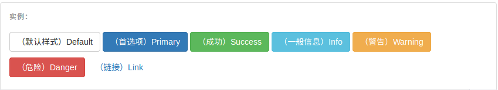

```html
<!-- Standard button -->
<button type="button" class="btn btn-default">（默认样式）Default</button>

<!-- Provides extra visual weight and identifies the primary action in a set of buttons -->
<button type="button" class="btn btn-primary">（首选项）Primary</button>

<!-- Indicates a successful or positive action -->
<button type="button" class="btn btn-success">（成功）Success</button>

<!-- Contextual button for informational alert messages -->
<button type="button" class="btn btn-info">（一般信息）Info</button>

<!-- Indicates caution should be taken with this action -->
<button type="button" class="btn btn-warning">（警告）Warning</button>

<!-- Indicates a dangerous or potentially negative action -->
<button type="button" class="btn btn-danger">（危险）Danger</button>

<!-- Deemphasize a button by making it look like a link while maintaining button behavior -->
<button type="button" class="btn btn-link">（链接）Link</button>
```

#### 尺寸

- 需要让按钮具有不同尺寸吗？使用 `.btn-lg`、`.btn-sm` 或 `.btn-xs` 就可以获得不同尺寸的按钮。

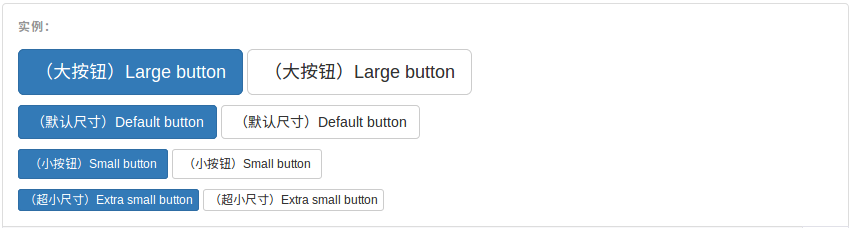

```html
<p>
  <button type="button" class="btn btn-primary btn-lg">（大按钮）Large button</button>
  <button type="button" class="btn btn-default btn-lg">（大按钮）Large button</button>
</p>
<p>
  <button type="button" class="btn btn-primary">（默认尺寸）Default button</button>
  <button type="button" class="btn btn-default">（默认尺寸）Default button</button>
</p>
<p>
  <button type="button" class="btn btn-primary btn-sm">（小按钮）Small button</button>
  <button type="button" class="btn btn-default btn-sm">（小按钮）Small button</button>
</p>
<p>
  <button type="button" class="btn btn-primary btn-xs">（超小尺寸）Extra small button</button>
  <button type="button" class="btn btn-default btn-xs">（超小尺寸）Extra small button</button>
</p>
```

- 通过给按钮添加 `.btn-block` 类可以将其拉伸至父元素100%的宽度，而且按钮也变为了块级（block）元素。

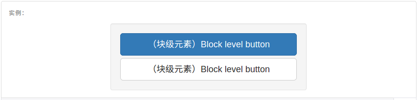

```html
<button type="button" class="btn btn-primary btn-lg btn-block">（块级元素）Block level button</button>
<button type="button" class="btn btn-default btn-lg btn-block">（块级元素）Block level button</button>
```

#### 激活状态

- 当按钮处于激活状态时，其表现为被按压下去（底色更深、边框夜色更深、向内投射阴影）。对于 `<button>` 元素，是通过 `:active` 状态实现的。对于 `<a>` 元素，是通过 `.active` 类实现的。然而，你还可以将 `.active` 应用到 `<button>` 上（包含 `aria-pressed="true"` 属性)），并通过编程的方式使其处于激活状态。

##### button 元素

- 由于 `:active` 是伪状态，因此无需额外添加，但是在需要让其表现出同样外观的时候可以添加 `.active` 类。

```html
<button type="button" class="btn btn-primary btn-lg active">Primary button</button>
<button type="button" class="btn btn-default btn-lg active">Button</button>
```

##### 链接（`<a>`）元素

- 可以为基于 `<a>` 元素创建的按钮添加 `.active` 类。

```html
<a href="#" class="btn btn-primary btn-lg active" role="button">Primary link</a>
<a href="#" class="btn btn-default btn-lg active" role="button">Link</a>
```

#### 禁用状态

- 通过为按钮的背景设置 `opacity` 属性就可以呈现出无法点击的效果。

##### button 元素

- 为 `<button>` 元素添加 `disabled` 属性，使其表现出禁用状态。

```html
<button type="button" class="btn btn-lg btn-primary" disabled="disabled">Primary button</button>
<button type="button" class="btn btn-default btn-lg" disabled="disabled">Button</button>
```

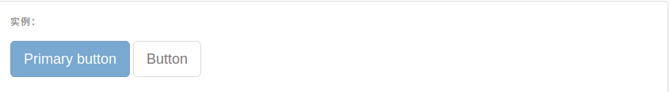

##### 链接（`<a>`）元素

- 为基于 `<a>` 元素创建的按钮添加 `.disabled` 类。

```html
<a href="#" class="btn btn-primary btn-lg disabled" role="button">Primary link</a>
<a href="#" class="btn btn-default btn-lg disabled" role="button">Link</a>
```

### 9.图片

#### 响应式图片

- 在 Bootstrap 版本 3 中，通过为图片添加 `.img-responsive` 类可以让图片支持响应式布局。其实质是为图片设置了 `max-width: 100%;`、 `height: auto;` 和 `display: block;` 属性，从而让图片在其父元素中更好的缩放。
- 如果需要让使用了 `.img-responsive` 类的图片水平居中，请使用 `.center-block` 类，不要用 `.text-center`。

```html

```

#### 图片形状

- 通过为 `` 元素添加以下相应的类，可以让图片呈现不同的形状。

> #### 跨浏览器兼容性
>
> 请时刻牢记：Internet Explorer 8 不支持 CSS3 中的圆角属性。

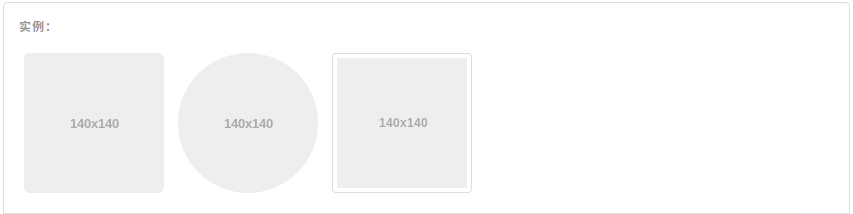

```html
<div class="container-fluid">
      
      
      
    </div>
```

### 10.响应式工具

#### 可用的类

- 通过单独或联合使用以下列出的类，可以针对不同屏幕尺寸隐藏或显示页面内容。

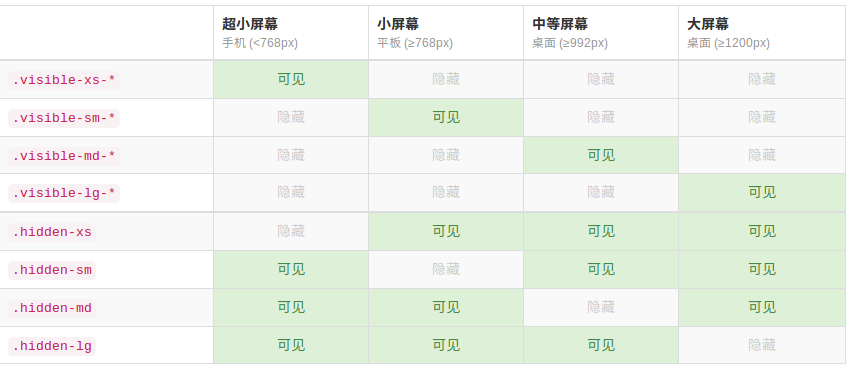

- 从 v3.2.0 版本起，形如 `.visible-*-*` 的类针对每种屏幕大小都有了三种变体，每个针对 CSS 中不同的 `display` 属性，列表如下：

| 类组                        | CSS `display`            |
| ------------------------- | ------------------------ |
| `.visible-*-block`        | `display: block;`        |
| `.visible-*-inline`       | `display: inline;`       |
| `.visible-*-inline-block` | `display: inline-block;` |

- 因此，以超小屏幕（`xs`）为例，可用的 `.visible-*-*` 类是：`.visible-xs-block`、`.visible-xs-inline` 和 `.visible-xs-inline-block`。

  `.visible-xs`、`.visible-sm`、`.visible-md` 和 `.visible-lg` 类也同时存在。但是**从 v3.2.0 版本开始不再建议使用**。除了 `<table>` 相关的元素的特殊情况外，它们与 `.visible-*-block` 大体相同。

## 补充内容

### 代码块(pre)

```html
<pre>
    看说就看过看到机会大家好看到机会就的客户机  到说建行卡的建行卡     的建行卡
 </pre>

<pre>
    var a = 10;
    for(var i = 0;i <10; i++){
       console.log(i);
    }
</pre>
```
