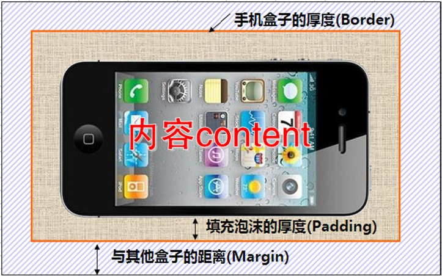
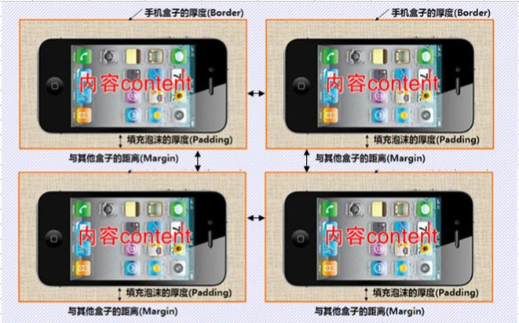
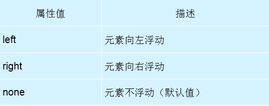

## CSS盒子模型/浮动问题/定位问题

[TOC]

### 1.盒子模型(有两种/border-box/centent-box)

- 　所谓盒子模型就是把HTML页面中的元素看作是一个矩形的盒子，也就是一个盛装内容的容器。每个矩形都由元素的内容、内边距（padding）、边框（border）组成。




- **如果把手机想象成HTML元素，那么手机盒子就是一个CSS盒子模型，其中手机为CSS盒子模型的内容，填充泡沫的厚度为CSS盒子模型的内边距，纸盒的厚度为CSS盒子模型的边框。 **
- 多个手机放在一起时



- 最终的网页就是有多个盒子组成。

### 2.盒子宽度和高度的计算

#### centent-box(内容宽高固定)

总体Width  =  border_left  +  padding_left  +  内容width(固定)  +  padding_right  + border_right ;

总体Height =  border_top  + padding_top  +  内容Height(固定) + padding_ bottom + border_bottom ;

#### border-box(总体宽高固定)

总体Width(固定)  =  border_left  +  padding_left  +  内容width  +  padding_right  + border_right ;

总体Height(固定) =  border_top  + padding_top  +  内容Height + padding_ bottom + border_bottom ;

### 3. 边框属性 border

- **border : none;**     去掉边框


- border-width	边框宽度
- border-style          边框样式
- border-color         边框颜色

```html
以上边框为例，其余方向类似
<!--
	上边框宽度：border-top-width:10px;
	上边框颜色：border-top-color:red;
	上边框样式：border-top-style:solid;
-->
<!--
	样式:solid(实线)
		dashed(虚线)
		dotted(点线)
		double(双实线)
-->
```

#### 边框的综合设置（上\右\下\左）

(上下对称，左右对称，style 必须设置)

－	边框宽度

- border-width:10px  20px  30px  40px ;

  －边框样式

- border-style: solid dotted  dashed  double ;

  －边框颜色

- border-color: red  green  blue  pink ;

－　单独一个边框的设置方法（以上边框为例）

- border-top : 10px  solid  red ;	(style 必须设置，否则无效)
- border-left : 10px  solid  red ;
- border-right : 10px  solid  red ;
- border-bottem : 10px  solid  red ;

－　边框都一样

- border : 10px  solid  red ;

#### 去掉表格间隙 border-collapse

- border-collapse : collapse ;

### 4.内边距padding属性

- padding-top: 上内边距
- padding-right: 右内边距
- padding-bottom: 下内边距
- padding-left: 左内边距

  －**综合设置：padding: 上内边距[右内边距 下内边距 左内边距]**

  - padding: 10px;(默认全部为10px)
- padding: 10px 20px;  (上下为10px,左右为20px;)
- padding: 10px 20px 30px;  (上为10px,下为30px,左右都是20px;)

### 5.外边距margin属性

- margin-top: 上外边距
- margin-right: 右外边距
- margin-bottom: 下外边距
- margin-left: 左外边距

综合设置：margin: 上外边距[右外边距 下外边距 左外边距]

- margin: 10px;
- margin: 10px 20px;
- margin: 10px auto; 实现盒子水平居中
- margin: 10px 20px 30px;

#### 上下外边距合并（块元素）

－	行元素无法设置margin-top和margin-bottom

```
上下外边距合并
  同级元素margin-bottom margin-top
  都是正值，间距取最大值
  是正负值，间距求和
  都是负值，重叠 为绝对值最大的一个
注意:
1.外边距可以使用负值，使相邻元素重叠。
2.可能会出现外边距合并情况
3.为了方便操作,可以用
* {
	margin:0;
	padding: 0
}
取消浏览器的默认属性。
```

#### 嵌套上外边距合并问题的解决办法（块元素）

- 对于两个嵌套关系的块元素，如果父元素没有上内边距及边框，则父元素的上外边距会与子元素的上外边距发生合并，**合并后的外边距为两者中的较大者**，即使父元素的上外边距为0，也会发生合并。

```
解决方法：
    1. 给父元素添加边框 border,相对的父元素减去相对应的值
    2. 给父元素添加padding,相对应的父元素减去对应的值
```

#### 左右外边距合并

```
左右外边距合并
	同级元素margin-left和margin-right
	都是正值，求和
	是正负值，也求和
行元素没法设置上下外边距
```

#### margin居中问题

－	单个水平居中问题

- margin : 0  auto;

－　**父子关系的子完全居中问题（4种方法）**

- **宽度和高度未知**	
  1.   父盒子相对定位，子盒子绝对定位
  2.   子元素 top、right、bottom、left 全部为0
  3.   子元素的margin：auto；


```css
.two {
        width: 500px;
        height: 300px;
        background-color: blue;
        position: relative;
      }

      .two_s {
        width: 300px;
        height: 200px;
        text-align: center;
        line-height: 200px;
        background-color: pink;
        margin: auto;
        position: absolute;
        top: 0px;
        left: 0px;
        right: 0px;
        bottom: 0px;
      }
```

- **宽高是已知的**  


1.   父盒子相对定位，子盒子绝对定位
2.   left : 50% , top : 50% ;
3.   margin-left : 负的 子元素宽的一半
4.   margin-top :  负的 子元素 高的一半

```css
.one {
        width: 500px;
        height: 300px;
        background-color: red;
        position: relative;
      }

      .one_s  {
        width: 300px;
        height: 200px;
        line-height: 200px;
        text-align: center;
        background-color: green;
        position: absolute;
        top: 50%;
        left: 50%;
        margin-left: -150px;
        margin-top: -100px;
      }
```

- 设置transform:translate(-50%,-50%)(移动)


```html
<style>
  .f {
  width: 800px;
  height: 500px;
  background: lightblue;
  margin-top: 50px;
  /*父元素设置相对定位,口号*/
  position: relative;
}

.f > .s {
  width: 600px;
  height: 400px;
  background: pink;
  position: absolute;
  /*这里的 50% 是相对于 设置过定位的最近的祖先元素 的50%*/
  top: 50%;
  left: 50%;
 
  /*
  margin-left: -100px;
  margin-top: -50px;
  */
  
  /*transform可以直接使用百分比进行设置*/
   /*这里的 -50% 是相对于 自身 的50% */
  transform: translate(-50%,-50%);
}
</style>
```

- 4------------------------------------------


[TOC]

---

## float浮动问题

－	元素的浮动是指**设置了浮动属性的元素会脱离标准文档流的控制，移动到其父元素中指定位置的过程**。比喻：游泳池的池底以及水面游泳池的池底相当于标准流（文档流），水面相当于浮动的元素所有“层”。水面的元素会遮挡水中的元素)。

### 标准流和非标准流

- 标准流：按照标签的顺序和默认的行为进行显示，占据页面位置
- 非标准流（脱离标准流）：不一定按照顺序排列，不占页面位置
- ( 脱离标准流 )，不占原来的位置，后边的元素都会跟上来

### 1.浮动的CSS定义格式

```
选择器　｛
	float:属性值；
	｝

	属性值包括：left,right,none;
```



### 2.浮动的特点

1. 浮动脱离标准流，不占位置，会影响标准流。浮动只有左右浮动。
2. 浮动的元素A排列位置，跟上一个元素（块级）有关系。如果上一个元素有浮动，则A元素顶部会和上一个元素的顶部对齐；如果上一个元素是标准流，则A元素的顶部会和上一个元素的底部对齐。
3. 一个父盒子里面的子盒子，如果其中一个子级有浮动的，则其他子级都需要浮动。这样才能一行对齐显示。
4. 浮动根据元素书写的位置来显示相应的浮动。
5. 元素添加浮动后，元素会具有行内块元素的特性。元素的大小完全取决于定义的大小或者默认的内容多少。
6. 如果一个div没有设置高，这个div中的所有的元素都浮动了(脱离标准流)，那么这个div的高是0。

### 3.浮动的影响和清除

#### 01) 浮动的影响

- 如果在一个大的**没有设置高的div**中有两个小的子div，那么这个大的div的高就是这两个小div之和，但是一旦两个小的div都浮动了，那么大的div高度就变为0，因为浮动之后div不会撑开父容器。这种情况会导致父盒子div后边的同级元素会和当前盒子中的浮动的子盒子重叠显示，导致页面混乱。(**父元素没有高度，而所有的元素都浮动了，会导致父元素高度为0.那么就不占页面位置，就会出现元素重叠。**)


#### 02) 浮动的清除方式(四种方式 -- height/clear/overflow/伪元素)

##### 1.直接给父盒子设置一个高度

- (严格的说不算清除浮动)。这种方式简单方便，但是当父盒子没有办法直接设置高度就必须用其他方法清除浮动。

##### 2.在发生浮动的父盒子中的最后添加一个空元素，然后给该空元素设置clear属性值。

```html
<p style="clear:both;"></p>
```

| clear属性值 | 含义     |
| -------- | ------ |
| left     | 清除左浮动  |
| right    | 清除右浮动  |
| both     | 清除所有浮动 |

但是当页面中发生浮动的元素很多时就需要添加很多空元素，不推荐使用。

##### 3.直接给父盒子设置overflow属性

```
overflow：hidden;
```

这种方式简单方便，但是如果页面一旦出现了定位，那么定位可能会受到影响。

**overflow的其它应用：(在此与清除浮动无关)**

| overflow值  | 含义                  |
| ---------- | ------------------- |
| **hidden** | **超出部分隐藏**          |
| scroll     | 超出部分显示滚动条           |
| **auto**   | **超过部分显示滚动条，否则不显示** |

##### 4.终极方法--使用伪元素清除浮动(不理解先背下来会用)

```html
.clearfix::after , .clearfix::before {
	content: ""; 			<!--content必须填写,去掉之后类失效-->
	height: 0; 				<!--伪元素高度为0-->
	display: block; 		<!--display实现行元素和块元素的任意转换-->
	visibility: hidden; 	<!--设置元素不可见-->
	line-height: 0; 		<!--设置行高为0-->
	clear: both; 			<!--clear清除浮动-->
}
.clearfix {
	zoom: 1;				//兼容ie
} 							<!--可以查看新浪等网站查看 -->
```

### 4. visibility 属性(设置元素是否可见)

- visibility 属性规定元素是否可见。
- 提示：**即使不可见的元素也会占据页面上的空间**。
- 使用 **"display" 属性**来创建**不占据页面空间的不可见元素**。(display:none;)

| 值           | 描述                                       |
| ----------- | ---------------------------------------- |
| **visible** | 默认值。**元素是可见的**。                          |
| **hidden**  | **元素是不可见的。**                             |
| collapse    | 当在表格元素中使用时，此值可删除一行或一列，但是它不会影响表格的布局。被行或列占据的空间会留给其他内容使用。如果此值被用在其他的元素上，会呈现为 "hidden"。 |
| inherit     | 规定应该从父元素继承 visibility 属性的值。              |

### 5. Display

- 使用 **"display" 属性**来创建**不占据页面空间的不可见元素**。(display:none;)

| 值            | 描述                        |
| ------------ | ------------------------- |
| none         | 设置元素不可见(并且不占据页面空间)        |
| block        | 设置元素显示；将行元素转换为块元素         |
| inline       | 设置元素显示；将块元素转换为行元素         |
| inline-block | 设置元素显示；可以实现行元素和块元素之间的相互转换 |

#### 行元素

-  默认display的值为 inline，**普通行元素是不可以设置宽高的，设置无效。**


- **input, img属于行元素的个例，可以设置宽高。**


- **如果需要对行元素设置宽高**，可以把display:inline-block 或者 block;

```html
<html>
<head>
  <style>
  	.inline_ele {
      width: 500px;
      height: 100px;
      background: red;
      display: inline-block;
    }
  </style>
</head>
<body>
	<span class="inline_ele" >第一段</span>	<!--
													span本来是行元素
													现在已经转换为块元素了
												-->
	<span>第二段</span>
</body>
</html>
```

#### 块元素

-  默认display的值为 block.
-  如果需要让块元素用于行元素的特点，可以把display:inline-block 或者 inline;

[TOC]

---

## 定位问题(position)

### 1.基本思想

- 定位的基本思想很简单，它允许你定义元素框相对于其正常位置应该出现的位置，或者相对于父元素、另一个元素甚至浏览器窗口本身的位置。
- 定位：就是通过对元素进行相对偏移或者绝对偏移，来对元素的位置进行摆放。
- 相对于自己原先的位置定位，属于标准流。

### 2.常用定位的属性值

- static, 默认情况下浏览器中所有的盒子都是静态的。
- relative, 相对定位，元素相对于自身位置的移动。
- absolute, 绝对定位,有三种情况。
  - 如果盒子没有body之外其他的祖先元素，那么在绝对定位的时候这个位置是相对于body的。
  - 如果盒子有祖先元素，但是祖先元素并没有设置定位，那么在绝对定位的时候这个位置还是相对于body的。
  - 如果盒子有祖先元素并且祖先元素有定位(absolute,relative都可以)，那么这个时候我们的盒子定位是相对于最近一个设置过定位的祖先元素的。
- fixed, 固定，以窗口页面进行定位，不会随着滚动条移动。

### 3.relative(相对定位)的用法

- **相对于自己原先的位置定位，属于标准流。（占用位置）**


- position : relative ;
- top : 10px;
- left : 10px;

### 4.absolute(绝对定位)的用法

**脱离标准流，（不占用位置）**

- **1)、除了body之外，没有其他祖先元素此时的绝对定位是相对于body**
- **2)、有父元素 f,但是f并没有设置过任何定位的属性，仍然相对于body定位**
- **3)、只要祖先元素中有任何一个设置过 relative,absolute,fixed其中一个值的。那么该元素绝对定位时，是相对于最近设置过定位的元素。**

```html
<!--子绝父相-->
父元素不用设置移动位置
只写position：relative；
```

### 5.fix(固定定位)的用法

**脱离标准流，（不占用位置）**

- position: fixed;
- left: 200px;
- top: 200px;

### 6.position不同值的特点(是否脱离标准流)

| 属性值      | 是不是标准流 |
| -------- | ------ |
| static   | 是      |
| relative | 是      |
| absolute | 否(脱离)  |
| fixed    | 否(脱离)  |

### 7.精灵图/雪碧图(sprite)

```html
<head>
    <meta charset="utf-8">
    <title>精灵图</title>
    <style>
      * {
        margin: 0;
        padding: 0;
      }
      .one {
        width: 23px;
        height: 22px;
        border: 1px solid red;
        margin: 50px auto;
        background: url("./images/sprite.png") -88px -46px;
      }
    </style>
  </head>
  <body>
    <div class="one"></div>
  </body>
```

## 补充内容

- 无论父元素是relative，absolute，后代的绝对定位都是相对于父元素的．
- 绝对定位默认跟着body走
- ul中的li元素需要浮动到一行上，
  - 只和他们**父元素的宽度**有关系，和其他祖先元素没有关系．
  - 只要父元素足够宽，那么就可以浮动到一行

### 层级(显示使用Ｚ-index)

> - 一行排列,默认情况下,从左到右,层次从0开始椎间递增,最大无限接近于1
> - 在同一个位置，都有定位。那么按照顺序，后边的层级要高于前边的！！！！
> - 父子关系与父兄弟之间的层级关系,只要父子关系中的一个设置了层级之后,都会超过父兄弟的层级

**z-index 必须和除了static以外的其他定位配合使用,否则无效.**

```html
<style>
      * {
        margin: 0;
        padding: 0;
      }

      ul li {
        list-style: none;
      }

      .one {
        height: 90px;
        width: 500px;
        margin: 50px auto;
      }

      .one li {
        width: 80px;
        height: 80px;
        border: 3px solid green;
        float: left;

        /*
        向左偏移，让中间的边框重叠
        */
        margin-left: -3px;
      }

      .one li:hover {
        border-color: purple;

        /*
        z-index必须和static以外的其他定位只配合使用，否则无效。
        */
        position: relative;
        z-index: 2;
      }

      .two,.three {
        width: 100px;
        height: 100px;
        position: absolute;
        top: 0;
        left: 0;
      }

      .two {
        background: yellow;
        z-index: 1;
      }

      .three{
        background: blue;
      }

      .four {
        height: 200px;
        border: 1px solid red;
        position: relative;
        z-index: 2;
      }

      .four_s {
        /*
        默认和父元素的层级一样！！！！！！
        也可以自己设置z-index!!!!
        */
        width: 100px;
        height: 100px;
        background: purple;
        position: absolute;
        top: 0;
        left: 0;
      }

      .five {
        width: 100px;
        height: 100px;
        position: absolute;
        top: 191px;
        left: 1px;
        background: pink;
      }

    </style>
  </head>
  <body>
    <ul class="one">
      <!--
      一行排列，默认情况下：从左到右，层级从0开始逐渐递增,最大无限接近于1
      -->
      <li>1</li>
      <li>2</li>
      <li>3</li>
      <li>4</li>
      <li>5</li>
    </ul>
    
    <!--
    在同一个位置，都有定位。
    那么按照顺序，后边的层级要高于前边的！！！！
    -->
    <div class="two"></div>
    <div class="three"></div>

	<!--
	父子关系与父兄弟之间的层级关系
	-->
    <div class="four">
      <div class="four_s"></div>
    </div>

    <div class="five"></div>

  </body>
```


