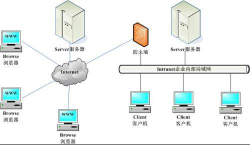

## HTML结构/基础标签/列表/meta标签的作用

[TOC]

### 1.复习Linux的基本命令

－文件的基本操作

- touch
- cp
- mv 
- cat
- ls
- ls  -al

－目录的基本操作

- mkdir
- rmdir
- find
- rm
- rm -rf

－文档的归档和压缩

- 使用gzip和gunzip对[文件](#)进行压缩和解压缩(.gz)
  - 压缩：gzip   filename
  - 解压缩：gunzip   filename
- 使用bzip2和bunzip2对[文件](#)进行压缩和解压缩(.bz2)
  - 压缩：bzip2   filename
  - 解压缩：bunzip2   filename
- 使用tar对[文件和目录](#)进行压缩和解压缩
  - 压缩：（Ｃ:表示创建；F:表示文件目录；j	: bz2格式  ;  J  :  xz格式）
    - tar     czf     filename.tar.gz    filename
    - tar     cjf     filename.tar.bz2   filename
    - tar     cJf     filename.tar.xz    filename
  - 解压缩（V : 看过程）
    - tar   xzf   filename.tar.gz
    - tar   xvf   fimename.tar.[ ]   (想解压成什么格式就写什么)

### 2.安装HTML开发工具

- 安装atoma编辑器：

```
$ sudo apt-get install atom -y
```

- 安装chrome浏览器：官网下载软件包[chrome](https://www.google.cn/chrome/browser/desktop/index.html)	

```
$ sudo dpkg -i google-chrome-stable_current_amd64.deb
```

- 安装gimp图形处理工具：

```
$ sudo apt-get install gimp -y
```

- 安装shutter截图工具：

```
$ sudo apt-get install shutter -y
```

### 3.关于浏览器和服务器

#### 浏览器

- 浏览器是指可以显示网页服务器或者文件系统的HTML文件（标准通用标记语言的一个应用）内容，并让用户与这些文件交互的一种软件。国内网民计算机上常见的网页浏览器有，QQ浏览器、Internet　Explorer、Firefox、Safari，Opera、Google Chrome、百度浏览器、搜狗浏览器、猎豹浏览器、360浏览器、UC浏览器、傲游浏览器、世界之窗浏览器等，浏览器是最经常使用到的客户端程序。

#### 服务器

- 服务器，也称伺服器，是提供计算服务的设备。由于服务器需要响应服务请求，并进行处理，因此一般来说服务器应具备承担服务并且保障服务的能力。服务器的构成包括处理器、硬盘、内存、系统总线等，和通用的计算机架构类似，但是由于需要提供高可靠的服务，因此在处理能力、稳定性、可靠性、安全性、可扩展性、可管理性等方面要求较高。在网络环境下，根据服务器提供的服务类型不同，分为文件服务器，数据库服务器，应用程序服务器，WEB服务器等


#### 浏览器和服务器的关系



### 4.了解http协议

#### HTTP协议

- 超文本传输协议（HTTP，HyperText Transfer Protocol)是互联网上应用最为广泛的一种网络协议。所有的WWW文件都必须遵守这个标准。设计HTTP最初的目的是为了提供一种发布和接收HTML页面的方法。
- HTTP是一个客户端和服务器端请求和应答的标准（TCP）。客户端是终端用户，服务器端是网站。通过使用Web浏览器、网络爬虫或者其它的工具，客户端发起一个到服务器上指定端口（默认端口为80）的HTTP请求。
- 通过HTTP或者HTTPS协议请求的资源由统一资源标示符（Uniform Resource Identifiers）（或者，更准确一些，URLs）来标识。
- HTTP协议包括，头部，主体，状态码。

#### 常见状态码

- 1xx:信息
- 2xx:成功
- 3xx:重定向
- 4xx:客户端错误
- 5xx:服务器错误

#### HTML

- 超文本标记语言，标准通用标记语言下的一个应用。“超文本”就是指页面内可以包含图片、链接，甚至音乐、程序等非文字元素。主要用于
- 描述文档的内容，无法描述文档的样式(类似txt文本和word)。

#### 后缀名

- HTML是一个网页文件的拓展名，和txt、jpg、mp3一样，是一个文件格式。.html文件就是网页文件。后缀名与文件之间是没有直接的关系。


- 后缀名仅仅决定了文件的打开方式
- 真正决定文本类型的是文件的内容

#### HTML发展

- 超文本标记语言（第一版）——在1993年6月作为互联网工程工作小组（IETF）工作草案发布（并非标准）：
- HTML 2.0——1995年11月作为RFC 1866发布，在RFC 2854于2000年6月发布之后被宣布已经过时
- HTML 3.2——1997年1月14日，W3C推荐标准
- HTML 4.0——1997年12月18日，W3C推荐标准
- HTML 4.01（微小改进）——1999年12月24日，W3C推荐标准
- HTML 5——2014年10月28日，W3C推荐标准 <https://www.w3.org>


### 5.HTML结构

```html
示例代码：
<!DOCTYPE>
<html>  -->html是一个双标签 开始标签
<head>
<meta http-equiv="Content-Type" content="text/html;charset=UTF-8" />
<title></title> -->可能是标题
</head>
<body>-->用来存放页面中的内容
 你的第一个HTML页面
</body>
</html> -->结束标签
```

#### 了解格式中每个标签的含义

```html
<!DOCTYPE　html>   ---->文档类型声明DOCTYPE用于声明文档类型，
			告诉浏览器用什么标准去解析该页面！！
<html></html> 	   ---->整个文档页面
<meta/>            ---->设置页面编码格式，关键字，以及页面的描述
<title></title>    ---->标题部分
<head></head>      ---->页面的头部分,用于对页面进行设置
<body></body>      ---->页面的主体部分用于显示页面内容
```


### 6.HTML基础标签

#### HTML中的注释方式

－	在HTML中还有一种特殊的标记——注释标记。如果需要在HTML文档中添加一些便于阅读和理解但又不需要显示在页面中的注释文字，就需要使用注释标记。
其基本语法格式如下：

body部分:`<!-- 我是注释  --->`

head部分:`/* 我是注释 */`

#### 常见标签学习

|   标签   |              格式               |
| :----: | :---------------------------: |
|   段落   |           \<p>\</p>           |
|   标题   |             h1－h6             |
|   水平   |              hr               |
|   换行   |             \<br>             |
|   加粗   | \<b>\</b>/\<strong>\</strong> |
|   倾斜   |     \<i>\</i>/\<em>\</em>     |
|  删除线   |    \<s>\</s>/\<del>\</del>    |
|  下划线   |    \<u>\</u>/\<ins>\</ins>    |
| 原始样式显示 |         \<pre>\</pre>         |

#### 图像标签img

－	HTML网页中任何元素的实现都要依靠HTML标记，要想在网页中显示图像就需要使用图像标记。

```html

```


|  属性   |      作用       |
| :---: | :-----------: |
| title |      标题       |
|  src  |      路径       |
|  alt  | 图像不正常显示时的文本提示 |

#### 创建超链接及锚点

－	在HTML中创建[超链接](#)非常简单，只需用标记环绕需要被链接的对象即可，其基本语法格式如下：

```html
<a href="www.baidu.com" target="_blank">百度</a>			<!--绝对路径-->
<a href="./home/01.html" target="_blank">我的电脑</a>	　　　　<!--相对路径-->
<a href="#">空链接跳转</a>

－　href：用于指定链接目标的url地址，当为<a>标记应用href属性时，它就具有了超链接的功能。href必须有，否则没有来链接效果
  
－　target：用于指定链接页面的打开方式，其取值有_self和_blank两种，		　
	  _self为默认值，
	　_blank为在新窗口中打开方式。
```

－	通过创建[锚点链接](#)，用户能够快速定位到目标内容。

```html
<!-- 锚点，跳到指定位置  -->

    <!-- 点击a,跳到指定文件的指定位置  -->

    <!--
    a锚点中指定的  #name   , 此处的name是要跳到的位置的id值。
    id属性值不要重复，必须保证在一个页面中唯一！！！！！！
    -->
	<a href="#p1">跳到p1位置</a>				<!--当前页-->
        <a href="./05.html#p2">跳到p2位置</a>		        <!--其它页-->
```

#### HTML特殊字符

－	HTML为这些特殊字符准备了专门的替代代码

| 特殊字符 |   描述    |    字符代码    |
| :--: | :-----: | :--------: |
|  <   |   小于号   |   `&lt;`   |
|  >   |   大于号   |   `&gt;`   |
|  &   |   和号    |  `&amp;`   |
|  ￥   |   人民币   |  `&yen;`   |
|  ©   |   版权    |  `&copy;`  |
|  ®   |  注册商标   |  `&reg;`   |
|  °   |   摄氏度   |  `&deg;`   |
|  ±   |   正负号   | `&plusmn;` |
|  ×   |   乘号    | `&times;`  |
|  ÷   |   除号    | `divide;`  |
|  ²   | 平方２(上标) |  `&sub2;`  |
|  ³   | 立方３(上标) |  `&sub3;`  |
|      |   空格符   |  `&nbsp;`  |

---

### 7.列表

> 任何不是描述性的文本的任何内容都可以认为是列表

#### 无序列表`ul`

－	无序列表的各个列表项之间没有顺序级别之分，是并列的。其基本语法格式是:

```html
<ul>					　　　<!--定义无序列表-->
  <li>列表项一</li>				　<!--描述具体的列表项-->
  <li>列表项二</li>
  <li>列表项三</li>
</ul>
```

－	在上面的语法中，`<ul></ul>`标记用于定义无序列表，`<li></li>`标记嵌套在`<ul></ul>`标记中，用于描述具体的列表项，每对`<ul></ul>`中至少应包含一对`<li></li>`。

注意:
不赞成使用无序列表的type属性，一般通过CSS样式属性替代。

```html
<li></li>之间相当于一个容器，可以容纳所有元素。但是<ul></ul>中只能嵌套<li></li>，直接在<ul></ul>标记中输入文字的做法是不被允许的。
```


#### 有序列表`ol`

> 有序列表即为有排列顺序的列表，其各个列表项按照一定的顺序排列定义，有序列表的基本语法格式如下:

```html
<ol>
  <li>列表项一</li>
  <li>列表项二</li>
  <li>列表项三</li>
</ol>
```

```html
语法结构和无序列表ul一样。在有序列表中，除了type属性之外，还可以为<ol>定义start属性、为<li>定义value属性，它们决定有序列表的项目符号。
注意:
各浏览器对有序列表的type和value属性的解析不同。
不赞成使用<ol><li>的type、start和value属性，可通过CSS样式替代。
```

#### 定义列表(dl)

－	定义列表常用于对术语或名词进行解释和描述，定义列表的列表项前没有任何项目符号。其基本语法如下：

```html
<dl>
    <dt>名词1</dt>
    <dd>名词1解释1</dd>
    <dd>名词1解释2</dd>

    <dt>名词2</dt>
    <dd>名词2解释1</dd>
    <dd>名词2解释2</dd>
</dl>
```

## 补充内容

### 1.当你在浏览器地址栏输入一个URL后回车，将会发生的事情？

* 进行DNS解析，得到IP
* 三次握手，建立TCP连接
* 发送http请求（可能是一堆请求）
* 服务器响应（根据客户端的缓存情况，返回内容）
* 浏览器接收响应，根据接收内容进行渲染，显示


### 2.meta标签

### 1).name属性

- name属性主要用于描述网页，与之对应的属性值为content，content中的内容主要是便于搜索引擎机器人查找信息和分类信息用的。

#### 页面关键词

- keywords用来告诉搜索引擎你网页的关键字是什么。 

```html
<meta name="Keywords" content="网上购物,网上商城,手机,笔记本,电脑,MP3,CD,VCD,DV,相机,数码,配件,手表,存储卡,京东" />
```

#### 页面描述

- description用来告诉搜索引擎你的网站主要内容

```html
<meta name="description" content="京东JD.COM-专业的综合网上购物商城,销售家电、数码通讯、电脑、家居百货、服装服饰、母婴、图书、食品等数万个品牌优质商品.便捷、诚信的服务，为您提供愉悦的网上购物体验!" />
```

#### 移动设备

```html
<meta name="viewport" content="width=device-width,initial-scale=1,maximum-scale=1,mininum-scale=1,user-scalable=no" />
```

#### 定义网页作者

- 标注网页的作者

```html
 <meta name="author" content="author name" /> 
```

#### generator

- generator的信息参数，代表说明网站的采用的什么软件制作。 

```html
<meta name="generator"content="信息参数"/> 
```

#### COPYRIGHT(网站版权信息)

- COPYRIGHT的信息参数，代表说明网站版权信息

```html
<META NAME="COPYRIGHT"CONTENT="信息参数"> 
```

#### revisit-after

- revisit-after代表网站重访,7days代表7天，依此类推。

```html
<META name="revisit-after"CONTENT="7days"> 
```

#### 申明编码　　

```html
<meta charset='utf-8' />
```

#### 搜索引擎索引方式

- robots用来告诉搜索机器人哪些页面需要索引，哪些页面不需要索引

```html
<meta name="robots" content="index,follow" />
　　<!--
　　all：文件将被检索，且页面上的链接可以被查询；
　　none：文件将不被检索，且页面上的链接不可以被查询；
　　index：文件将被检索；
　　follow：页面上的链接可以被查询；
　　noindex：文件将不被检索；
　　nofollow：页面上的链接不可以被查询。
　　-->
```

#### 浏览器不会自动调整文件的大小,也就是说是固定大小,不会随着浏览器拉伸缩放。

```html
<meta name="MobileOptimized" content="240"/> 
```

#### 隐藏状态栏/设置状态栏颜色

```html
<meta name="apple-mobile-web-app-status-bar-style" content="black-translucent"/>
```

#### 添加到主屏后的标题

```html
<meta name="apple-mobile-web-app-title" content="标题">
```

#### 忽略数字自动识别为电话号码

```html
<meta name="format-detection" content="telephone=no" />
```

#### 忽略识别邮箱

```html
<meta name="format-detection" content="email=no" />
```

#### 

### 2).http-equiv属性

- http-equiv顾名思义，相当于http的文件头作用，它可以向浏览器传回一些有用的信息，以帮助正确和精确地显示网页内容

#### Refresh(刷新)

- 自动刷新并指向新页面。

```html
<meta http-equiv="Refresh"content="2;URL=http://www.haorooms.com"> //(注意后面的引号，分别在秒数的前面和网址的后面) 
<!--其中的2是指停留2秒钟后自动刷新到URL网址。-->
```

#### Expires(期限)

- 可以用于设定网页的到期时间。一旦网页过期，必须到服务器上重新传输。 

```html
<meta http-equiv="expires"content="Fri,12Jan200118:18:18GMT"> 
```

#### Pragma(cache模式)

- 禁止浏览器从本地计算机的缓存中访问页面内容。 

```html
<meta http-equiv="Pragma"content="no-cache">
```

#### Set-Cookie(cookie设定)

- 如果网页过期，那么存盘的cookie将被删除。 

```html
<meta http-equiv="Set-Cookie"content="cookie value=xxx;expires=Friday,12-Jan-200118:18:18GMT；path=/"> 
<!--必须使用GMT的时间格式。 -->
```

#### Window-target(显示窗口的设定)

- 强制页面在当前窗口以独立页面显示。 

```html
<meta http-equiv="Window-target"content="_top"> 
<!--用来防止别人在框架里调用自己的页面。-->
```

#### content-Type(显示字符集的设定)

- 设定页面使用的字符集。

```html
<meta http-equiv="content-Type"content="text/html;charset=gb2312"> 
```

- GB2312时，简体中文； 
- BIG5时，繁体中文； 
- iso-2022-jp时，日文； 
- ks_c_5601时，韩文； 
- ISO-8859-1时，英文； 
- UTF-8时，代表世界通用的语言编码； 

#### content-Language（显示语言的设定）

```html
<meta http-equiv="Content-Language"content="zh-cn"/> 
```

#### http-equiv="imagetoolbar"

- 指定是否显示图片工具栏，当为false代表不显示，当为true代表显示。

```html
<meta http-equiv="imagetoolbar"content="false"/> 
```

#### Content-Script-Type

- W3C网页规范，指明页面中脚本的类型。

```html
<Meta http-equiv="Content-Script-Type"Content="text/javascript"> 
```

#### 优先使用 IE 最新版本和 Chrome

```html
<meta http-equiv="X-UA-Compatible" content="IE=edge,chrome=1" />
　　<!-- 关于X-UA-Compatible -->
　　<meta http-equiv="X-UA-Compatible" content="IE=6" ><!-- 使用IE6 -->
　　<meta http-equiv="X-UA-Compatible" content="IE=7" ><!-- 使用IE7 -->
　　<meta http-equiv="X-UA-Compatible" content="IE=8" ><!-- 使用IE8 -->
```

#### 禁止浏览器从本地计算机的缓存中访问页面内容

```html
<meta http-equiv="Pragma" content="no-cache">
```


