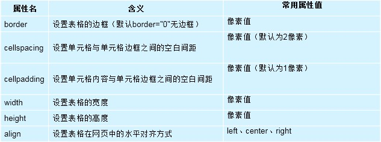
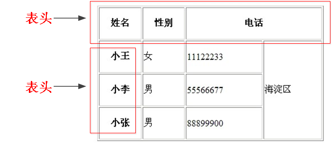

## HTML基本标签(table/div)/标签分类/语义化标签
[TOC]

|   标签   |        含义        |
| :----: | :--------------: |
|  div   |       块容器        |
|  span  |       行容器        |
| style  |      用于填写样式      |
|  link  | 引入外部CSS样式表(href) |
| script |  引入外部js文件(src)   |
|  form  |        表单        |

### 1.Table标签


#### caption标签
－　caption 标签必须紧随 table 标签之后。您只能对每个表格定义一个标题。通常这个标题会被居中于表格之上。

#### th标签

－ 	表头一般位于表格的第一行或第一列，其文本加粗居中，如下图所示，即为设置了表头的表格。设置表头非常简单，只需用表头标记`<th></th>`替代相应的单元格标记`<td></td>`即可。



代码如下：

```html
<!DOCTYPE html>
<html>
  <head>
    <meta charset="utf-8">
    <title>表格标签</title>
  </head>
  <body>
    <table cellspacing="0" align="center" border="1" width="500" height="400" >
      <!-- 设置标题信息 -->
      <caption><h1>学生信息</h1></caption>
      <!-- 设置表头，定义表格头部 -->
      <thead>
        <tr>
        <th>姓名</th>
        <th>性别</th>
        <th colspan="2">电话</th>
      </tr>
      </thead>
      <!-- 设置内容 ，定义表格主体-->
      <tbody>
      <tr align="center">
        <th>小王</th>
        <td>男</td>
        <td>670775</td>
        <td rowspan="3">海淀区</td>
      </tr>
      <tr align="center">
        <th>小李</th>
        <td>女</td>
        <td>626598</td>
      </tr>
      <tr align="center">
        <th>小张</th>
        <td>男</td>
        <td>561245</td>
      </tr>
    </tbody>
    <!-- tfoot 设置尾部，定义表格页脚 -->
    <tfoot>

    </tfoot>
    </table>
  </body>
</html>
```

#### tr标签

- tr只能嵌套td，th，不能嵌套其他！！！！

#### td标签

- td就是容器，什么标签都可嵌套 

  `colspan:`(合并行)

```html
colspan="2"			---> 表示合并两行
```

`rowspan:`	(合并列)

```html
rowspan="3"			---> 表示合并三列
```

#### 表格结构

```html
在使用表格进行布局时，可以将表格划分为头部、主体和页脚，具体 如下所示：
<thead></thead>：用于定义表格的头部，必须位于<table></table>标记中，一般包含网页的logo和导航等头部信息。
<tfoot></ tfoot >：用于定义表格的页脚，位于<table></table>标记中<thead></thead>标记之后，一般包含网页底部的企业信息等。
<tbody></tbody>：用于定义表格的主体，位于<table></table>标记中<tfoot></ tfoot >标记之后，一般包含网页中除头部和底部之外的其他内容。
可以查看比如股票大盘等网站。
```

- border-collapse : collapse ;	CSS设置表格间隙为０．

### 2.div标签

- **\<span>**标签和**\<div>**标签一样也是一个容器，但span是行内元素，而div是块元素。

### 3.像素

－	px是Pixel的缩写，也就是说像素是指基本原色素及其灰度的基本编码，由 Picture(图像) 和 Element（元素）这两个单词的字母所组成的。

－	pixel即像素，它不是自然界的长度单位。px是就是一张图片中最小的点，一张位图就是由这些点构成的。1024px就是1024像素，最简单的你可以在windows桌面属性里的“设置”看到，如果是1024×768，也就是说水平方向上有1024个点，垂直方向上有768个点。谁能说出一个“点”有多长多大么？可以画的很小，也可以很大。如果点很小，那画面就清晰，我们称它为“分辨率高”，反之，就是“分辨率低”。所以，像素的大小是会“变”的，也称为“相对长度”。

－	px 是相对单位，它与**设备无关，只是与尺寸有关**。

### 4.标签分类

－	HTML标记一般分为**块标记**和**行内标记**两种类型，它们也称**块元素**和**行内元素**。

* 块元素,占据整行
* 行元素，根据内容填充
* **块，行是可以相互转换的！！**

#### 块元素(占据整行)

－	每个块元素通常都会独自占据一整行或多整行，可以对其设置宽度、高度、对齐等属性，常用于网页布局和网页结构的搭建。
常见的块元素有`<h1>~<h6>、<p>、<div>、<ul>、<ol>、<li>`等，其中`<div>`标记是最典型的块元素。

#### 行内元素(根据内容填充)

－	行内元素不占有独立的区域，仅仅靠自身的字体大小和图像尺寸来支撑结构，一般不可以设置宽度、高度、对齐等属性，常用于控制页面中文本的样式。
常见的行内元素有`<strong>、<b>、<em>、<i>、<del>、<s>、<ins>、<u>、<a>、<span>`等，其中`<span>`标记最典型的行内元素。

**#注意**

－	在行内元素中有几个特殊的标记`、<input />、<td>`,可以对它们设置宽高和对齐属性，有些资料可能会称它们为行内块元素。

**#注意 ! ! ! !**

#### 元素嵌套

1. 块级元素可以嵌套行元素，也可以嵌套块元素(也有例外)

   ```html
   <h1></h1>标签可以嵌套<p></p>标签，但是<p></p>标签不可以嵌套<h1></h1>标签
   ```

2. 行元素，只能嵌套行元素，不能嵌套块元素

### 5.语义化标签（带有含义的标签，叫语义化标签）

－	w3c标准： html结构 ,css样式 ,js 行为;
－	遵循的原则：先确定语义的HTML ，再选合适的CSS。
－	语义是否良好： 当我们去掉CSS之后，网页结构依然组织有序，并且有良好的可读性。
－	语义化的主要目的就是让大家直观的认识标签(markup)和属性(attribute)的用途和作用。
－	语义化的网页的好处，最主要的就是对搜索引擎友好，有了良好的结构和语义你的网页内容自然容易被搜索引擎抓取。

#### 语义化

1. **没有样式的情况下，网页结构组织有序，并且有良好的可读性。**
2. **便于搜索引擎优化SEO,（提高网站流量，提高搜索引擎的排名）**
3. **尽量使用语义化的标签**

#### 语义化原则

1. **重语义的地方多用有语义的标签，比如 h 和 p 等等，少用没有语义的标签比如 div span 等等。**
2. **如果有地方可以用p 又可以用div， 优先选用 p标签（结构更清晰，特别是文字段落）。**
3. **少用纯样式标签 比如 \<b>, \<u> ,\<font>，可以运用css样式。 如果有强调的地方，可以考虑 \<strong> ,\<em> 等有强调语义的标签。**


## 补充内容

- 块级元素默认的宽度和父元素一样
- width,height都可以使用百分比设置，但是**百分比都是相对于父元素**