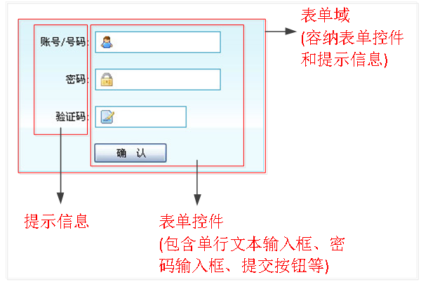
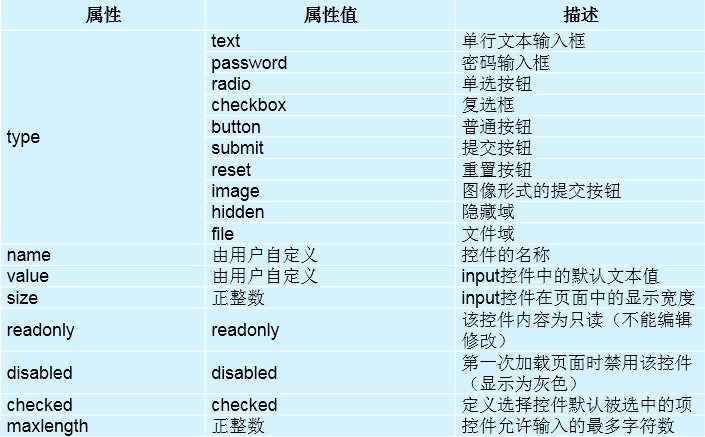
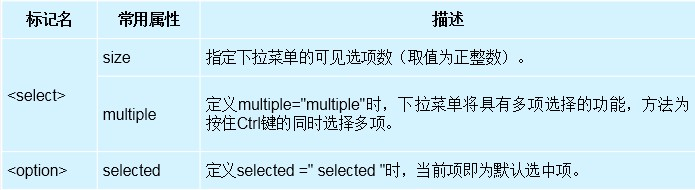

## HTML基础标签(form表单)

[TOC]

### 1.表单

- 表单在网页中主要负责数据采集功能。



####　表单组成

- 对于表单构成中的表单控件、提示信息和表单域，初学者可能比较难理解，对他们的具体解释如下：
  * 表单控件：包含了具体的表单功能项，如单行文本输入框、密码输入框、复选框、提交按钮、重置按钮等。
  * 提示信息：一个表单中通常还需要包含一些说明性的文字，提示用户进行填写和操作。
  * 表单域：他相当于一个容器，用来容纳所有的表单控件和提示信息，可以通过他定义处理表单数据所用程序的url地址，以及数据提交到服务器的方法。如果不定义表单域，表单中的数据就无法传送到后台服务器。

#### form标签

- 在HTML中，form标记被用于定义表单域，即创建一个表单，以实现用户信息的收集和传递，form中的所有内容都会被提交给服务器。创建表单的基本语法格式如下：

```html
<form action="#" method="get" name="form1">
        <input type="text" name="" value="">
</form>
```

- form标签具体属性解释：
  * action, 属性用于指定接收并处理表单数据的服务器程序的URL地址。
  * method, 属性用于设置表单数据的提交方式，其取值为get或post。
  * name, 属性用于指定表单的名称，以区分同一个页面中的多个表单。

#### input控件

- input控件的基本语法格式为：

```html
<input type="类型" ...　/>

<!--在上面的语法中，
<input />标记为单标记，type属性为其最基本的属性，其取值有多种，用于指定不同的控件类型。
-->

// 如何处理 input 表单获取焦点之后的 黄色背景
input:-webkit-autofill {
	-webkit-box-shadow: 0px 0px 0px 100px white inset;
	border:1px solid #ccc !important;
}
```

- 除了type属性之外，\<input />标记



- value可以设置默认值
- 实现单选功能，需要设置name的值相同
- 当type类型选择file类型时　可以设置属性指定某种特殊类型
  - accetp 用于指定类型
  - multiple　允许多选
- readonly 只读，不能修改
- checked 默认选中
- disabled　禁止操作

```html
<!DOCTYPE html>
<html>
  <head>
    <meta charset="utf-8">
    <title>表单</title>
  </head>
  <body>
    <form action="#" method="get">

      <!-- value设置默认值
      maxlength 最大字符个数
      -->

      用户名： <input type="text" name="username" value="admin"  maxlength="10">  <br> <br>
      密码： <input type="password" name="passwd"  value="123"> <br> <br>

      <!--实现单选时，name要一样  -->
      性别： <input type="radio" name="gender"  value="0"> 男
      <input type="radio" name="gender" value="1">女 <br><br>

      课程： <input type="checkbox"  name="sx"> 数学
      <input type="checkbox" name="yw">语文   <br><br>
	  <!--hidden 设置input标签隐藏-->
      VIP: <input type="hidden"> <br><br>

      <!-- accept 用于指定图片的类型
      multiple允许多选
    -->
      <input type="file" name="file" multiple accept="image/*"> <br><br>

      <!--
      readonly只读，不能修改
      checked 默认选中
      disabled 禁止操作
      -->
      <input type="text" value="有本事你改一下" readonly> <br><br>

      <input type="checkbox" checked disabled > 同意  <br><br>

      <input type="reset" value="清空">
      <input type="submit" value="注册">

      <!--通过点击图片完成数据提交  -->
      <input type="image" src="./images/zhaosi.jpg"> 

    </form>
  </body>
</html>
```

#### textarea控件

- 如果需要输入大量的信息，就需要用到textarea标记。
- 通过textarea控件可以轻松地创建多行文本输入框，其基本语法格式如下：

```html
<textarea name="text" cols="列数" rows="行数">
....
</textarea>
```

```html
<!DOCTYPE html>
<html>
  <head>
    <meta charset="utf-8">
    <title>表单</title>
  </head>
  <body>

    <form action="#" method="get"  >
      
      <!--多行文本输入  设置 width height控制宽高 -->
      <textarea name="text" cols="80" rows="5"></textarea> <br><br>
      
    </form>
  </body>
</html>
```

#### select控件

- 当点击下拉符号“ ”时，会出现一个选择列表。在HTML中，要想制作如下图所示的下拉菜单，就需要使用select控件。
- 基本语法格式：

```html
<select>
  <option>选项1</option>
  <option>选项2</option>
  <option>选项3</option>
  ...
</select>
```

- select和option属性



```html
<!DOCTYPE html>
<html>
  <head>
    <meta charset="utf-8">
    <title>表单</title>
  </head>
  <body>
    <form action="#" method="get"  >

      <!-- select下拉菜单
      multiple="multiple" 多选，但是选项都显示
      size="1"控制显示选项的个数
    -->
      
      <select name="food">
        <option value="0">小葱拌豆腐</option>

        <!--默认选项  -->
        <option selected value="1">鱼香肉丝</option>
        <option value="2">老虎菜</option>
        <option value="3">油条</option>
      </select>
    </form>
  </body>
</html>
```

#### fieldset组合控件

- 用于将form中的控件进行分组，filedset没有必须或唯一的属性。
- legend用于给fieldset定义标题。
- 语法格式如下：

```html
<form action="#" method="get">
  <fieldset>
    <legend>标题</legend>
    ...
  </fieldset>
</form>
```

### 2.JQuery中的表单操作

#### 选择器

- :button
- :checkbox
- :checked
- :disabled
- :enabled
- :focus
- :file
- :image
- :input
- :password
- :radio
- :reset
- :selected
- :submit
- :text

#### 表单元素操作

- val()　获取值
- .val(value)设置值

```html
// 从复选框获取选中值
$( "input[type=checkbox][name=bar]:checked" ).val();
```

```html
//设置文本框的值
$("input").val(text);
```

### 3.Get

- GET 方法用于获取由 Request-URI 所标识的资源的信息，常见的形式是：
  GET Request-URI HTTP/1.1

- GET方法是默认的HTTP请求方法，例如当我们通过在浏览器的地址栏中直接输入网址的方式去访问网页的时候，浏览器采用的就是 GET 方法向服务器获取资源。

- 我们可以使用GET方法来提交表单数据，用GET方法提交的表单数据只经过了简单的编码，同时它将作为URL的一部分向服务器发送，因此，如果使用GET方法来提交表单数据就存在着安全隐患上。例如：

  ```html
  http://localhost/login.php?username=aa&password=1234
  ```

- 从上面的URL请求中，很容易就可以辩认出表单提交的内容。（？之后的内容）另外由于GET方法提交的数据是作为URL请求的一部分所以提交的数据量不能太大。这是因为浏览器对url的长度有限制

- 各种浏览器也会对url的长度有所限制，下面是几种常见浏览器的url长度限制:(单位:字符)

  IE : 2803
  Firefox:65536
  Chrome:8182
  Safari:80000
  Opera:190000 

### 4.POST

- POST方法是GET方法的一个替代方法，它主要是向Web服务器提交表单数据，尤其是大批量的数据。 在请求头信息结束之后的两个回车换行之后（实际是空一行），就是表单提交的数据。如上面提到的post表单数据：

  ```html
  username=aa&password=1234
  ```

- POST方法克服了GET方法的一些缺点。通过POST方法提交表单数据时，数据不是作为URL请求的一部分而是作为标准数据传送给Web服务器，这就克服了GET方法中的信息无法保密和数据量太小的缺点。因此，出于安全的考虑以及对用户隐私的尊重，通常表单提交时采用POST方法。

- 从编程的角度来讲，如果用户通过GET方法提交数据，则数据存放在QUERY＿STRING环境变量中，而POST方法提交的数据则可以从标准输入流中获取。

### 5.GET和POST方法区别

1. 在客户端，Get方式在通过URL提交数据，数据在URL中可以看到；POST方式，数据放在HTTP包的body中。
2. GET方式提交的数据大小有限制（因为浏览器对URL的长度有限制），而POST则没有此限制。
3. 安全性问题。正如在（1）中提到，使用 Get 的时候，参数会显示在地址栏上，而 Post 不会。所以，如果这些数据是中文数据而且是非敏感数据，那么使用 get；如果用户输入的数据不是中文字符而且包含敏感数据，那么还是使用 post为好。
4. 服务器取值方式不一样。GET方式取值，如php可以使用\$\_GET来取得变量的值，而POST方式通过\$\_POST来获取变量的值。

### 6.placeholder 浏览器兼容性问题

```html
<!-- 兼容谷歌和苹果 -->
.two::-webkit-input-placeholder{
       color: blue;
 }
<!-- 兼容IE -->
 .two::-ms-input-placeholder {
       color: blue;
 }
<!-- 兼容火狐 -->
 .two::-moz-placeholder {
       color:blue;
}
```

### 7. HTML 框架 iframe

```html
<p>我是 SVG</p>
	<iframe frameborder="0" name="iframe_a" src="./02-html框架iframe.html" width="1000" height="500"></iframe>

	<p><a href="./01.svg" target="iframe_a">链接本页面</a></p>
	<!--
		移除 iframe 的边框
		frameborder="0"
	-->
```

### 8. 数学标记语言 MathML

- MathML 是数学标记语言,是一种基于 XML 的标准.用来在网页上书写数学符号和公式的置标语言
- 使用具有局限性 只可以在Firefox 和 Safari 上使用, Chrome 和 Opera 上无效

```html
<math xmlns="http://www.w3.org/1998/Math/MathML">
		 <mrow>
       <msup><mi>a</mi><mn>2</mn></msup>
       <mo>+</mo>

       <msup><mi>b</mi><mn>2</mn></msup>
       <mo>=</mo>

       <msup><mi>c</mi><mn>2</mn></msup>
     </mrow>
	 </math>
	 <br>
	 <math>
    <mrow>
       <msup>
          <mi>x</mi>
          <mn>2</mn>
       </msup>
       <mo>+</mo>
       <mrow>
          <mn>4</mn>
          <mi>x</mi>
       </mrow>
       <mo>+</mo>
       <mn>4</mn>
			 <mo>=</mo>
	     <mn>0</mn>
    </mrow>
   </math>
	 <br>
	 <math>
		<mrow>
		 <mi>A</mi>
		 <mo>=</mo>

		 <mfenced open="[" close="]">
				<mtable>
					 <mtr>
							<mtd><mi>x</mi></mtd>
							<mtd><mi>y</mi></mtd>
					 </mtr>

					 <mtr>
							<mtd><mi>z</mi></mtd>
							<mtd><mi>w</mi></mtd>
					 </mtr>
				</mtable>
		 </mfenced>
		</mrow>
	 </math>
```

