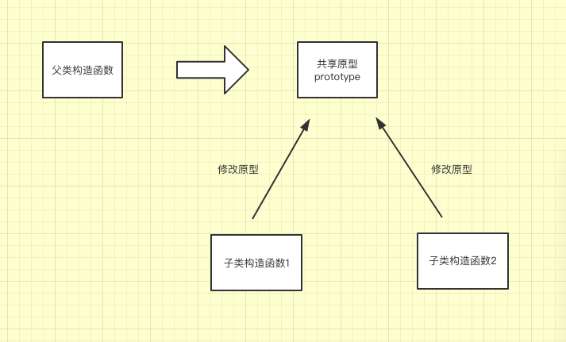
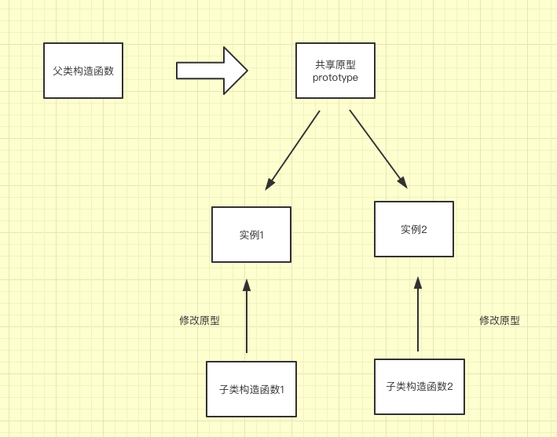
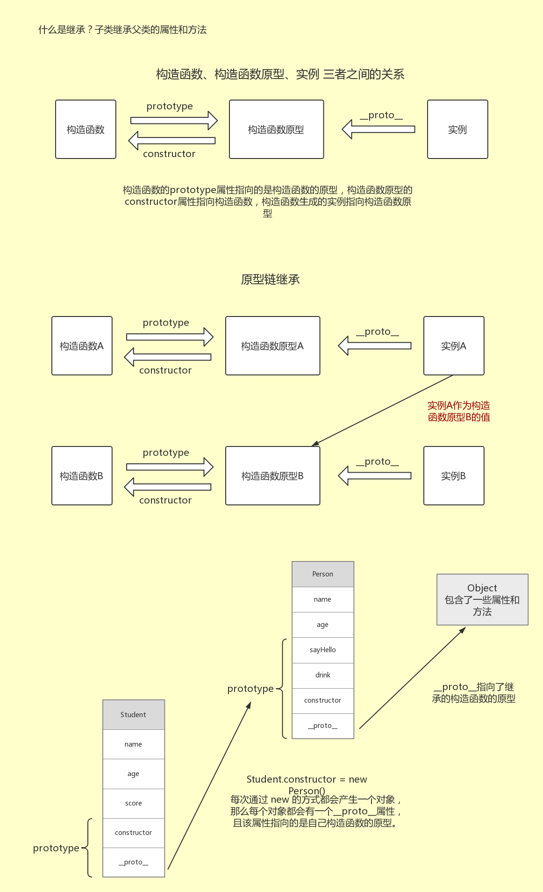

## JavaScript this指向问题/闭包/面向对象/原型及原型链继承/JSON

[TOC]

### 1.this 的指向问题

- this 指向的 永远只可能是对象
- this 指向谁 永远不取决于this在哪,而是取决于函数在哪调用   
- this 指向的对象 我们称之为函数的**执行上下文** 也叫**函数的调用**

```javascript
// this:当前对象
console.log(this);  // window 对象

// window
// 全局对象 (最顶层的对象),所有的全局变量或者函数都是属于 window
var a = 100;
console.log(window.a,a);  // 100 100
--------------------------------------------------------------------
function fn() {
// 严格模式的声明
// "use strict";
console.log("全局区域的函数");
var c = 300;

d = 400;  //  省略 var 默认成全局变量,严格模式下会报错,后面的代码不再执行
console.log(d);
}
// 方法;
window.fn();

// c
// 使用 window.c 不报错
// 相当于把 c 当做了 window 的未定义的属性
console.log(window.c);  // undefined

// window.d
console.log(d,window.d);  // 400 400
-------------------------------------------------------------------
function fn2(){
    "use strict";
    console.log(this);  
  // 有严格模式 undefined 没有严格模式 window 对象
}
fn2();
--------------------------------------------------------------------
setTimeout(function(){
    // 会有延时
    console.log(this);   // window
},10);
```

```javascript
var name = "杨浪";
var person = {
    name:"浪哥",
    obj:{
        name:"蓝鸥",
        run:function () {
            var name = "蓝鸽";
            console.log(this.name);
            console.log(name);

            var _this = this.name;

            console.log(this === person);

            function eat () {
                console.log(this);
                console.log(_this);
            }
            eat();
        }
    }
};
// 函数属于某个对象,并且通过该对象去调用,this就代表这个对象
person.obj.run();  // 蓝鸥 蓝鸽 false window 蓝鸥

// person.obj.run 代表找到了这个函数,将其赋给 test 相当于重新拷贝一份
var test = person.obj.run;
test(); // 杨浪  蓝鸽 false window 杨浪
```

### 2.修改 this 的指向问题 (call  apply  bind)

- 直接执行并且修改 this 指向,就用 call 或者 apply
- 通过返回地址让系统或者其他模块执行 + 修改 this 指向,用 bind 方法

#### call方法

- call 方法的功能:在一个指定的this上调用函数,其实就是将函数内部的this指向搞清楚
- call 方法从第二个参数开始的参数,都是传递给函数的参数!!!

```javascript
function run (a,b,c) {
    console.log(this,a,b,c);
}
console.log(typeof run);  // function
run.age = 19;
console.log(run.age);  // 19
console.log(run.call);  
// 通过函数的 call 方法,还是调用自己
// 参数1:本次调用需要修改 this 的指向
// 参数2:函数的原始参数 
run.call("你好",10,20,30); // String对象 10,20,30
run.call([],20,30,40);  // Array对象 20,30,40
-------------------------------------------------------------------
<script type="text/javascript">
	var name = 'global'; // window.name
	function fun(arg1, arg2) {
		console.log("this = ", this);
		console.log("this.name = ", this.name);
		console.log("arg1 = ", arg1);
		console.log("arg2 = ", arg2);
	}

	fun(); //  window  global undefined undefined
	console.log('-----------间接调用-----------');

	var obj1 = {name: 'ssy',age: 12}
	var obj2 = {name: "lisi",age: 23}
/*
call 方法的功能:在一个指定的this上调用函数,其实就是将函数内部的this指向搞清楚call 方法从第二个参数开始的参数,都是传递给函数的参数!!!
*/

	fun.call(obj1, 10, 20); // obj1对象 ssy 10 20
	fun.call(obj2, 30, 23); // obj2对象 lisi 30 23
	fun.call(null, 10, 20); // window global 10 20
--------------------------------------------------------------------
var arr  = [1,2,3,4,5];
// slice 修改了 this 的指向
var nArr = arr.slice(0,2);
console.log(arr.__proto__); // 数组原型
console.log(arr,nArr);

// 原理 数组的原型上有个 slice 方法,使用 call 动态改变 this 的指向
var kArr = Array.prototype.slice.call(arr,0,2);
console.log(kArr);  //
--------------------------------------------------------------------
	console.log('-----------apply-----------');
	/*
	  apply:功能和call一模一样
	  区别:最多接受两个参数,给函数传参使用的是数组,
	*/
	fun.apply(obj1, [10, 20]); // obj1对象 ssy 10 20
</script>
```

#### apply方法

- 功能和call一模一样
- 区别:最多接受两个参数,给函数传参使用的是数组,

```javascript
// 参数2:是个数组,存放原始数组
run.apply({name:"ssy"},[10,20,30]);

var arr = [10,20,15,100];
// Math.max(arr[0],arr[1]);
// 找最大值
var max = Math.max.apply(null,arr);
console.log("max =",max);
```

#### bind方法

```javascript
function fn(a,b){
  console.log(this,a,b);
}

fn.call({name:"call"},10,20); // {name:"call"} 10 20
fn.apply({name:"apply"},[10,20]); // {name:"call"} 10 20
------------------------------------------------------------------
/*
* 参数格式和 call 一样
* bind 不会自动执行原函数
* bind函数执行完成之后会把原函数 copy 一份,存储在新的内存中,
* 执行新的函数地址后, this指向和原参数都是在bind执行时配置好的
*/
var newFn = fn.bind({name:"bind"},100,);
console.log(newFn);
console.log(newFn === fn);  // false
newFn(200);  // 上边缺省的第二个参数可以在这个函数中补
--------------------------------------------------------------------
// 标准浏览器写法
// 创建一个匿名函数,然后copy一份,把copy的地址赋给fn2,并且修改this的指向
console.log("------bind 标准浏览器写法-------");
var fn2 = function (a,b) {
  console.log(a,b);
  console.log(this);
}.bind({name:"bindFn2"});

fn2(666,888);  // 666 888 {name:"bindFn2"}
--------------------------------------------------------------------
setTimeout(function(a,b,c,d){
  console.log(this);
  console.log(a,b,c,d);  //下边"小红"先输出,后边的自动拼接 
}.bind({name:"lisi"},"小红"),100,"思研","小马");

// 输出结果:
// {name:"lisi"}  小红 思研 小马 undefined
```

### 3.创建对象的常见方式

#### 1) 使用构造方法创建

```javascript
var obj = new Object();
var date = new Date();
```

#### 2) 直接使用字面量的方法创建

```javascript
var obj = {
  name:'ssy',
  age:23,
  sayName:function(){
    console.log('this.name');
  }
}
```

#### 3) 工厂模式

```javascript
function Animal (type,age) {
    // 构造方法
    var aml = new Object();
    aml.type = type;
    aml.age = age;
    aml.grow = function (){
        this.age++;
        console.log(this.type + "在成长,今年" + this.age + "岁了!");
    };
    return aml;
}

var dog = Animal("小狗",10);
dog.grow();  // 小狗在成长,今年11岁了!
var bear = Animal("狗熊",15);
bear.grow();  // 狗熊在成长,今年16岁了!
-------------------------------------------------------------
function Plants (type,age) {
    // 字面量创建
    var pt = {
        types:type,
        ages:age,
        grow:function () {
            this.ages++;
            console.log(this.types + "在生长,今年" + this.ages + "岁了!");
        }
    };
    return pt;
};

var  md = Plants("牡丹",10);
var  rows = Plants("玫瑰",18);
md.grow();  // 牡丹在生长,11岁了!
rows.grow();  // 玫瑰在生长,19岁了!
```

#### 4) 自定义构造方法 --(new 关键字的作用)

- new 关键字的作用:
- 1.构造函数中,每次调用都会创建一个新的对象 var Animal = {}
- 2.修改 this 指向为当前创建的对象
- 3.把新创建的对象 return 出去

```javascript
// 自定义构造方法
  function Animal(type,age) {
      this.type = type;
      this.age = age;
      this.grow = function (){
          console.log(this.type + "在生长!今年" + this.age + "岁了!" )
      }
  }

  var dog = new Animal("小狗",10);
  dog.grow();  // 小狗在生长!今年10岁了!
  var bear = new Animal("熊二",15);
  bear.grow();  // 熊二在生长!今年15岁了!
-----------------------------------------------------------------
优化方法:
/*
 * 优点:run创建一次,可以使所有对象共同使用,减少内存消耗,
 * 缺点:函数直接暴露在外界,污染全局区,且体现不出构造函数的关联
 */
function run() {
    console.log(this.type + "在生长!今年" + this.age + "岁了!" );				
}

// 自定义构造方法
function Animal(type,age) {
    this.type = type;
    this.age = age;
    // 调用 run 函数
    this.grow = run;
}

var dog = new Animal("小狗",10);
dog.grow();
var bear = new Animal("熊二",15);
bear.grow();
```

#### 5) 原型模式 // 什么是原型

- 变化的属性放到构造函数中,不变的属性或者方法放到原型中,让所有的实例对象共享
- 原型:构造函数的prototype属性,是一个对象类型
- 原型对象又有一个constructor属性,来标记自己属于哪个构造函数,又指向自己的构造函数

```javascript
// 自定义构造方法
function Animal(type,age,job) {
    this.type = type;
    this.age = age;
}
// 1.构造函数 找原型
// 把方法绑定在原型上
Animal.prototype.grow = function (){
    console.log(this.type + "在生长!今年" + this.age + "岁了!" );				
}
Animal.prototype.job = "PHP";

function Plants (type) {
    this.type = type;
}

// 访问原型对象
console.log("Animal",Animal.prototype);  // object对象
console.log("Plants",Plants.prototype);  // object对象

var dog = new Animal("小狗",10);
dog.grow();  // 小狗在生长!今年10岁了!
console.log(dog.job);  // PHP
var bear = new Animal("熊二",15);
bear.grow();  // 熊二在生长!今年15岁了!
console.log(bear.job);  // PHP
// 2.实例对象 找原型
console.log("bear",bear.__proto__);  // object对象
console.log("dog",dog.__proto__);  // object对象

// 验证原型的唯一性
console.log(bear.__proto__ === dog.__proto__);  // true  
console.log(bear.__proto__ === Animal.prototype);  // true

// 验证每个构造函数都有自己独立的原型
console.log(Plants.constructor === bear.__proto__);  // false
```

#### 6) 原型模式和构造函数结合

```javascript
function Person(name,age){
    this.name=name;
    this.age=age;
}

Person.prototype = {
    <!-- costructor 构造函数 -->
    costructor:Person,
    sayName:function(){
        console.log(this.name);
    }
}
```

### 4.闭包问题

#### 0.变量的生命周期

- 全局变量一直存在
- 局部变量:函数调用时创建,调用函数结束时,被系统回收

```javascript
// 引用类型
var a = [1,2,3];
b = a;

// 没有对数组的引用,这块区域被系统回收
a = null;
b = null;

// 值类型
var b = 100;

function fn(ev) {
    // 局部,函数调用结束,被系统回收
    var f1 = 100;
}
fn();
```

#### 1. 什么是闭包？

- 闭包是指是指有权访问上层函数作用域中变量的函数.子函数可以访问父函数中的变量.即便上一层函数已经关闭
- 返回值是一个函数.
- 闭包就是函数内嵌套函数
- 闭包函数在外面被调用，访问
- 闭包可以访问函数外变量，函数外变量不可以访问闭包内部
- 闭包就是一个函数引用另一个函数的变量.

```javascript
var add = (function() {
    var a = 0;
    return function() {
        return ++a;
    }
})();

function my(){
    text.innerHTML = add();
};
```

#### 2. 闭包的优缺点

##### 优点

- 减少全局变量的定义,有利于变量的私有化.注意:JS 目前没有私有变量.

```javascript
// 闭包优点
function fun() {
      //计数功能
      var count = 0;

      function addCount() {
        count++;
      }

      function minCount() {
        count--;
      }

      function getCount() {
        return count;
      }

      return [addCount, minCount, getCount];
    }

    var result = fun();
    // var add = result[0];
    // var min = result[1];
    // var get = result[2];
    //
    // add();
    // min();
    // console.log(get());

    // 等价于
    result[0]();    // add
    result[1]();    // min
    console.log(result[2]());
```

##### 缺点

- 运行环境 会一直存在,变量常驻内存,增加内存损耗,不容易被释放.

```javascript
// 闭包缺点 闭包变量常驻内存，增加内存消耗
<script type="text/javascript">
      function fun() {
      var a = [];

      for (var i = 0; i < 5; i++) {
          aa[i] = function() {
            console.log("我是: ", i);
          };
      }

      return a;
    }

    var result = fun();
    result[0]();
    result[1]();
    result[2]();
    result[3]();
    result[4]();
</script>
```

#### 3. 如何创建闭包

- 在函数内部定义一个内部函数,内部函数引用了当前作用域的变量,并且将内部函数返回
- 内部函数就是闭包.

```javascript
// 创建闭包
<script type="text/javascript">
    function fun() {
      var a = 10;
      return function() {
        console.log("a = " + a);
      }
    }
    var ret = fun();
    ret();
</script>
```

```javascript
// 清除执行环境
<script type="text/javascript">
      function fun1(){
        var a = 10; // enclosing 作用域
        // fun2 就是闭包
        function fun2(){
          a++;
          alert(a);
        }
        return fun2;
      }

      var fun = fun1();
      fun(); //11
      // 执行环境保留
      fun(); //12
      // 清除执行环境
      fun = null;
      fun();
    </script>
```

```javascript
// 闭包的作用 保留执行环境
<script type="text/javascript">
  function fun1(){
    var a = 10;
    // fun2 是闭包
    function fun2(){
      for (var i = 0; i < 5; i++) {
        a++;
      }
      console.log(a);
    }
    return fun2;
  }

  var ret = fun1();
  ret();  //15
  // 执行环境保留
  ret();  //20
</script>
```

#### 4. 经典闭包问题

```javascript
<script type="text/javascript">
    function fun(n,o) {
      console.log(o);
      return {
        fun:function(m){
          return fun(m,n);
        }
      };
    }
    var a = fun(0); // undefined
    a.fun(1);  // 0
    a.fun(2);  // 0
    a.fun(3);  // 0

    var b = fun(0).fun(1).fun(2).fun(3);
    //undefined,0,1,2

    var c = fun(0).fun(1); // undefined 0
    c.fun(2); // 1
    c.fun(3);//  1
    //问:三行a,b,c的输出分别是什么？
    </script>
```

#### 5. 作用域和作用域链

```javascript
<script type="text/javascript">
      var name = "The Window";
      var object = {
        name : "My object",
        getNameFunc : function(){
          // 下面这个匿名函数是 闭包
          return function(){
            var name = "ssy";
            console.log(this);
            return this.name;
          }
        }
      }

      var first = object.getNameFunc();
      var s = first();
      alert(s);

      // 等价于
      // alert(object.getNameFunc()());

      /*
        this 指向的 永远只可能是对象
        this 指向谁 永远不取决于this写在哪!,而是取决于函数在哪调用
        this 指向的对象,我们称之为函数的上下文context,也叫函数的调用者.
      */
    </script>
```

```javascript
<script type="text/javascript">
      var name = "The Window";
      var object = {
        name : "My object",
        getNameFunc : function(){
          var that = this;
          console.log(this);
          // 下面这个匿名函数是 闭包
          return function(){
            var name = "ssy";
            return that.name;
          }
        }
      }
  alert(object.getNameFunc()());
</script>
```

### 5.面向对象

#### 1. 对象:属性和方法的集合

#### 2. 类:变量和方法的集合

#### 3. 封装:隐藏实现细节,只提供对外接口

- 封装，为程序员提供了在这门语言中构建对象的能力，对象是属性和方法的集合，调用对象时是通过对象调用方法，对象不同，调用的方法会有所不同。

#### 4. 继承:子类 继承 父类 的属性和方法

#### 5. 多态:对两个或多个属于不同类的对象,对同一方法的调用作出不同响应的方式.

#### 6. JS没有函数重载,C没有继承和多态

### 6.函数和方法的区别

- 函数 ： 它是独立运行的功能模块
- 方法 ： 是绑定在对象上的

### 7.四种作用域

```
   L       >     E       >       G       >       B
(local)     (enclosing)       (global)       (build in)
 局部           闭包              全局            内置
```

### 8.继承

- 继承方式总共有6种，比较常用的有3种
- 原型链继承 / 借助构造函数继承  /  组合继承

构造函数，构造函数原型，实例 这这三者之间的关系

```javascript
// 构造函数
function Person(name) {
  this.name = name;
}

// 构造函数原型
Person.prototype.getName = function() {
  console.log(this.name);
};

// person 是实例
var person = new Person("ssy");

// 构造函数的 prototype属性 指向构造函数原型
console.log(Person.prototype);

// 构造函数原型的 constructor属性 指向构造函数
console.log(Person.prototype.constructor);  // 指向构造函数

// 构造函数生成的实例 通过_proto_属性指向 构造函数原型
console.log(person.__proto__); // 指向 构造函数原型

// 判断构造函数原型的prototype属性 和 实例的 __proto__ 属性 指向是否相同
console.log(Person.prototype == person.__proto__);  //true
```

#### 继承

- 继承:让子类拥有父类的属性和方法
- 问题:每个子类都共享一个父类的原型;通过任意一个子类修改原型,其他子类都会受到影响.



- 优化:



```javascript
// 父类:父构造函数
function Animal(name,age){
    this.name = name;
    this.age = age;
}

Animal.prototype.run = function () {
    console.log(this.name + "在奔跑!");
};

// 子类:
function Dog(type,name,age){
    // 子类扩展的属性
    this.type = type;
    // 继承父类
    Animal.call(this,name,age);
}

// 原型的继承:原型赋值
Dog.prototype = Animal.prototype;

// 子类的扩展
Dog.prototype.wang = function () {
    console.log(this.age + "岁的" + this.type + this.name + "在汪汪叫!");
}

// 通过子类实例化对象,子类不能实例化
var dog = new Dog("哈士奇","小巴",5);
dog.wang(); // 5岁的哈士奇小巴在汪汪叫!
dog.run();
console.log(Dog.prototype);
Dog.prototype.constructor = Dog;

var dog1 = new Dog("泰迪","小马",3);
dog1.wang();  // 3岁的泰迪小马在汪汪叫!
dog1.run();

console.log("----------Pig----------");
function Pig(name,age){
    Animal.apply(this,arguments);
};
// 继承
Pig.prototype = Animal.prototype;
// 扩展
Pig.prototype.sleep = function(){
    console.log(this.name + "在睡觉!");			
}
var pig = new Pig("小花",5);
pig.sleep();
pig.run();

/*
 * 问题:每个子类都共享一个父类的原型;通过任意一个子类修改原型,
 * 其他子类都会受到影响.
 */
pig.wang();
```

#### 原型链—/原型链继承



##### 原型及原型链--构造函数原型(prototype)

```javascript
function Animal (type,age) {
    this.type = type || "name";
    this.age = age || 19;
}

Animal.prototype.color = "red";

Animal.prototype.grow = function () {
    console.log(this.type,this.age,this.color);
}

var dog = new Animal("PHP",10,"green");
dog.grow();  // PHP 10 red

console.log(Animal.prototype);  // Animal对象
console.log(dog.__proto__);  // Animal 对象
```

##### 字符串是基本数据类型,但是它的原型却是 Object 对象

```javascript
// 原型
console.log(Array.prototype);  // 数组原型
console.log(String.prototype);  // 字符串原型

---------------------------------------------------------
String.prototype.trimAll = function (){
    console.log(this + "-字符串原型自定义方法");
    var repStr = this.replace(/浪/gi,"字");
    console.log(repStr);
}
console.log(String.prototype);  // 字符串原型

var name = " 浪  哥   浪 ";
name = name.trim();  // 去除首尾空格
console.log(name.length);  // 8
var age = "18";
var gender = "男";

name.trimAll();
age.trimAll();
gender.trimAll();
```

##### getElementsByTagName 和 querySelectorAll 区别

```javascript
// getElementsByTagName 不能通过原型找forEach等方法
// 它是一个集合,集合自身没有forEach方法
// 原型: HTMLCollection
var liCollection1 = document.getElementsByTagName("li");
console.log(liCollection1);

// querySelectorAll 可以通过原型找 forEach 方法
// 原型: NodeList 有一个 forEach 方法
var liCollection2 = document.querySelectorAll("li");
console.log(liCollection2.__proto__);
-------------------------------------------------
// 封装函数:让 html 元素集合有 forEach 方法
Array.prototype.forEach.call(liCollection1,function (value,index) {
    console.log(index,value);
});

// 给所有的 HTMLCollection 集合实例添加 forEach 方法
HTMLCollection.prototype.forEach = function(cb){
    Array.prototype.forEach.call(this,function (value,index) {
        cb(index,value);
    });
}
console.log(liCollection1);  // HTMLCollection对象
// HTMLCollection 调用 forEach 方法
liCollection1.forEach(function (value,index) {
    console.log(value,index);
});
console.log("-------------");
console.log(liCollection1[0].__proto__); // HTMLLIElement 对象
console.log(document.body.__proto__);  // HTMLBodyElement 对象
```

##### Object.prototype (Object 对象原型)

```javascript
/*
 * Object.prototype: 所有类型原型链的最顶端,可以被所有的实例共享
 */
Object.prototype.setColor = function () {
    console.log(this);
    console.log("setColor");
}

pig.setColor();  // 数组对象
dog.setColor();  // Animal 对象
document.body.setColor();  // body 对象
liCollection1.setColor();  // HTMLCollection 对象
```

##### 原型链

- 一直通过__proto__ 查找原型的原型,一直到 Object 的构造函数原型结束

```javascript
/*
 * 原型链:一直通过__proto__ 查找原型的原型,一直到 Object 的构造函数原型结束
 */
var dog = new Animal();
console.log(dog.__proto__.__proto__);  // Object 对象
console.log(dog.toString());  // 将实例对象转化 为字符串
```

```javascript
<script type="text/javascript">
// 构造函数 Animal
function Animal(name){
  this.name = name;
}

// 构造函数Animal原型上定义了一个方法,并且Animal的实例会继承该方法
Animal.prototype.getPlanet = function() {
  return this.planet;
}

// 构造函数Person
function Person(name){
  this.name = name;
}

/*
  Person的原型用Animal的实例进行赋值,(实例A)
  Person的原型 (构造函数原型B)就有了Animal(实例A)的一切属性和方法
  Animal实例(实例A)的属性和方法都是继承自Animal构造函数和原型的属性和方法
*/
Person.prototype = new Animal("earth");

// Person的原型添加自己的一个新方法 getName
Person.prototype.getName = function() {
  return this.name;
}

/*
person 是Person构造函数的实例,继承了Person原型上的新增方法
又有Animal实例继承自Animal原型上的属性和方法
person 实例也可以作为值, 赋给别的构造函数的原型,供其实例进行继承,这样做就会变成了一个链式继承,这就是原型链继承
*/

var person = new Person('ssy');

// 判断实例对象属于哪个构造函数
// 判断 person 是否是 Person构造函数的原型
console.log(person instanceof Person);   // true

console.log(Animal.isPrototypeof(Person.prototype));

console.log(person);   // Person{}

var p = person.getPlanet();
console.log(p);  // undefined

</script>
```

```javascript
<script type="text/javascript">
      function SuperType(){
        this.property = true;
      }

      SuperType.prototype.getSuperValue = function(){
        return this.property;
      }

      function SubType() {
        this.subproperty = false;
      }

      // SubType的原型 继承了SuperType 的属性和方法
      SubType.prototype = new SuperType();

      SubType.prototype.getSubValue = function () {
        return this.subproperty;
      }

      var instance = new SubType();
      console.log(instance.getSuperValue()); //true
      console.log(instance.getSubValue());  //false

      // 判断instance 是否是 xxxx 的一个实例对象
      console.log(instance instanceof Object);  //true
      console.log(instance instanceof SuperType);  // true
      console.log(instance instanceof SubType);    // true

      // 判断 instance 是否在 xxx 原型链上
      console.log(Object.prototype.isPrototypeOf(instance));  //true
      console.log(SuperType.prototype.isPrototypeOf(instance));  //true
      console.log(SubType.prototype.isPrototypeOf(instance));  // true
    </script>
```

##### 原型链查找顺序

```javascript
<script type="text/javascript">
    var name = 'html name';
    function Person(){
      this.name = 'this.name'
    }

    Person.prototype.name = 'ssy';
    Person.prototype.age = 12;

    var one = new Person();
    var two = new Person();
    two.name = 'hello';

    console.log(one.name); // this.name
    /*
      查找顺序: 全局作用域  函数作用域  原型
      提示:这段和原型链查找顺序,不矛盾,也不是一回事
    */
    console.log(two.name);  // hello
</script>
```

```javascript
/* 方法:
* 原型链查找顺序:
* 1.先看自己的实例有没有,如果有就调用.没有就继续找自己构造函数的原型
* 2.构造函数原型有,直接调用并停止查找,没有继续找上层原型对象
* 3.若一直没有,找到最顶层原型 Object, 还没有得话,直接报错,属性返回 undefined
*/

function Animal (type) {
  this.type = type;
  // 1.先看自己的实例有没有,如果有就调用.没有就继续找自己构造函数的原型
  this.run = function () {
      console.log("实例的 run");
  };

  this.grow = function (){
      console.log(this.type);	
  };
}

Animal.prototype.run = function () {
  console.log("Animal 原型 run");
};


Object.prototype.run = function () {
  console.log("Object run");
};

var pig = new Animal("佩奇");
pig.run();

/*
* 属性:
*/
Animal.prototype.job = "PHP";

// 自定义属性,和原型没有任何关系,这里改的是实例
pig.job = "HTML5";
// 修改原型
pig.__proto__.job = "JavaScript";

var dog = new Animal("旺财");
// 找原型
console.log(dog.job);
```

##### 原型链继承的缺点

```javascript
<script type="text/javascript">
      function Super(){
        this.colors = ['red','green','blue'];
      }

      function Sub() {
      }

      Sub.prototype = new Super();

      /*
        所有实例共享属性,修改任意一个都会影响所有实例
        在创建实例时无法传递参数
      */

      var one = new Sub();
      console.log(one.colors);

      one.colors.push("pink");

      var two = new Sub();
      console.log(two.colors);
    </script>
```

#### 借助构造函数继承

```javascript
<script type="text/javascript">
      function Super(name) {
        this.name = name;
        // this 指定的执行环境为 Sub
        console.log(this);   // Sub{}
        console.log(this.name);  // lisi
      }

      function Sub(name,age) {
        Super.call(this,name);  //调用父类构造函数
        this.age = age;
      }

      var one = new Sub('lisi',10);
      console.log(one.name);  // lisi
      console.log(one.age);   // 10
    </script>
```

```javascript
<script type="text/javascript">
      function Person(name,age) {
        this.name = name;
        this.age = age;
      }

      Person.prototype.sayHello = function() {
        console.log('say Hello!');
      }

      function Student(name,age,score) {
        // 借用构造函数
        Person.call(this, name,age);
        this.score = score;
      }

      var one = new Student('lisi',20,88);
      // 借用构造函数的缺点就是 只能继承构造函数的属性和方法
      // 无法继承构造函数原型上的属性和方法
      // 也就是 sayHello 没有被调用
      console.log(one);  // Student{}
      one.sayHello(); // one.sayHello is not a function
    </script>
```

#### 组合继承

```javascript
<script type="text/javascript">
    function Super(name){
      this.name = name;
      this.colors = ["red", "blue"];
    }
    Super.prototype.getName = function(){
      return this.name;
    };

    function Sub(name,age){
      Super.call(this,name);
      this.age = age;
    }

    Sub.prototype = new Super();
    Sub.prototype.constructor = Sub;
    Sub.prototype.getAge = function(){
      return this.age;
    };

    var one = new Sub('lisi', 10);
    console.log(one.getName());// lisi
    console.log(one.getAge()); //10
    one.colors.push("black");

    var two = new Sub('wangwu', 12);
    console.log(two.getName());// wangwu
    console.log(two.getAge()); //12
    console.log(two.colors); //["red", "blue"];
    </script>
```

```javascript
<script type="text/javascript">
      function Person(name,age) {
        this.name = name;
        this.age = age;
      }

      Person.prototype.sayHello = function() {
        console.log('say Hello!');
      }

      function Student(name,age,score) {
        // 借用构造函数,继承构造函数内部的属性
        Person.call(this, name,age);
        this.score = score;
      }


      // 使用原型链继承原型的方法和属性
      Student.prototype = new Person();
      Student.prototype.constructor = Student;


      var stu1 = new Student('lisi',12,56);
      console.log(stu1);
      stu1.sayHello();
    </script>
```

```javascript
<script type="text/javascript">
      function Super(name) {
        this.name = name;
        this.colors = ['red','green'];
      }

      Super.prototype.getName = function() {
        return this.name;
      }

      function Sub(name,age) {
        Super.call(this,name);
        this.age = age;
      }

      Sub.prototype = new Super();
      Sub.prototype.constructor = Sub;

      Sub.prototype.getAge = function(){
        return this.age;
      }

      var one = new Sub('lisi',10);
      console.log(one.getName());  // lisi
      console.log(one.getAge());   // 10

      one.colors.push('blue');

      var two = new Sub('ssy',32);
      console.log(two.getName());  // ssy
      console.log(two.getAge());   // 32
      console.log(two.colors);   // ['red','green']
    </script>
```

###  9.JSON

#### JSON序列化

- JSON序列化就是将JSON对象转换为字符串类型
- JSON.stringify()

```json
<script type="text/javascript">
      var stu = {
        "name" : "lisi",
        "age" : 23,
        "hobby" : ['read','write','drink'],
        "score" : 88
      }

      var str = JSON.stringify(stu,function(key,value){
        if (key === "age") {
          return value + 100;
        }

        if (key === "score") {
          return value - 10;
        }

        return value;
      });

      console.log(str);
	  // {"name":"lisi","age":123,"hobby":["read","write","drink"],"score":78}

      str = JSON.stringify(stu,['name','age','score']);
      console.log(str);
	// {"name":"lisi","age":23,"score":88}

      str = JSON.stringify(stu,null,'\t');
      console.log(str);
/*
	{
      "name": "lisi",
      "age": 23,
      "hobby": [
          "read",
          "write",
          "drink"
      ],
      "score": 88
	}
*/
    </script>
```

#### JSON解析

- 将一个JSON字符串解析为一个JavaScript值，在解析的过程中可以选择性修改一些属性值
- JSON.parse()

```json
<script type="text/javascript">
      var str = '{"name":"lisi","age":10,"score":90}';
      var json = JSON.parse(str);

      console.log(json);

      var obj = JSON.parse(str,function(key,value){
        if (key === 'name') {
          return "我是" + value;
        }

        if (key === 'score') {
          return "实际成绩为:" + (value - 10);
        }

        return value;
      });

      console.log(obj);
    </script>
```

