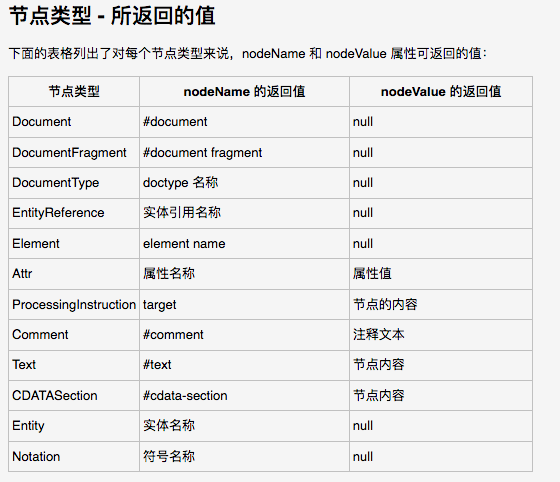
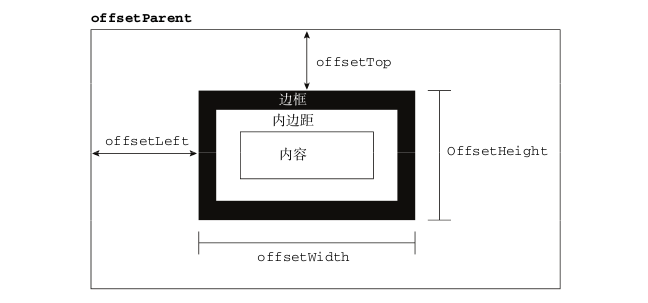
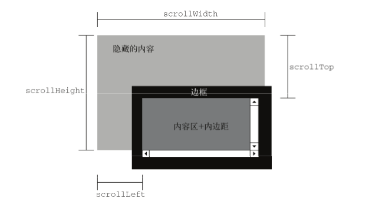

## DOM对象/节点/client/offset/scroll/瀑布流布局/图片预加载/图片懒加载

[TOC]

## DOM 对象/节点

- DOM(文档对象模型)是指针对HTML和XML文档的一个API(应用程序编程接口).DOM脱胎于网景公司和微软创始的DHTML(动态HTML).

### 1.文档对象模型



```javascript
// DOM:文档对象模型
// document: 文档对象
// DOM 属性结构: document -> html-> 各节点组成

// 常用的节点:
/*
	1.元素节点 <div></div> 	nodeType=1
    2.属性节点  id  class 	nodeType=2
    3.文本节点				nodeType=3
    4.注释节点				nodeType=8
    5.根节点 document 		 document.nodeType=9
    6.<!DOCTYPE html>       document.doctype.nodeType=10
*/

// nodeName 标签名
// nodeType 节点类型
// nodeValue 节点值
// 每个节点都具有这三个属性

// 1.document
console.log(document,document.nodeName,document.nodeType,document.nodeValue);  
// 文档对象 "#document" 9 null

// 2.documentElement html对象
console.log(document.documentElement,document.documentElement.nodeName,document.documentElement.nodeType,document.documentElement.nodeValue);  
// "HTML" 1 null

console.log(document.html);  // undefined 未定义,不这么写

// 3.head
console.log(document.head,document.head.nodeName,document.head.nodeType,document.head.nodeValue);		
// head 对象 "HEAD" 1 null

// 4.body
console.log(document.body,document.body.nodeName,document.body.nodeType,document.body.nodeValue);		
// body 对象 "BODY" 1 null

var box = document.getElementById('box');
console.log(box,box.nodeName,box.nodeType,box.nodeValue);  
// DIV 1 null

// 5.node.childNodes 元素所有子节点
console.log(box.childNodes);

// 6.Node.parentNode 获取节点的父节点
console.log(document.body.parentNode);		// html 对象

// document 对象 是这个文档的根节点吗,没有父节点,输出为空
console.log(document.parentNode);  // null

var nodeT = box.childNodes[0];
// #text 代表文本节点  3代表节点类型为文本节点
console.log(nodeT.nodeName,nodeT.nodeType,nodeT.nodeValue);  
// #text 3

var nodeC = box.childNodes[1];
console.log(nodeC.nodeName,nodeC.nodeType,nodeC.nodeValue);  
// #comment 8 注释1

// 根节点: document
console.log(document.nodeName,document.nodeType,document.nodeValue);  // #document 9 null
// #document 9 null

// <!DOCTYPE html> 声明节点
console.log(document.doctype.nodeName,document.doctype.nodeType,document.doctype.nodeValue);  // html 10 null
// html 10 null

// 7.属性节点
// attributes 获取所有的属性节点
console.log(box.attributes);

console.log(box.attributes[0].nodeName);  // id
console.log(box.attributes[0].nodeType);  // 2
```

### 2.获取样式(style/getComputedStyle/currentStyle)

```javascript
/* 
	getAttribute 和 style 的区别
	1).getAttribute 是获取元素的属性, style是获取元素的 style中的行间样式
	2).getAttribute 可以获取元素的自定义属性,比如name,age等
	3).style 是获取的 style 中的 width,height 等属性.
*/

// 1.node.style 的方式只能够获取 元素的行间样式
console.log(box.style.height,typeof(box.style.height)); 
// 300px string

// 2.标准浏览器中的方法: getComputedStyle(元素对象,参数2)
//  返回该元素对象的所有样式
//  可以获取到  行间样式 ,也可以获取到  嵌套样式
//  参数2:伪类/伪元素的名字,一般省略或者给null
//  IE8 以下的浏览器  currentStyle

var a = window.getComputedStyle(box,null);
console.log(a);

console.log(a.height);  // 300px
console.log(a.backgroundColor);  // rgb(0,0,255)

var b = window.getComputedStyle(box,":before");
console.log(b,typeof b);  // object
console.log(b.content);	// 通过参数2获取
console.log(b.height);  // 100px

function getStyle(ele,attr) {
// 兼容性写法
return ele.currentStyle ? ele.currentStyle[attr]: getComputedStyle(ele)[attr];

// 2. 判断浏览器有没有这个方法,前边加 window 且不能省略
return window.getComputedStyle ? getComputedStyle(ele)[attr] : ele.currentStyle[attr];
}
```

### 3.节点访问(父/兄/子)

```javascript
// 1.获得父节点 标准写法,找到父节点
document.parentNode  // 输出为空 document对象是根节点,没有父节点
// parentElement 不是标准写法
baby.parentElement.style.border = "5px solid red";

// 2.兄弟节点
one.nextSibling  // 将文本节点也识别为兄弟
one.nextElementSibling  // 只识别标签作为自己的兄弟

one.previousSibling  // 访问元素的上一个节点,包括文本节点
one.previousElementSlibing  // 访问元素的上一个元素节点

// 3.firstChild 选择的是第一个子节点,其中可包括文本节点
// 所有浏览器都支持,标准浏览器下返回第一个节点(可以是文本节点或者注释节点)
// IE 6,7,8下返回第一个 元素节点(不包括文本节点等)
console.log(box.firstChild);  // 文本节点

// 4.firstElementChild() 选择第一个元素子节点
// 只有标准浏览器支持, IE 下的为 undefined
// 返回的是第一个 元素节点
box.firstElementChild.style.fontSize = "30px";
console.log(box.firstElementChild);

// 获取第一个子元素的兼容写法
function firstEle(ele) {
    return ele.firstElementChild || ele.firstChild;
}

one.lastChild  // 访问元素的最后一个子节点,包括文本节点
one.lastElementChild  // 访问元素的最后一个 子元素节点

// last:特点同上
function lastEle(ele) {
    return ele.lastElementChild || ele.lastChild;
}

// 5.直接子元素集合
// children属性,获取所有的子代元素
// 不是标准写法,但是所有浏览器都支持
console.log(box.children);

one.children[2]  // 不包含文本节点
one.children[4]
```

### 4.获得节点( ID/ClassName/TagName/querySelector)

```javascript
document.getElementById("id");
document.getElementsByTagName("div");
document.getElementsByClassName("test");

// JS 新增的选择器,只有标准浏览器支持
// 1. querySelector()
// 参数 : 选择器
// 返回 : 元素,及时有多个元素也只是返回第一个元素
var box1 = document.querySelector("div#box");
console.log(box1);

// 2. querySelectorAll() 返回的是一个集合
// 参数 : 选择器
// 返回 : 元素集合  [元素对象]
var p1 = document.querySelectorAll("#box > p");
console.log(p1);
p1[0].style.fontSize = "30px";
```

### 5.创建节点(createElement/createTextNode/createComment)

```javascript
// 1.创建元素节点
var test = document.createElement("div");
// 2.创建文本节点
var textNode = document.createTextNode("百度一下,你就知道!");
console.log(textNode, typeof(textNode));  // 文本  "Object"
// 3.创建节点注释
var com = document.createComment("这是注释");
// 调用两次,只有后边的设置有效
ele.appendChild(com);
box.appendChild(com);
```

### 6.操作节点(appendChild/insertBefore/replaceChild/removeChild)

```javascript
// 插入操作
// 1. 把元素绘制到 dom 中
box.appendChild(ele);

var sEle = document.createElement("strong");
var sEle1 = document.createElement("strong");
sEle.innerText = "strong标签";
sEle1.innerText = "strong标签";
box.appendChild(sEle);
box.appendChild(sEle1);

// 2. box.insertBefore()
// 参数1:新元素
// 参数2:参照元素
var Img = document.createElement("img");
Img.src = "./img/favicon.ico";
Img.style.width = "30px";
box.insertBefore(Img,sEle);

// 3. replaceChild(新元素,旧元素);
// 参数1:新元素
// 参数2:参照元素,要替换的旧元素
box.replaceChild(Img,sEle1);
//替换节点(被替换的节点还在文档中,但是在文档中已经没有了自己的位置)

// 4.删除子元素
box.removeChild(Img);
//移除节点(要移除的节点还在文档中,但是在文档中已经没有了自己的位置)

// 5.remove() 删除全部元素
box.remove();
```

### 7.节点属性相关(操作属性的方式/getAttribute/setAttribute)

```javascript
/*
 * 操作属性的方式:
 * 		元素对象自定义的属性,和行间自定义属性没有关联,不能渲染到文档
 * 1.点语法 可以获取或者设置行间系统的属性
 * 2.元素对象[""]  可以放置变量,不能去引号,去掉引号被认为是变量
 * 3.getAttribute() 获取文档中系统或者自定义的属性
 * 4.setAttribute() 设置文档中系统或者自定义属性都可以加载到文档中
 * 5.hasAttribute("") 判断元素有没有当前的属性
 * 6.hasAttributes() 判断元素有没有设置属性 
 */
<div id="box" class="BoxName" name="NameBox" age="123" style="background-color:red;">
    <!-- 注释1 --><!-- 注释2 -->
    文本节点
    <p>p标签</p>
</div>

var box = document.getElementById('box');

console.log(box);

// 1. 点语法
console.log("------点语法------");
console.log(box.id,box.className);
box.name = "box1";
console.log(box.id,box.name);

// 点语法无法获得自定义的属性
console.log(box.age);  // undefined

// ?!重点难理解!?
// 元素对象自定义的属性,和行间自定义属性没有关联,不能渲染到文档
box.age = "20";
box.sex = "男";
console.log(box.age);  // 20 能打印不能喧染到文档

console.log("------元素对象[]------");
// 2.元素对象[] 不能去引号,去掉引号被认为是变量
console.log(box["id"]);  // box

console.log("------getAttribute() 获取属性值------");
// 3.获取属性值
console.log(box.getAttribute("age"));   // (自定义属性) 123
console.log(box.getAttribute("style"));   // (系统属性) background-color:red;
console.log(box.getAttribute("sex"));   // null

// 获取 class 标准浏览器使用 class  IE 6,7,8 使用 className
console.log(box.getAttribute("class"));   // Boxname

// 4.设置: 系统或者自定义的属性都可以被加载到文档中
box.setAttribute("sex","男");

// 5.获取元素的所有属性节点
console.log(box.attributes);

// 6.判断有没有 某个属性 有返回 true
console.log(box.hasAttribute("age"));

// 7.判断元素有没有设置属性 设置返回 true
console.log(box.hasAttributes());
```

### 8.克隆节点(cloneNode)

```javascript
var a = document.getElementById(“id”);
vaar clone = a.cloneNode(true);

// 只能克隆元素,无法克隆事件

/*
创建副本节点
  {
  true 深复制,复制节点及其整个子节点树
  flase 浅复制,只复制节点本身
  不复制添加到DOM节点中的js属性
  }
*/
```

### 9.处理文本节点(normalize)

```javascript
normalize() //处理文档树中的文本节点
// 调用该方法:后代节点遇到 空文本节点,就删除;遇到多个相邻的文本节点合并为一个文本节点.
```

### 10.innerHTML遗留问题/效率问题

```javascript
// innerHTML赋值,会覆盖掉 box 中子元素绑定的事件, box中的布局会被重新绘制
<div id="box">
	<p>文本</p>
	<button>按钮</button>
</div>
<hr>
<p>
	<button id="bCreate">开始创建1</button>
</p>
<script type="text/javascript">
  var box = document.querySelector("#box");
  var bCreate = document.querySelector("#bCreate");
  var btn = document.querySelector("#box button");

  var pEle = document.createElement("p");
  var textNode = document.createTextNode("百度一下,你就知道!");

  pEle.appendChild(textNode);

  btn.onclick = function() {
      alert("box内按钮");
  };

  bCreate.onclick = function() {
      // innerHTML赋值,会覆盖掉 box 中子元素绑定的事件, box中的布局会被重新绘制
      box.innerHTML += "<p>新的元素</p>";
      // 如果单独的 appendChild 点击按钮是只添加一次
      // 加上 innerHTML 相当于每次都会重新绘制元素在界面的显示, appendChild就是每次都追加
      box.appendChild(pEle);
  }
</script>
```

```javascript
<div id="box"></div>
<script type="text/javascript">
    console.time("浪哥")
    var content = "";
    for (var i = 0; i < 900; i++) {
        // 创建 cell
        // appendChild  2-3ms
        // var cell = document.createElement("div");
        // cell.className = "cell";
        // box.appendChild(cell);

        // 错误 : innerHTML  500-900ms
        // box.innerHTML += "<div class='cell'></div>";

        // 解决:文档碎片 1ms-3ms
        content += "<div class='cell'></div>";
    }
    box.innerHTML = content;
    console.timeEnd("浪哥");
</script>
```

## client 元素内部尺寸/浏览器可视区域尺寸

- clientWidth/clientHeight 是指元素的内尺寸
- 返回值是 number类型
- 包含内容区和 padding 区,不包含边框

```javascript
// content + padding
console.log("内尺寸:宽度",box.clientWidth,"高度:",box.clientHeight);

// 左边框尺寸和上边框尺寸
console.log("边框尺寸:左边框",box.clientLeft,"上边框:",box.clientTop);

// 获取浏览器可视窗口的宽和高
console.log("浏览器可视区域宽度:",document.documentElement.clientWidth,"高度:",document.documentElement.clientHeight);

// IE6,7,8不支持
console.log("浏览器可视区域宽度:",window.innerWidth,"高度:",window.innerHeight);

// 函数封装
function clientHeight() {
return window.innerHeight || document.documentElement.clientHeight;
}

function clientWidth() {
return window.innerWidth || document.documentElement.clientWidth;
}
```

## offset 元素外尺寸

- 元素的可见大小由其高度、宽度决定,包括所有内边距、滚动条和边框大小(注意,不包括外边距)。通过
  下列 5 个属性可以取得元素的偏移量:
  1. offsetHeight: 获得元素高度　＝　height + border + padding
  2. offsetWidth : 获得元素宽度　 ＝ widht + border + padding
  3. offsetLeft: 获得元素左外边框距离包含该元素的左内边框的距离(经过定位)
  4. offsetTop: 获得元素上外边框距离包含该元素的上内边框的距离(经过定位)
  5. offsetParent: 获得包含该元素的元素(定位)



```javascript
<div class="f">
      <div id="box"></div>
    </div>

    <script src="./js/jquery.min.js" charset="utf-8"></script>
    <script type="text/javascript">
      console.log($(document).width());
      console.log($(window).width());

      console.log("---------jQuery 方法---------");

      // 获得内容的 width
      console.log("width = ", $('#box').width()); // 200
      // 获得 width + padding
      console.log("innerWidth = ", $('#box').innerWidth()); // 240
      // 获得 width + padding + border
      console.log("outerWidth = ", $('#box').outerWidth()); // 260

      console.log("---------原生JS 方法---------");

      var box = document.getElementById('box');

      // 获得内容的 width
      var styles = window.getComputedStyle(box);
      console.log("width = ", parseInt(styles.width));  // 200
      console.log("border = ",styles.border);

      // 获得 width + padding
      console.log("clientWidth = ", box.clientWidth);  // 240 只读属性
      // 获得 width + padding + border
      console.log("offsetWidth = ", box.offsetWidth); // 260  只读属性

      console.log("---------位置有关系---------");
      //一个元素和最近的设置过定位(不是static)的祖先元素之间的距离
      // offsetLeft, offsetTop 只读
      console.log("box.offsetLeft = ",box.offsetLeft);  // 0
      console.log("box.offsetTop = ",box.offsetTop);  // 0

      box.style.left = "100px";
      box.style.top = "50px";

      console.log("box.offsetLeft = ",box.offsetLeft); // 100
      console.log("box.offsetTop = ",box.offsetTop);  // 50
    </script>
```

### offsetWidth/offsetHeight

- offserWidth/offsetHeight : 元素外尺寸
- 返回值是 number 类型
- 和 client 相比,包含了边框
- 内容区, padding 区, border 区

```javascript
// content + padding + border
console.log("外尺寸:宽度",box.offsetWidth,"高度:",box.offsetHeight);
```

### offsetParent 偏移父元素

- 和定位配合使用.父元素添加相对定位,子元素偏移就会相对于父元素
- 如果不加定位,默认会相对于 body 进行偏移
- body 的偏移父元素为 null

```javascript
console.log(box.offsetParent);  // wrap
console.log(box.offsetParent.offsetParent);  // body

// body的 offsetParent 是 null
console.log(box.offsetParent.offsetParent.offsetParent);  // null

// 到它的 offsetParent的内边距的 左边距离和上边距离
console.log("元素左边距",box.offsetLeft,"上边距",box.offsetTop);

// 返回元素到页面顶部的距离
function getOffsetTop(ele) {
    if (ele.nodeName == "BODY") {
        return 0;
    }
    var top = 0;
    while (true) {
        top += ele.offsetTop + ele.offsetParent.clientTop;
        ele = ele.offsetParent;
        // 如果是 body 停止
        if (ele.offsetParent == null)break;
    }
    return top
}

var topValue = getOffsetTop(link);
console.log("topValue:",topValue);
```

### offset 动画

```javascript
<!DOCTYPE html>
<html>
  <head>
    <meta charset="utf-8">
    <title>offset动画</title>
    <style media="screen">
    * {
      margin: 0;
      padding: 0;
    }

    .ctrl button {
      width: 100px;
      height: 80px;
      text-align: center;
    }

    #box {
      width: 100px;
      height: 100px;
      background: green;
      border-radius: 50%;
      position: absolute;
      top: 100px;
      left: 0px;
    }
    </style>
  </head>
  <body>
    <div class="ctrl">
      <button id="go">go</button>
      <button id="back">back</button>
    </div>

    <div id="box"></div>

    <script src="./js/jquery.min.js" charset="utf-8"></script>
    <script src="./js/move.js" charset="utf-8"></script>
    <script type="text/javascript">
    var box = document.getElementById("box");
    var timer;

    $('#go').click(function() {
      // 向右移动
      linearMove(box,1500);
    });

    $("#back").click(function(){
      //向左移动
      slowDownMove(box,0);
    });
    </script>
  </body>
</html>
```

### scroll 滚动



- 通过**父元素**获取滚动大小
- scrollTop 页面向上走被遮挡的部分
- scrollLeft 页面向左走被遮挡的部分

```html
<style>
  #box {
    width: 300px;
    height: 300px;
    border: 10px solid red;

    overflow: scroll;
}

#inner {
    width: 1000px;
    height: 1000px;
    background-color: green;
    font-size: 50px;
}
</style>
<div id="box">
	<div id="inner"></div>
</div>
<!--这的1000指的是子元素的滚动宽高-->
console.log(box.scrollWidth,box.scrollHeight);  // 1000 1000
console.log(box.scrollTop,box.scrollLeft); // 0 0
```

### scrollTop/scrollLeft

```javascript
function getScrollTop() {
    // 获取:
    // 必有一个为 0,所以可以两个值相加
   	return document.documentElement.scrollTop + document.body.scrollTop;
  // 或者
    return document.documentElement.scrollTop || document.body.scrollTop;
}

function setScrollTop(value) {
  // 设置
  document.body.scrollTop = document.documentElement.scrollTop = value;
}
```

### window.onscroll 监听窗口滚动

```javascript
// 监听窗口滚动,页面滚东,或者第一次刷新,
window.onscroll = function() {
    console.log(getScrollTop());

    var value = getScrollTop();
    var useable = false;
    if (value >= 200) {
        // 显示
        goTop.style.display = "block";
        useable = true;
    } else {
        // 隐藏
        goTop.style.display = "none";
        useable = false;
    }
}
```

## 瀑布流布局

```html
<!DOCTYPE html>
<html lang="en">
<head>
	<meta charset="UTF-8">
	<title>瀑布流布局</title>
	<style media="screen">
		* {
			margin:0px;
			padding: 0px;
		}

		ul li {
			list-style-type: none;
		}

		#box {
			overflow: hidden;
			border: 5px solid blue;
			margin-top: 200px;
		}

		#box ul {
			margin-left: 2%;
			width: 17.6%;
			float: left;
		}

		#box ul li {
			background-color: gray;
			font-size: 30px;
			text-align: center;
			color: #fff;
			margin-top: 5%;
		}
	</style>
</head>
<body>
	<div id="box">
		<ul></ul>
		<ul></ul>
		<ul></ul>
		<ul></ul>
		<ul></ul>
	</div>

	<script type="text/javascript">
		var ulArr = document.querySelectorAll("#box ul");
        // 创建方法
		function createItem(length) {
			for (var i = 0; i < length; i++) {
				var item = document.createElement("li");
				item.innerText = i + 1;
				item.style.backgroundColor = randomColor();

	            // 随机高度
	            var h = randomNumber(100,400);
				item.style.height = h + "px";
				item.style.lineHeight =  h + "px";

				// ulArr[randomNumber(0,4)].appendChild(item);
				ulArr[getMinIndex()].appendChild(item);
			}
		}
		createItem(50);
		window.onscroll = function() {
            // 当显示到最短一列,再次加载100个
            // 当滚动距离+可视窗口高度 == 最短列的高度 加载
			var value = getScrollTop() + clientHeight();
			console.log(value);

            // 获取最小一列下标
            var minIndex = getMinIndex(ulArr);
            // 获取元素的最小高度
			var minHeight = ulArr[minIndex].offsetHeight;
			// 返回元素到页面顶部的距离
			var offTop = getOffsetTop(ulArr[minIndex]);

			if (value >= (minHeight + offTop)) {
				// console.log("时机到了",value,"--",minHeight);
				createItem(50);
			}
		};

		// 返回元素到页面顶部的距离
		function getOffsetTop(ele) {
			if (ele.nodeName == "BODY") {
				return 0;
			}
			var top = 0;
			while (true) {
				top += ele.offsetTop + ele.offsetParent.clientTop;
				ele = ele.offsetParent;
                // 如果是 body 停止
				if (ele.offsetParent == null)break;
			}
			return top;
		}

        // 获取页面的滚动距离
		function getScrollTop() {
			// return document.documentElement.scrollTop + document.body.scrollTop;
			return document.documentElement.scrollTop || document.body.scrollTop;
		}

        // 获取浏览器可视窗口的高度
		function clientHeight() {
			return window.innerHeight || document.documentElement.clientHeight;
		}

        // 找最小高度
        function getMinIndex() {
			// ulArr[0].offsetHeight
			var minIndex = 0;
			for (var i = 1; i < ulArr.length; i++) {
				minIndex = ulArr[minIndex].offsetHeight > ulArr[i].offsetHeight ? i : minIndex;
			}
			return minIndex;
        }

		function randomColor() {
			var r = parseInt(Math.random()*256);
			var g = parseInt(Math.random()*256);
			var b = parseInt(Math.random()*256);
			var a = Math.random();
			return "rgb(" + r + "," + g +  ","+ b +")";
		}

        // 包含 a,b
		function randomNumber(a, b){
			var max = Math.max(a, b);
			var min = Math.min(a, b);
			return parseInt(Math.random() * (max - min + 1) + min);
		}
	</script>
</body>
</html>
```

##  图片瀑布流

```html
<!DOCTYPE html>
<html lang="en">
<head>
	<meta charset="UTF-8">
	<title>瀑布流图片</title>
	<style media="screen">
		* {
			margin:0px;
			padding: 0px;
		}

		ul li {
			list-style-type: none;
		}

		#box {
			overflow: hidden;
			border: 5px solid blue;
		}

		#box ul {
			margin-left: 2%;
			width: 17.6%;
			float: left;
		}

		#box ul li {
			background-color: gray;
			font-size: 30px;
			text-align: center;
			color: #fff;
			margin-top: 5%;
		}

		#box ul li img {
			width: 100%;
		}
	</style>
</head>
<body>
	<div id="box">
		<ul></ul>
		<ul></ul>
		<ul></ul>
		<ul></ul>
		<ul></ul>
	</div>

	<script type="text/javascript">
		var ulArr = document.querySelectorAll("#box ul");
		var srcArr = ["./img/img2/P_000.jpg","./img/img2/P_001.jpg","./img/img2/P_002.jpg","./img/img2/P_003.jpg","./img/img2/P_004.jpg"];

        // 创建方法
        var i = 0;
		function createItem(length) {
			i++;
			if (i > length) {
				return;
			}
			var item = document.createElement("li");
			item.innerText = i;
            var img = document.createElement("img");
			img.src = srcArr[randomNumber(0,4)];
			item.appendChild(img);

            // 预加载图片
			img.onload = function() {
				ulArr[getMinIndex()].appendChild(item);
                // 加载下一张
                /*
                	递归调用,必须要 return 停止
                	第一次执行到递归调用后,会停止在该位置,
               	 	等待第二次执行结束,第二次等待第三次,
                	直到最后一次函数被 return 结束,
                 	倒序 n次 10,9,8...2,1;结束函数
                 */
                createItem(length);
			}
		}

		createItem(50);


		window.onscroll = function() {
            // 当显示到最短一列,再次加载100个
            // 当滚动距离+可视窗口高度 == 最短列的高度 加载
			var value = getScrollTop() + clientHeight();
			console.log(value);

            // 获取最小一列下标
            var minIndex = getMinIndex(ulArr);
            // 获取元素的最小高度
			var minHeight = ulArr[minIndex].offsetHeight;
			// 返回元素到页面顶部的距离
			var offTop = getOffsetTop(ulArr[minIndex]);

			if (value >= (minHeight + offTop)) {
				// console.log("时机到了",value,"--",minHeight);
				// createItem(50);
			}
		};

		// 返回元素到页面顶部的距离
		function getOffsetTop(ele) {
			if (ele.nodeName == "BODY") {
				return 0;
			}
			var top = 0;
			while (true) {
				top += ele.offsetTop + ele.offsetParent.clientTop;
				ele = ele.offsetParent;
                // 如果是 body 停止
				if (ele.offsetParent == null)break;
			}
			return top;
		}

        // 获取页面的滚动距离
		function getScrollTop() {
            // 获取:
            // 必有一个为 0,所以可以两个值相加
			// return document.documentElement.scrollTop + document.body.scrollTop;
			return document.documentElement.scrollTop || document.body.scrollTop;
		}

        // 获取浏览器可视窗口的高度
		function clientHeight() {
			return window.innerHeight || document.documentElement.clientHeight;
		}

        // 找最小高度
        function getMinIndex() {
			// ulArr[0].offsetHeight
			var minIndex = 0;
			for (var i = 1; i < ulArr.length; i++) {
				minIndex = ulArr[minIndex].offsetHeight > ulArr[i].offsetHeight ? i : minIndex;
			}
			return minIndex;
        }

		function randomColor() {
			var r = parseInt(Math.random()*256);
			var g = parseInt(Math.random()*256);
			var b = parseInt(Math.random()*256);
			var a = Math.random();
			return "rgb(" + r + "," + g +  ","+ b +")";
		}

        // 包含 a,b
		function randomNumber(a, b){
			var max = Math.max(a, b);
			var min = Math.min(a, b);
			return parseInt(Math.random() * (max - min + 1) + min);
		}
	</script>
</body>
</html>

```

## 图片预加载 onload

- 图片预加载:提前缓存网页中用到的图片,当使用图片时,可以立马显示并可以获取大小
- 缺点:第一次进入界面的时候会下载所有的图片,造成服务器的压力

```html
<!DOCTYPE html>
<html lang="en">
<head>
	<meta charset="UTF-8">
	<title>图片的预加载</title>
	<style media="screen">
		* {
			margin: 0px;
			padding: 0px;
		}
	</style>
</head>
<body>
	
	<script type="text/javascript">
		var pic = document.getElementById('pic');

		console.log("宽度:",pic.width,"高度:",pic.height);

		document.onclick = function () {
            // 预加载图片
            /*
             * 图片预加载:提前缓存网页中用到的图片,当使用图片时,可以立马显示并可以获取大小
             *
             * 缺点:第一次进入界面的时候会下载所有的图片,造成服务器的压力
             */
            var obj = new Image();
			obj.src = "http://e.hiphotos.baidu.com/zhidao/pic/item/ac345982b2b7d0a2284d772bcdef76094a369afb.jpg";
            // onload 方法
			console.log(obj);
			obj.onload = function() {
                // 只有该方法回调,才能准确获取图片的大小,图片被浏览器缓存
				console.log("图片加载完成");
				console.log("load后(原图):",obj.height);

				pic.src = obj.src;
				console.log("缓存后:",pic.height);
			}
			console.log("------------");
			console.log("load前:",obj.height);
		}
	</script>
</body>
</html>
```

```javascript

/* 功能封装
 * 功能: 图片预加载 
 * 参数1:图片地址数组
 * 参数2:图片加载回调
 * 参数3:下载完成回调
 */
var Loading = {
	flag:0,
	prepareLoad:function(imgArr,loadingCB,successCB) {

		imgArr.forEach(function(value,index) {
			// console.log(value,index);
            // 每个地址都创建一个对象
			var obj = new Image();
            // 下载
            obj.src = value;

            // 监听下载的完成
			obj.onload = function () {
                // 加一下,代表下载完成一项
				Loading.flag++;

				var Ivalue = Math.ceil((Loading.flag / imgArr.length) * 100);
                // 判断执行了数组的 length 次
                // index:无序,代表图片下载完成顺序和代码执行顺序无关
                // this:当前下载完成的图片
				// console.log(flag,"加载完了第",index,"张");
				// console.log(this);  // 谁下载完了就代表谁

                // 下载回调
                typeof loadingCB == "function" && loadingCB(Ivalue);

                // 判断执行的数组的 length次
                if (Loading.flag == imgArr.length) {
					typeof successCB == "function" && successCB();
                }
			}
		});
	}
};

/*
Loading.load(["地址"],function(value){

},function(){

})
*/
```

## 图片懒加载

- 图片懒加载:大型网站,图片比较多的网站使用
- 优点:优化网站,是网页加载更加流畅
- 处理方式:
  - 没有出现的图片, src 先给一个1像素的占位图,把真实的地址存储在其他属性中,监听网页的滚动,在图片即将出现的时候取出真实的地址赋给 src

```html
<!DOCTYPE html>
<html lang="en">
<head>
	<meta charset="UTF-8">
	<title>图片的懒加载</title>
	<style media="screen">
		* {margin: 0;padding: 0;}
		li {list-style-type: none;}
		#box {width: 500px;margin: auto;}
		#box li {border: 5px solid red;margin-bottom: 300px;}
		#box li img {width: 100%;}
	</style>
</head>
<body>
	<div id="box">
		<ul>
			<li>
				
			</li>
			<li>
				
			</li>
			<li>
				
			</li>
			<li>
				
			</li>
			<li>
				
			</li>
		</ul>
	</div>
	<script type="text/javascript">
		var imgArr = ["./img2/P_000.jpg","./img2/P_001.jpg","./img2/P_002.jpg","./img2/P_003.jpg","./img2/P_004.jpg"];
		var lis = document.querySelectorAll("#box li");
		window.onscroll = function () {
            // 页面滚出去的距离
            var sTop = getScrollTop();
            // 可视区的高度
            var cHeight = clientHeight();
			for (var i = 0; i < lis.length; i++) {
                // 元素距离页面顶部的距离
                var offTop = getOffsetTop(lis[i]);
                // 刚出现在可视区
				var imgObj = lis[i].children[0];
				var src = imgObj.getAttribute("lazy-src");
				if (sTop + cHeight > offTop && src) {
					imgObj.src = src;
                    // 删除 lazy-src
                    imgObj.removeAttribute("lazy-src");
		}}}
        // 默认调用
        window.onscroll(); // 前边的就会默认显示
		// 页面滚动的距离
		function getOffsetTop(ele) {
			if (ele.nodeName == "BODY") {return 0;}
			var top = 0;
			while (true) {
				top += ele.offsetTop + ele.offsetParent.clientTop;
				ele = ele.offsetParent;
				// 如果是 body 停止
				if (ele.offsetParent == null)break;
			}
			return top
		}
		// 获取滚动元素距离屏幕顶部的距离
		function getScrollTop() {
			return document.documentElement.scrollTop || document.body.scrollTop;
		}
        // 页面可视区高度
		function clientHeight() {
			return window.innerHeight || document.documentElement.clientHeight;
		}
	</script>
</body>
</html>
```

