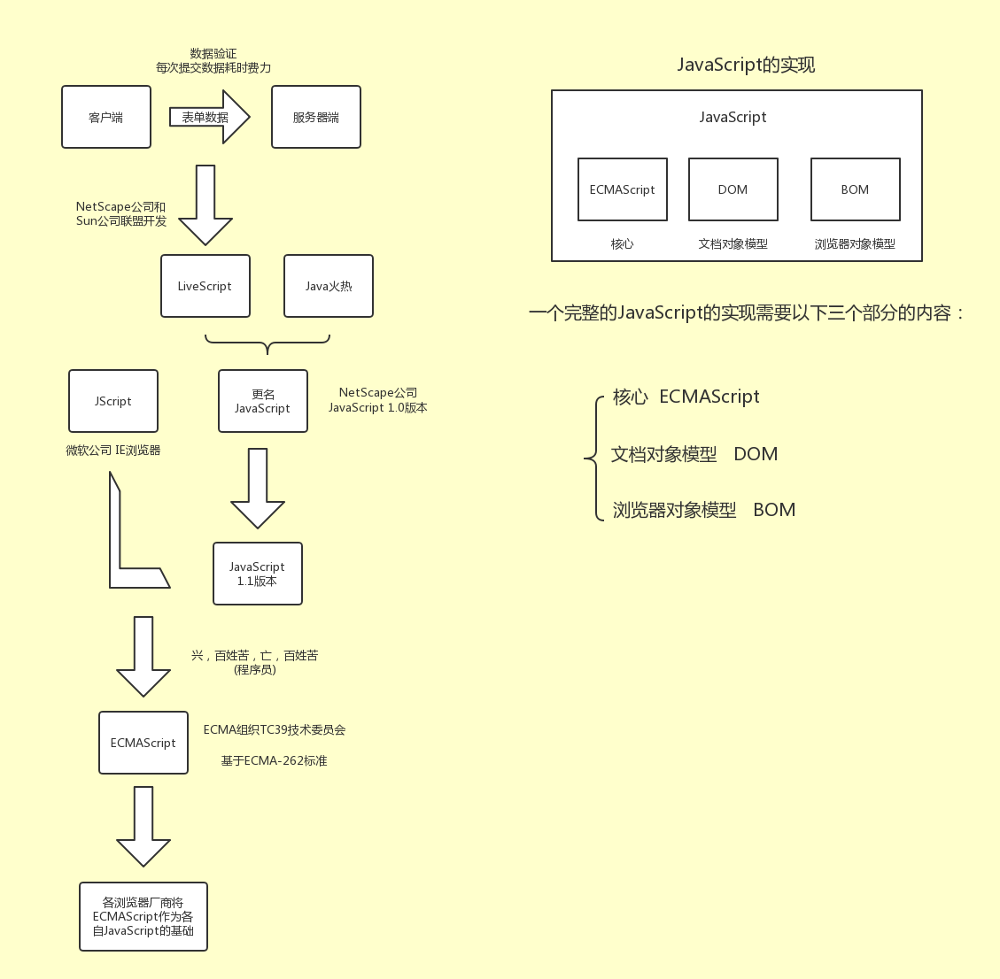

## JavaScript高级程序设计 (第3版)

[TOC]

### 1.JavaScript 发展简介



### 第二章 在HTML中使用JavaScript

####  script 元素

```javascript
async: 可选 表示应该立即下载脚本，但不应妨碍页面中的其他操作，比如下载其他资源或等待加载其他脚本。
charset : 可选 表示通过src属性指定的代码的字符集。
defer : 可选 表示脚本可以延迟到文档完全被解析和显示之后执行。只对外部脚本文件有效。
src ：可选 表示包含要执行代码的外部文件。
type ：可选 表示编写代码使用脚本语言的内容类型。type/javaScript
```

- 使用\<script>元素的方式有两种：直接在页面中嵌入JavaScript代码，和包含外部JavaScript文件