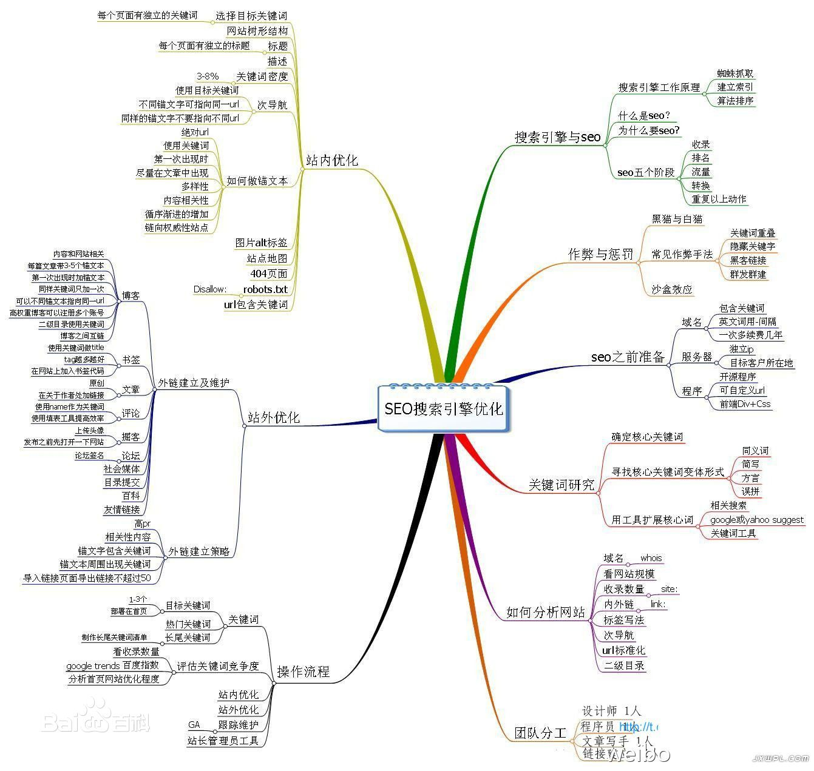

## SEO

[TOC]

### 什么是SEO

SEO是由英文Search Engine Optimization缩写而来， 中文意译为“搜索引擎优化”。SEO是指通过对网站进行**站内优化和修复**(网站Web结构调整、网站内容建设、网站代码优化和编码等)和**站外优化**，从而提高网站的网站关键词排名以及公司产品的曝光度。通过搜索引擎查找信息是当今网民们寻找网上信息和资源的主要手段。而SEM，搜索引擎营销，就是根据用户使用搜索引擎的方式，利用用户检索信息的机会尽可能将营销信息传递给目标用户。在目前企业网站营销中，SOM（SEO+SEM）模式越来越显重要。

-    中文名

     [搜索引擎优化](https://baike.baidu.com/item/%E6%90%9C%E7%B4%A2%E5%BC%95%E6%93%8E%E4%BC%98%E5%8C%96/3132)

-    外文名

     Search Engine Optimization(SEO)

-    诞生时间

     1990年

-    别    称

     网站优化

-    作    用

     提升网站关键词排名,推广品牌

-    定    义

     网站推广、关键词排名、网络营销

-    所    属

     [网络营销](https://baike.baidu.com/item/%E7%BD%91%E7%BB%9C%E8%90%A5%E9%94%80/175416)

-    域    名

     .com、.cn、.cx、.cc、.vip等.

-    分    类

     SEO白帽、SEO灰帽、SEO黑帽

### 优化内容

#### 内部优化

-    meta标签的优化:例如:title keywords  description 等的优化
-    内部链接的优化,包括相关性链接(Tag标签) 锚文本链接  各导航链接 及图片链接
-    网站内容的更新:每天保持站内的更新(主要是文章的更新)
-    代码的压缩改进:例如,网站主页的唯一性,网站内页链向主页,301,404等.

#### 外部优化

-    外部链接类别:博客 论坛 B2B 新闻 分类信息 贴吧 问答 百科 社区  空间  微信  微博等相关信息网等尽量保持链接的多样性.
-    外链组建：每天添加一定数量的外部链接，使关键词排名稳定提升。
-    友链互换：与一些和你网站相关性比较高,整体质量比较好的网站交换友情链接,巩固稳定关键词排名。

#### 链接优化

