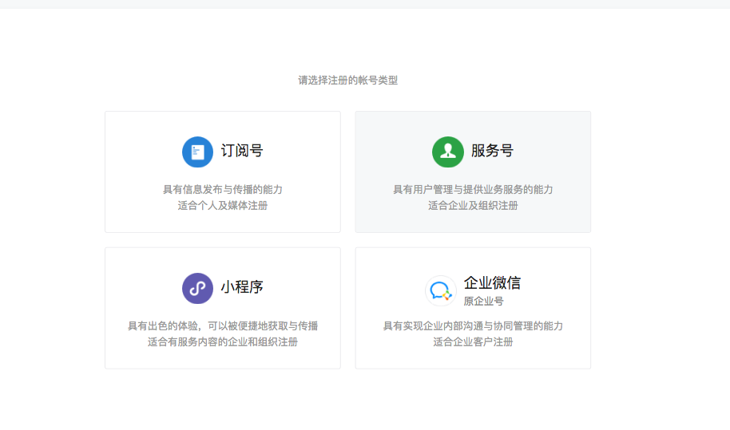
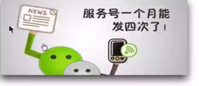
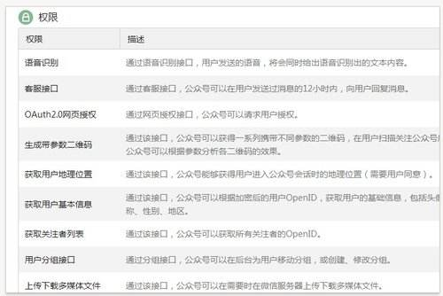

## 微信公众号的开发

[TOC]

### 1.微信公众平台的基本概念

- 运营者通过公众号为微信用户提供资讯和服务的平台.

### 2. 分类

- 订阅号
- 服务号
- 企业号
- 微信小程序

### 3. 侧重功能

1) 服务号侧重对用户的服务;

2)订阅号侧重于信息的传播

3)企业号侧重于生产运营的管理

### 4.适用范围

1)服务号主要适用于媒体,企业,政府或其他有需求的组织

2)订阅号主要适用于个人,媒体,企业政府或其他有需求的组织

3)企业号主要适用于企业,政府,事业单位或其他有需求的组织.

4)主要还是按照申请者的需求来定的,没有强制说必须使用哪种服务号.

### 5.消息推送显示地方

1)服务号和企业号推送的消息,直接显示在微信的对话列表中

2)订阅号推送的消息,显示在微信对话列表中"订阅号"文件夹中

### 6.推送消息的限制次数

1)服务号每月4条

2)订阅号每天一条

3)企业号每分钟200条

### 7.关注者验证

1)服务号和订阅号可以被任何微信用户扫码关注

2)企业号只有通讯录的成员才可以关注

### 8.高级接口功能

1) 订阅号不支持

2) 服务号和企业号通过认证之后支持

### 9.微信支付功能

1) 订阅号 无微信支付功能

2) 服务号和企业号通过认证之后支持微信支付功能

### 10.公众号两种服务模式

1) 公众号消息会话

- 这种模式下,公众号是以微信用户一个联系形式存在,可以回复微信用户信息,可以定制公众号菜单,可以处理菜单的点击事件等.

2) 公众号内网页

- 比较复杂的业务场景,需要通过网页形式提供服务,网页授权获取用户基本信息,使用微信 JS-SDK调用一些硬件功能.

### 11.前期准备工作

1) 先创建一个微信公众账号 (个人一般申请订阅号)

2) 准备一个服务器用于处理微信转发过来的信息或事件( 可以使用新浪 SAE, 新浪平台需要进行实名认证,审核周期3个工作日,并非3个自然日)

3)配置环境,配置公众号对应的服务器地址