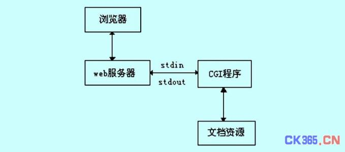
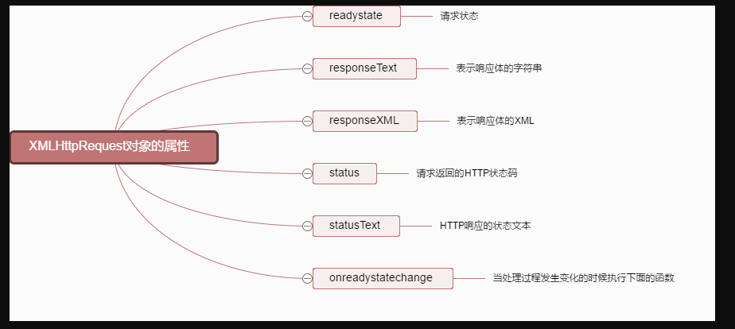
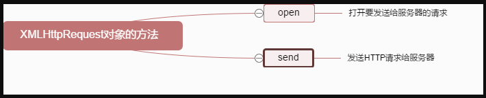
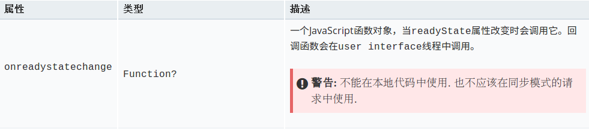
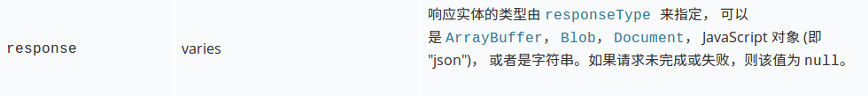
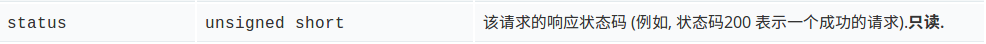

## Ajax应用/图灵完备

[TOC]

```
	AJAX即“Asynchronous Javascript And XML”（异步JavaScript和XML），是指一种创建交互式网页应用的网页开发技术。
	AJAX是一种用于创建快速动态网页的技术。通过在后台与服务器进行少量数据交换，AJAX 可以使网页实现异步更新。
	这意味着可以在不重新加载整个网页的情况下，对网页的局部进行更新,传统的网页（不使用 AJAX）如果需要更新内容，必须重载整个网页页面。
(引自百度百科)
	Ajax 技术的核心是 XMLHttpRequest 对象（简称 XHR），XHR 为向服务器发送请求和解析服务器响应提供了流畅的接口。能够以异步方式从服务器取得更多信息，意味着用户单击后，可以不必刷新页面也能取得新数据。也就是说，可以使用 XHR 对象取得新数据，然后再通过 DOM 将新数据插入到页面中。另外，虽然名字中包含 XML 的成分，但 Ajax通信与数据格式无关；这种技术就是无须刷新页面即可从服务器取得数据，但不一定是 XML 数据。
```

```
XML　　中文名　：可扩展标记语言
是一种用于标记电子文件使其具有结构性的标记语言。

１、什么是可扩展标记语言？
    可扩展标记语言是一种很像超文本标记语言的标记语言。
    它的设计宗旨是传输数据，而不是显示数据。
    它的标签没有被预定义。您需要自行定义标签。
    它被设计为具有自我描述性。
    它是W3C的推荐标准。
2、可扩展标记语言和超文本标记语言之间的差异

	它不是超文本标记语言的替代。
	它是对超文本标记语言的补充。
	它和超文本标记语言为不同的目的而设计：

    它被设计用来传输和存储数据，其焦点是数据的内容。
    超文本标记语言被设计用来显示数据，其焦点是数据的外观。

	超文本标记语言旨在显示信息，而它旨在传输信息。
	对它最好的描述是：它是独立于软件和硬件的信息传输工具。
３、可扩展标记语言是W3C的推荐标准
	XML 于 1998 年 2 月 10 日成为 W3C 的推荐标准。
４、可扩展标记语言无所不在
	超文本标记语言。
	XML 是各种应用程序之间进行数据传输的最常用的工具。
```

### 0. apache Web服务器的安装与CGI的配置

#### apache web服务器的安装

1. sudo apt-get update
2. sudo apt-get install tasksel
3. sudo tasksel

```
tasksel -- ubuntu里面方便安装服务的软件，用这个软件可以方便安装dns server, lamp, kubuntu desktop, ubuntu desktop, xubuntu之类的软件包。
这个软件在ubuntu server里是预装的，而在桌面版里是不预装的，想用的话得安装一下：
```

#### CGI的配置

- CGI(Common Gateway Interface) 是WWW技术中最重要的技术之一，有着不可替代的重要地位。CGI是外部应用（CGI程序）与Web服务器之间的接口标准，是在CGI程序和Web服务器之间传递信息的过程。(引自百度百科)

- CGI  通用网关接口  （网关是在传输层）

- LAMP，L是指Linux，A是指apache，M是指MySql，P是指PHP，Prel，Python

- CGI程序:工作的原理

  ```
  1.浏览器通过HTML表单或超链接请求指上一个CGI应用程序的URL。 
  2.服务器收发到请求。 
  3.服务器执行指定所CGI应用程序。 
  4.CGI应用程序执行所需要的操作，通常是基于浏览者输人的内容。 
  5.CGI应用程序把结果格式化为网络服务器和浏览器能够理解的文档（通常是HTML网页）。 
  6.网络服务器把结果返回到浏览器中。
  ```



- CGI 程序是实现了网页动态交互能力
- CGI应用程序主要的用途有以下几种

```
1. 根据浏览者填写的HTML表单发送定制的答复。
2. 创建可单击的图像缩小图。
3. 创建一个浏览者可以搜索内容的数据库
4. 提供服务器与数据库的接口，并把结果转换为HTML文档
制作动态HTML文档
```

- 如何配置？

```shell
1. sudo ln -s /etc/apache2/mods-available/cgi.load     /etc/apache2/mods-enabled/cgi.load
2. 重启 apache 服务器 service apache2 restart
3. 需要运行的cgi文件的存放路径为 /usr/lib/cgi-bin
```

### 1.Ajax的定义 = Asynchronous JavaScript and XML(异步的 JavaScript 和 XML)

-  ajax是用于客户端和服务端进行异步数据交互，在无需刷新整个页面的情况下实现局部数据更新的一种技术。

### 2.Ajax的特点:前后端通信，异步方式通信，无刷新，局部更新。

-  前后端通信，异步方式通信，无刷新，局部更新。

### 3.Ajax的优缺点

#### 优点:无需刷新页面,异步通信,降低服务端的压力，原则是"按需取数据"

#### 缺点:浏览器没有历史记录（无法后退）,   对搜索引擎不友好，破坏了程序的异常机制，且不容易调试。

### 4.Ajax 技术的核心是 XMLHttpRequest 对象

- [原文链接](https://developer.mozilla.org/zh-CN/docs/Web/API/XMLHttpRequest)
- XMLHttpRequest 是一个API, 它为客户端提供了在客户端和服务器之间传输数据的功能。它提供了一个通过 URL 来获取数据的简单方式，并且不会使整个页面刷新。
- XMLHttpRequest对象的属性:



- XMLHttpRequest对象的方法:



#### 构造函数

- XMLHttpRequest()
- 构造函数初始化一个XMLHttpRequest对象. 必须在**所有其他方法被调用前**调用构造函数。

### 5.原生的Ajax使用的基本步骤

#### 1).创建XMLHttpRequest对象(Ajax技术的核心)

```javascript
// 兼容低版本ie浏览器的代码,对于现代浏览器可以省略部分代码
function createXHR(){
    if (typeof XMLHttpRequest != "undefined"){
        return new XMLHttpRequest();
    } else if (typeof ActiveXObject != "undefined"){
         if (typeof arguments.callee.activeXString != "string"){
            var versions = [ "MSXML2.XMLHttp.6.0", "MSXML2.XMLHttp.3.0",
            "MSXML2.XMLHttp"], i, len;
            for (i=0,len=versions.length; i < len; i++){
                try {
                    new ActiveXObject(versions[i]);
                    arguments.callee.activeXString = versions[i];
                    break;
                } catch (ex){
                    //跳过
                }
            }
        }
        return new ActiveXObject(arguments.callee.activeXString);
     } else {
            throw new Error("No XHR object available.");
    }
}

//此处的xhr用于ajax通信
var xhr =  createXHR();

//高版本浏览器 直接执行以下代码
 var xhr = new XMLHttpRequest();
```

#### 2).准备向服务器发送一次http请求(get, post)                 open()

```xml-dtd
void open(
   DOMString method,
   DOMString url,
   optional boolean async,
   optional DOMString user,
   optional DOMString password
);
```

```html
参数
- method
    请求所使用的HTTP方法; 例如 "GET", "POST", "PUT", "DELETE"等. 如果下个参数是非HTTP(S)的URL,则忽略该参数.
- url
    该请求所要访问的URL
- async
    一个可选的布尔值参数，默认为true,意味着执行异步操作，如果值为false,则send()方法不会返回任何东西，直到接受到了服务器的返回数据。如果为值为true，一个对开发者透明的通知会发送到相关的事件监听者。这个值必须是true,如果multipart 属性是true，否则将会出现一个意外。
- user
    用户名,可选参数,为授权使用;默认参数为空string.
- password
    密码,可选参数,为授权使用;默认参数为空string. 
```

```javascript
//true表示是异步请求
//    异步：客户端发送请求之后，不用死等服务端的响应，可以继续先做自己的事。
//         服务端什么时候响应，那客户端就什么时候接收响应。

//数据格式  url?key=value&key=value

//请求所使用的HTTP方法 "get"　数据含在ＵＲＬ中
xhr.open("get", "http://127.0.0.1:8000/index?name=张三&age=22&score=88", true);
//用于转码用的
console.log(encodeURIComponent("张三 李四 xxx yyy ))) * /~skjkjh"));

//请求所使用的HTTP方法 "post"　数据不再ＵＲＬ中　而是在http包的ｂｏｄｙ中
xhr.open("post", "http://127.0.0.1:8000/index", true);

//用于转码用的,控制台输出对应的编码
console.log(encodeURIComponent("name=lisi&age=22&score=88"));
```

#### 3).真正发送一次请求   send()

```javascript
//get请求，数据携带在url上，所有send为空即可
xhr.send();

//发送post数据时，按照form表单的数据格式进行发送
//需要设置http的头部来指定要发送的数据格式

xhr.setRequestHeader("Content-Type", "application/x-www-form-urlencoded");
xhr.send("name=lisi&age=22&score=88");
```

#### 4).用于时刻准备接受服务端的响应  onreadystatechange

```javascript
//4. 用于时刻准备接受服务端的响应
      xhr.onreadystatechange = function () {
      	console.log("当前状态： " + xhr.readyState);

        //当状态为4时，表示响应完成， 失败？成功？
        if (xhr.readyState === 4){
          if ((xhr.status >= 200) && (xhr.status < 400)){

            //通过xhr.response得到后端发送来的数据
            console.log("recv from server: ", xhr.response);

            $("<h1>success</h1>").appendTo("body");
          } else {
            $("<h1>fail</h1>").appendTo("body");
          }
        }
      };
<--
控制台输出为：
当前状态： 2
当前状态： 3
当前状态： 4
recv from server:  {
  "one": 10,
  "two": 20
} 
 -->
```








### 6.jQuery中的Ajax的使用

- 执行一个异步的HTTP（Ajax）的请求。

```javascript
$.ajax({
         method: "post",
         url: "/index",		//直接填写路由即可
         data: {name:'lisi', age: 22, score:59},
         success: function(data, textStatus, jqXHR){	//success: 请求成功后的回调函数
           console.log("recv from server: ",data);		//data 发送到服务器的数据
           console.log("http status code : " + textStatus);
           if(data=="OK"){				
               
           }else{
               
           }
           //跳转页面
           window.location = "https://www.jd.com/";
         },
         error: function(jqXHR, textStatus, error){		//error: 请求失败后的回调函数
           console.log(error);		//error错误原因
           console.log("http status code : " + textStatus);
         }
       });
```

### 7.启动服务器

```shell
$ sudo ./node-v6.10.2-linux-x64/bin/node server.js
$ sudo chmod a+x ./node-v6.10.2-linux-x64/bin/node
$ ./node-v6.10.2-linux-x64/bin/node server.js
```

### 附：

#### get方法发送的源码

```html
<!DOCTYPE html>
<html>
  <head>
    <meta charset="utf-8">
    <title>ajax使用的基本步骤(get)</title>
  </head>
  <body>
    
    <button id="start">ajax</button>

    <script src="./js/jquery.min.js" charset="utf-8"></script>
    <script>

    // 兼容低版本ie浏览器的代码,对于现代浏览器可以省略部分代码
    function createXHR(){
      if (typeof XMLHttpRequest != "undefined"){
        return new XMLHttpRequest();
      } else if (typeof ActiveXObject != "undefined"){
        if (typeof arguments.callee.activeXString != "string"){
          var versions = [ "MSXML2.XMLHttp.6.0", "MSXML2.XMLHttp.3.0",
          "MSXML2.XMLHttp"], i, len;
          for (i=0,len=versions.length; i < len; i++){
            try {
              new ActiveXObject(versions[i]);
              arguments.callee.activeXString = versions[i];
              break;
            } catch (ex){
              //跳过
            }
          }
        }
        return new ActiveXObject(arguments.callee.activeXString);
      } else {
        throw new Error("No XHR object available.");
      }
    }

    $("#start").click(function(){

      //1. 想要使用ajax，必须要先创建xhr对象
      //此处的xhr用于ajax通信
      var xhr = createXHR();

      //高版本浏览器
      // var xhr = new XMLHttpRequest();

      //2. 准备向服务器发送一次http请求(get, post)
      /*
      true表示是异步请求
      异步：客户端发送请求之后，不用死等服务端的响应，可以继续先做自己的事。
      服务端什么时候响应，那客户端就什么时候接收响应。
      */

      //数据格式  url?key=value&key=value
      xhr.open("get", "http://127.0.0.1:8000/index?name=张三&age=22&score=88", true);

      //用于转码用的
      // console.log(encodeURIComponent("张三 李四 xxx yyy ))) * /~skjkjh"));

      //4. 用于时刻准备接受服务端的响应
      xhr.onreadystatechange = function () {
        console.log("当前状态： " + xhr.readyState);

        //当状态为4时，表示响应完成， 失败？成功？
        if (xhr.readyState === 4){
          if ((xhr.status >= 200) && (xhr.status < 400)){

            //通过xhr.response得到后端发送来的数据
            console.log("recv from server: ", xhr.response);

            $("<h1>success</h1>").appendTo("body");
          } else {
            $("<h1>fail</h1>").appendTo("body");
          }
        }
      };

      //3. 真正发送一次请求
      //get请求，数据携带在url上，所有send为空即可
      xhr.send();
      $("<h1>send完毕!</h1>").appendTo("body");
    });
    </script>
  </body>
</html>
```

#### post方法发送源码

```html
<!DOCTYPE html>
<html>
  <head>
    <meta charset="utf-8">
    <title>ajax使用的基本步骤(post)</title>
  </head>
  <body>
    
    <button id="start">ajax</button>

    <script src="./js/jquery.min.js" charset="utf-8"></script>
    <script>

    // 兼容低版本ie浏览器的代码,对于现代浏览器可以省略部分代码
    function createXHR(){
      if (typeof XMLHttpRequest != "undefined"){
        return new XMLHttpRequest();
      } else if (typeof ActiveXObject != "undefined"){
        if (typeof arguments.callee.activeXString != "string"){
          var versions = [ "MSXML2.XMLHttp.6.0", "MSXML2.XMLHttp.3.0",
          "MSXML2.XMLHttp"], i, len;
          for (i=0,len=versions.length; i < len; i++){
            try {
              new ActiveXObject(versions[i]);
              arguments.callee.activeXString = versions[i];
              break;
            } catch (ex){
              //跳过
            }
          }
        }
        return new ActiveXObject(arguments.callee.activeXString);
      } else {
        throw new Error("No XHR object available.");
      }
    }

    $("#start").click(function(){

      //1. 想要使用ajax，必须要先创建xhr对象
      //此处的xhr用于ajax通信
      var xhr = createXHR();

      //2. 准备向服务器发送一次http请求(get, post)
      /*
      true表示是异步请求
      异步：客户端发送请求之后，不用死等服务端的响应，可以继续先做自己的事。
      服务端什么时候响应，那客户端就什么时候接收响应。
      */

      xhr.open("post", "http://127.0.0.1:8000/index", true);

      //4. 用于时刻准备接受服务端的响应
      xhr.onreadystatechange = function () {
        // console.log("当前状态： " + xhr.readyState);
        //当状态为4时，表示响应完成， 失败？成功？
        if (xhr.readyState === 4){
          if ((xhr.status >= 200) && (xhr.status < 400)){
            $("<h1>success</h1>").appendTo("body");
          } else {
            $("<h1>fail</h1>").appendTo("body");
          }
        }
      };
      
      //3. 真正发送一次请求
      //post请求，数据应该在send中发送！！！！！
      //发送post数据时，按照form表单的数据格式进行发送
      //需要设置http的头部来指定要发送的数据格式

      xhr.setRequestHeader("Content-Type", "application/x-www-form-urlencoded");
      xhr.send("name=lisi&age=22&score=88");

      //控制台输出对应的编码
      console.log(encodeURIComponent("name=lisi&age=22&score=88"));
      $("<h1>send完毕!</h1>").appendTo("body");
    });
    </script>
  </body>
</html>

```

#### jQuery中的Ajax实现登录功能的源码

```html
<!DOCTYPE html>
<html>
<head>
  <meta charset="utf-8">
  <title>登录</title>
  <style>
    * {
      margin: 0;
      padding: 0;
    }

    .login {
      width: 500px;
      margin: 50px auto;
    }

    .login > p {
      color: red;
      visibility: hidden;
    }
  </style>
</head>
<body>
  <div class="login">
    <p>用户名或者密码不能为空！</p>
    用户名：<input type="text" name="username"> <br><br> 密 码：<input type="passwd" name="password"> <br><br>
    <button id="btn">登录</button>
  </div>

  <script src="./js/jquery.min.js" charset="utf-8"></script>
  <script type="text/javascript">
    $(function() {
      $("#btn").click(function() {
        var username = $(".login input[name=username]").val();
        var password = $(".login input[name=password]").val();

        if ((!username) || (!password)){
          //如果为空的情况要执行
          $(".login > p").css("visibility", "visible");
          return;
        }
        /*
        用户的输入都是合法的，发送ajax登录请求
        */
        $.ajax({
           method: "post",
           url: "/login",
           data: {name: username, passwd: password},
           success: function(data, textStatus, jqXHR){
             if (data == "OK"){
               //登录
               window.location = "https://www.baidu.com";
             } else {

               //将input的值设置为空
               $(".login input").val("");

               alert("用户名和密码错误");
             }
           },
           error: function(jqXHR, textStatus, error){
             console.error(error);
           }
        });
      });
    });
  </script>
</body>
</html>
<!--
二者都可以实现登录功能,他们的区别在于使用form表单不能从服务器取得数据,只是单纯的提交,而ajax则可以实现局部页面的刷新.
-->
```

#### 使用form表单实现登录功能源码(不使用Ajax)

```html
<!DOCTYPE html>
<html>
  <head>
    <meta charset="utf-8">
    <title></title>
    <style>
      * {
        margin: 0;
        padding: 0;
      }

      #account > p {
        color: red;
        visibility: hidden;
      }
    </style>
  </head>
  <body>

    <form id="account"  action="/login" method="post">
      <p>用户名或者密码！</p>
      <!-- input的name属性值必须和后端保持一致！！！！  -->
      username: <input type="text" name="name"> <br> <br>
      password: <input type="passwd" name="passwd"> <br> <br>
      <button>登录</button>
    </form>
    <script src="./js/jquery.min.js"></script>
    <script>

    $(function(){

      //submit事件
      $("#account").submit(function(){
        var username = $("#account input[name=name]").val();
        var password = $("#account input[name=passwd]").val();

        if ((!username) || (!password)){
          $("#account > p").css("visibility", "visible");

          //阻止提交
          return false;
        }

        //成功，就自动提交
      });

    });
    </script>
  </body>
</html>
```

### 8.Post和Get的区别

1. 在客户端，Get方式在通过URL提交数据，数据在URL中可以看到；POST方式，数据放在HTTP包的body中。
2. GET方式提交的数据大小有限制（因为浏览器对URL的长度有限制），而POST则没有此限制。
3. 安全性问题。正如在（1）中提到，使用 Get 的时候，参数会显示在地址栏上，而 Post 不会。所以，如果这些数据是中文数据而且是非敏感数据，那么使用 get；如果用户输入的数据不是中文字符而且包含敏感数据，那么还是使用 post为好。
4. 服务器取值方式不一样。GET方式取值，如php可以使用\$\_GET来取得变量的值，而POST方式通过\$\_POST来获取变量的值。


### 9. 什么是图灵完备？

- 图灵完备是指 一切可计算的问题都可以被计算。


### 10.ajax的跨域请求由哪些部分组成

- HTTP请求的方法和动作 (post 和 get) 默认为 “get”
- 请求的URL
- 请求头
- 请求体