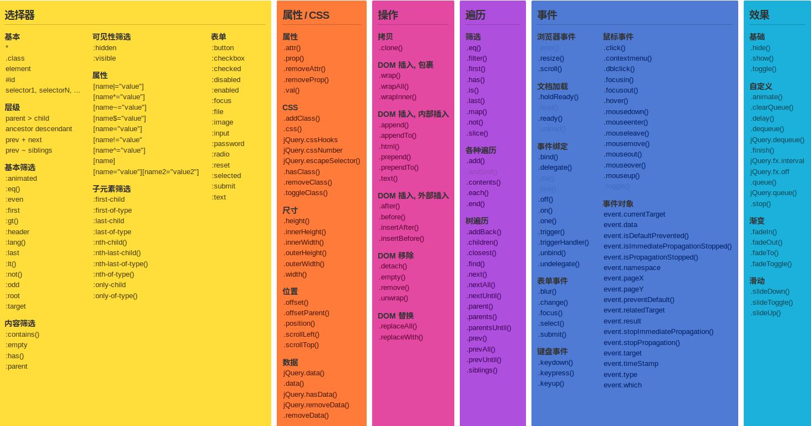
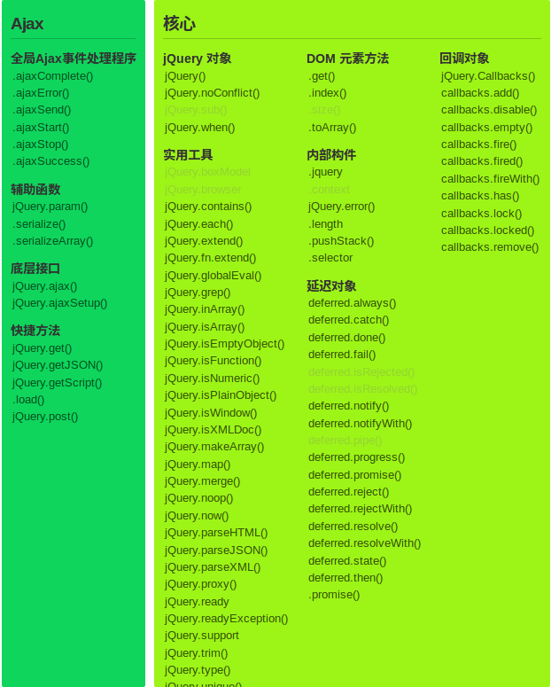

## jQuery选择器

[TOC]





### 1.什么是jQuery和CDN?

#### 什么是jQuery

> ​	jQuery是一个快速、简洁的JavaScript框架，它封装JavaScript常用的功能代码，提供一种简便的JavaScript设计模式，优化HTML文档操作、事件处理、动画设计和Ajax交互。 可以说jQuery改变了用户编写JavaScript代码的方式. jQuery设计的宗旨是"Write Less, Do More", 即写更少的代码, 做更多的事情.

> ​	jQuery项目主要包括jQuery Core(核心库), jQuery UI(界面库), Sizzle(CSS选择器)和Qunit(测试套件)四部分, 现在又增加了一个新的部分就是 jQuery Mobile(手机端).
>
> ​	jQuery 等价于 $ 符号;
>
> ​	jQuery的核心特性可以总结为：具有独特的链式语法和短小清晰的多功能接口；具有高效灵活的css选择器，并且可对CSS选择器进行扩展；拥有便捷的插件扩展机制和丰富的插件。jQuery兼容各种主流浏览器，如IE 6.0+、FF 1.5+、Safari 2.0+、Opera 9.0+等

- jQuery的特点：javascript库，体积小，功能丰富，使用简单，**兼容性好(兼容众多浏览器)**。

#### 什么是CDN

> ​	CDN的全称是Content Delivery Network，即**内容分发网络**。其基本思路是尽可能避开互联网上有可能影响数据传输速度和稳定性的瓶颈和环节，使内容传输的更快、更稳定。通过在网络各处放置**节点服务器**所构成的在现有的互联网基础之上的一层智能**虚拟网络**，CDN系统能够实时地根据[网络流量](https://baike.baidu.com/item/%E7%BD%91%E7%BB%9C%E6%B5%81%E9%87%8F)和各节点的连接、负载状况以及到用户的距离和响应时间等综合信息将用户的请求重新导向离用户最近的服务节点上。其目的是使用户可就近取得所需内容，解决 Internet网络拥挤的状况，提高用户访问网站的响应速度。

```javascript
<!--
    1. 使用CDN 引入jQuery(必须有网络)
    2. 引入本地文件
-->
  <!-- <script src="https://cdn.bootcss.com/jquery/3.0.0/jquery.min.js"></script> -->

  <!-- 引入外部js文件之后，该script中不要写代码  -->

  <script src="./jquery.min.js"></script>

console.log(jQuery); // ƒ (a,b){return new r.fn.init(a,b)}
console.log($);  // ƒ (a,b){return new r.fn.init(a,b)}
console.log($ === jQuery);  // true

// 选择器,返回一个 JQ 封装的对象
var eles = $("p");
console.log(eles,typeof eles); // jquery对象  "object"

// 原生
$("#box p")[0].style.border = "3px solid blue";
// jq,默认循环设置所有
$("#box p").css("border","3px solid pink");

// get() 获取原生对象
// jq转换为原生
$("#box p").get(1).style.fontSize = "30px";
// 不给参数,返回数组,获取选中的元素数组
console.log($("#box p").get());
$("#box p").get().reverse()[0].style.color = "pink";

// 原生转换为jq
var ele = document.getElementById('box1');
$(ele).css("font-size","30px");
```

### 2.基本选择器(*/标签/类/id/后代)--和CSS一致

- 通配选择器(*)
- 标签选择器
- 类选择器
- id选择器
- 并集选择器

```html
<div>
    我是标签div,我设置了背景红色和高度100px;
</div>
<h1 class="one">
    我是有class的h1标签,我设置了字体红色
</h1>
<p id="two">
    我是有Id的p标签,我设置了一像素的绿色边框
</p>
<script type="text/javascript">
        // * 通配选择符
        $("*").css("margin","0").css("padding","0");
        // 标签选择器
        $("div").css("background-color","red").css("height","100px");
        // 类选择器
        $(".one").css("color","red");
        // id选择器
        $("#two").css("border","1px solid green");
</script>
```

### 3.层级(jQuery)选择器/关系(CSS)选择器 (子/包含/相邻/兄弟)--和CSS一致

#### 包含选择器(后代)(.demo   div)

```html
<ul>
    <li>我是li标签,我设置了30像素的字体大小</li>
</ul>
<script type="text/javascript">
// 后代(包含)选择器
        $("ul li").css("font-size","30px");
</script>
```

#### 子选择器

```html
<div class="three">
      <div class="three_s">111</div>
      <div class="three_s">
        222
        <div>three的孙子元素</div>
      </div>
</div>
<script type="text/javascript">
// 子选择器 >		
      $(".three > div").css("border", "1px solid red");
//只有111和222有样式
 </script>
```

#### 相邻下一个兄弟选择器

```html
<div>1</div>
<div class="four">2</div>
<p>2222</p>
<div>3</div>
<div class="four">4</div>
<div>5</div>
<script type="text/javascript">
// 相邻下一个兄弟选择器 +
      $(".four + div ").css("font-size", "50px");
 //只有5是50px;p标签不符合兄弟选择器条件
</script> 
```

#### 兄弟选择器(后边的所有符合条件的兄弟)

```html
<div>1</div>
<div class="four">2</div>
<p>2222</p>
<div>3</div>
<div>4</div>
<div>5</div>
<script type="text/javascript">
//后边的所有符合条件的兄弟
      $(".four ~ div").css("color", "green");
  //
 </script>  
```

### 4.属性选择器--和CSS一致

- **单引号中可以直接包含双引号，但是不能直接包含单引号**

- **双引号中可以直接包含单引号，但是不能直接包含双引号**

  格式	$("[属性名称=属性值]")

#### $("[name=one]") 

- 选择指定属性是给定值的元素。

```html
<div name="one">1111</div>
<div>2222</div>
<script src="../jquery.min.js" charset="utf-8"></script>
    <script type="text/javascript">
    //属性选择器
    $("[name=one]").css("color", "red");
</script>
<!--1111变红色,2222不变色-->
```

#### $("[name|=on]") 

- 选择指定属性值等于给定字符串或以该字符串为前缀（该字符串后跟一个连字符“-” ）的元素。

```html
<div name="on">0000</div>
<div name="on-1">1111</div>
<div name="on-2">2222</div>
<div name="onno">3333</div>
<script src="../jquery.min.js" charset="utf-8"></script>
<script type="text/javascript">
  //属性选择器
$("[name|=on]").css("font-size", "50px");
</script>
<!-- 0~2 都是50像素,3333不是-->
```

#### \$("[data $=hello")

- 选择指定属性是以**给定值结尾**的元素。这个比较是区分大小写的。

```html
<div  data="hello">111</div>
<div  data="worldhello">111</div>
<div  data="helloworld">111</div>
<script src="../jquery.min.js" charset="utf-8"></script>
    <script type="text/javascript">
//属性值以hello结尾
    $("[data$=hello]").css("font-size", "50px");
    </script>

<!--只有前两个有效-->
```

#### \$("[data^=hello]")

- 选择指定属性是以给定字符串开始的元素

```html
<div  data="hello">111</div>
<div  data="worldhello">111</div>
<div  data="helloworld">111</div>
<script src="../jquery.min.js" charset="utf-8"></script>
    <script type="text/javascript">
//属性值以hello开头
    $("[data^=hello]").css("font-size", "50px");
    </script>

<!--只有一,三有效-->
```

### 5.子元素筛选--和css中的伪类选择器一致

#### :first-child

- 选择所有父级元素下的第一个子元素。这相当于`:nth-child(1)`

#### :last-child

- 选择所有父级元素下的最后一个子元素。

  #### :nth-child()(下标从1开始)

- 选择的他们所有父元素的第n个子元素。

```html
<ul class="one">
      <li>1</li>
      <li>2</li>
      <li>3</li>
      <li>4</li>
      <p>p元素</p>
      <li>5</li>
      <li>6</li>
      <li>7</li>
      <li>8</li>
</ul>
<script src="../jquery.min.js" charset="utf-8"></script>
    <script type="text/javascript">
      // :first-child
     $(".one li:first-child").css("color", "red");	//1变红
     $(".one li:last-child").css("color", "green"); //8变绿
     $(".one li:nth-child(3)").css("color", "blue");//3变蓝
</script>
```

##### :nth-child()与:eq()与:nth-of-type()的区别

```html
<ul class="one">
      <li>1</li>
      <li>2</li>
      <li>3</li>
      <li>4</li>
      <p>第一个p元素</p>
      <li>5</li>
      <p>第二个p元素</p>
      <li>7</li>
      <li>8</li>
    </ul>
<script src="../jquery.min.js" charset="utf-8"></script>
    <script type="text/javascript">
     /*
     nth-child 把所有的同辈元素都计数了,但必须符合前面的条件才有css样式
     nth-child(5)数组下标从1 开始,5是p元素,但是不符合li标签所以没样式
     */
      
     //eq只把符合条件的同辈元素计数,下标从0开始,数到3时跳过p元素
     $(".one li:nth-child(5)").css("font-size", "50px");//下标从1开始,没动
     $(".one li:eq(4)").css("font-size", "50px");//下标从0开始,5变大
      
	//nth-of-type(2)是选择父元素下的第二个p元素,不管p元素在什么位置,只要符合就行
	 $(".one p:nth-of-type(2)").css("color","red");	//第二个p元素变红
</script>
```

#### 自学 :nth-of-type()

- 选择同属于一个父元素之下，并且标签名相同的子元素中的第n个。

```html
<!DOCTYPE html>
<html>
  <head>
    <meta charset="utf-8">
    <title>nth-of-type()</title>
  </head>
  <body>
    <div class="one">
      <p>我是第一段</p>
      <div>divdivdiv</div>
      <p>我是第二段</p>
      <div>divdivdiv</div>
      <p>我是第三段</p>
      <div>divdivdiv</div>
      <p>我是第四段</p>
      <div>divdivdiv</div>
      <p>我是第五段</p>
    </div>
    <!-- 选择同属于一个父元素之下，并且标签名相同的子元素中的第n个 -->
    <script src="./jquery.min.js" charset="utf-8"></script>
    <script type="text/javascript">
    //第三个p元素变红,nth-of-type不计较要选择的元素在什么位置只要有就行
      $(".one p:nth-of-type(3)").css("color","red");
    </script>
  </body>
</html>
```

### 6.jQuery中特有的选择器

#### :even 索引为偶数(下标从0开始)

- 选择所引值为偶数的元素，从 0 开始计数。

#### :odd 索引为奇数

- 选择索引值为奇数元素，从 0 开始计数。

#### :eq(index)  index,下标从0开始

- 在匹配的集合中选择索引值为`index`的元素

#### :not()

- 选择所有元素去除不匹配给定的选择器的元素。

#### :first() 第一个

- 选择第一个匹配的DOM元素.

```javascript
// :first 区别: first只能匹配一个, first-child 可以匹配多个
$("li:first").css("font-size","30px");
// :first-child
$("li:first-child").css("color","red");
```

#### :gt()  大于

#### :lt()  小于

#### :last() 最后一个

- 选择最后一个匹配的元素。

```html
<ul class="one">
      <li>1</li>
      <li>2</li>
      <li>3</li>
      <li>4</li>
      <li>5</li>
      <li>6</li>
      <li>7</li>
      <li>8</li>
    </ul>

<ul class="two">
      <li>1</li>
      <li class="two_s">2</li>
      <li>3</li>
      <li>4</li>
      <li class="two_s">5</li>
      <li>6</li>
      <li>7</li>
      <li class="two_s">8</li>
    </ul>

<script src="../jquery.min.js" charset="utf-8"></script>
<script type="text/javascript">

    //:even 偶数(从0开始)， :odd奇数
    $(".one li:even").css("color", "red");			//1,3,5,7变红
    $(".one li:odd").css("font-size", "50px");		//2,4,6,8变大

    //:eq(index), index 从0开始
    $(".one li:eq(4)").css("border", "1px solid red"); //5加红色边框

    //:not(selector), 除去其中class=two_s的li
    $(".two li:not(.two_s)").css("color", "red");	//1,3,4,6,7变红
    </script>
```

## 补充内容

### 1.jQuery库中的$()是什么？

- 答：jQuery等价于$符号，\$()可以创建一个元素，并追加到相应的元素中去，还可以利用选择器选择DOM元素。

### 2.$(function(){})的作用是什么？

- 它是$(document).ready(function(){})的简写形式，是用来在DOM加载完成之后执行的一系列预先定义好的函数。
- 脚本文件尽量放到body的最后执行！！
- DOM节点加载完毕指的的是页面上所有的标签都已经加载就绪(但不是所有的资源，比如图片，音频，视频等等)

```html
  <h1>$(function(){})</h1>
  

  <!--
  脚本文件尽量放到body的最后执行！！
  -->
  <script src="./jquery.min.js" charset="utf-8"></script>
  <script type="text/javascript">
    /*
    DOM节点加载完毕指的的是页面上所有的标签都已经加载就绪(但不是所有的资源，比如图片，音频，视频等等)
    */
    //语句１
    $(function() {
      console.log("所有的DOM节点加载完毕之后再执行！！！！");
    });
	//语句２
    console.log("script .....");
  </script>

<!--
	 先执行语句２，再执行语句１
-->
```


#### 1.HTML页面的加载过程


#### 2.浏览器的加载与渲染过程

[原文链接](./onload.md)